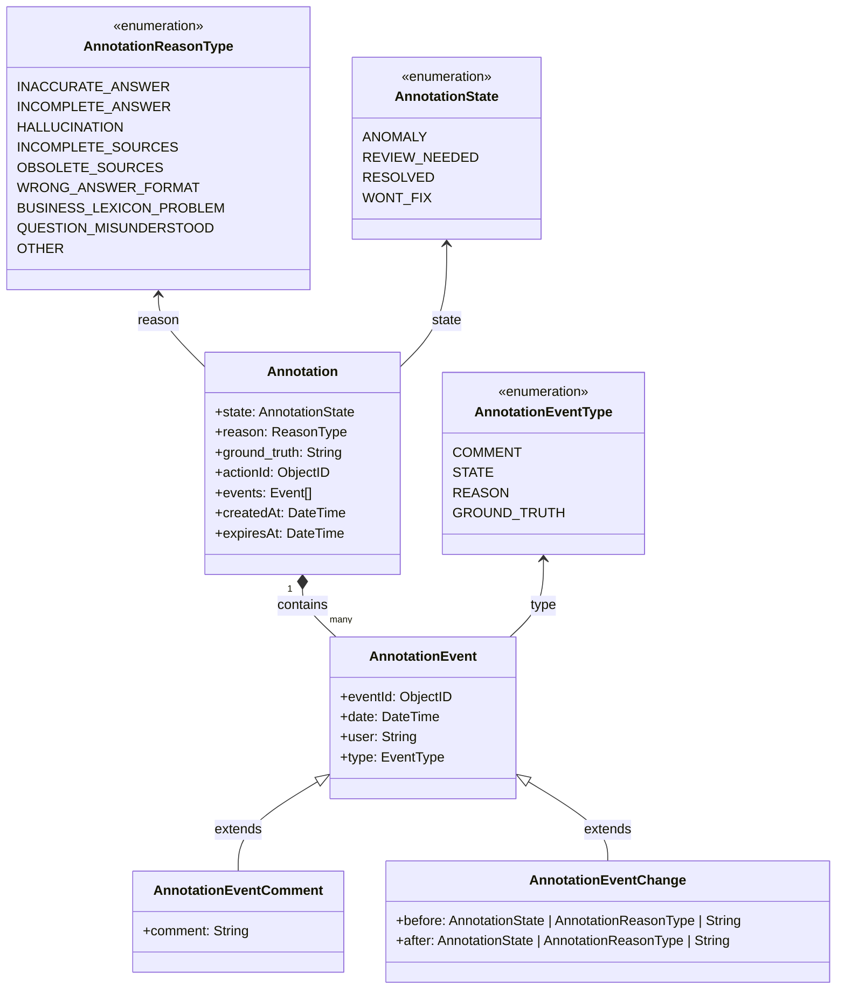

# Gestion des Annotations et events - DERCBOT-1309

**Epic Jira** : [*DERCBOT-1309*](http://go/j/DERCBOT-1309)


## Contexte et objectif de la feature

Ce document de design définit la gestion des annotations et des events liés aux réponses du bot. L'objectif est d'offrir aux administrateurs et développeurs les outils nécessaires pour évaluer, annoter, et tracer les anomalies ainsi que leurs résolutions.

### Périmètre de la fonctionnalité
Les annotations permettent :
- Aux **botUser** de marquer une anomalie, de l’analyser et d’y associer des états et raisons spécifiques.
- Aux **botUser** de filtrer et de suivre les résolutions des anomalies.

## Cas d'usages

### Rôle Administrateur de bot
* *UC1* - En tant qu' **administrateur de bot** je souhaite pouvoir **ajouter une annotation** sur une réponse du bot afin d’indiquer un problème.
* *UC2* - En tant qu' **administrateur de bot** je souhaite pouvoir **modifier les annotations existantes** pour refléter les changements d’état, les raisons, ou ajouter des commentaires.
* *UC3* - En tant qu' **administrateur de bot** je souhaite **suivre l'historique des events liés à une annotation** comme les changements d'état et les commentaires, pour garder une trace complète des décisions.
* *UC4* - En tant que **administrateur de bot** je souhaite pouvoir **filtrer les réponses** en fonction des états et des raisons des anomalies pour identifier les cas nécessitant une attention immédiate.
---

## Modèle de données



### Exemple de document stocké dans la collection :

Les events (`events`) sont toujours retournés dans l'ordre chronologique, triés par date (`date`).

Une purge sera mise sur les annotations, alignée sur la logique de purge des dialogs.

```json
{
  "_id": ObjectId("65a1b2c3d4e5f6a7b8c9d0e1"),
  "actionId": ObjectId("65a1b2c3d4e5f6a7b8c9d0e2"),
  "state": "ANOMALY",
  "reason": "INACCURATE_ANSWER",
  "ground_truth": "La date butoire de souscription au contrat est le 1er Janvier 2025",
  "events": [
    {
      "eventId": ObjectId("65a1b2c3d4e5f6a7b8c9d0e3"),
      "type": "STATE",
      "date": ISODate("2023-10-01T10:00:00Z"),
      "user": "USER192",
      "before": {
        "state": null
      },
      "after": {
        "state": "ANOMALY"
      }
    },
    {
      "eventId": ObjectId("65a1b2c3d4e5f6a7b8c9d0e4"),
      "type": "COMMENT",
      "date": ISODate("2023-10-01T10:05:00Z"),
      "user": "USER192",
      "comment": "La date donnée est incorrecte."
    },
    {
      "eventId": ObjectId("65a1b2c3d4e5f6a7b8c9d0e5"),
      "type": "STATE",
      "date": ISODate("2023-10-01T11:00:00Z"),
      "user": "ADMIN1",
      "before": {
        "state": "ANOMALY"
      },
      "after": {
        "state": "REVIEW_NEEDED"
      }
    }
  ],
  "createdAt": ISODate("2023-10-01T10:00:00Z"),
  "expiresAt": ISODate("2023-12-01T10:00:00Z")
}
```

# API Routes Documentation

## Liste des Routes

#### [POST] /rest/admin/bots/:botId/annotations
Crée une nouvelle annotation. 

Un event de changement d'état est automatiquement créé pour passer de `null` à l'état initial `ANOMALY`.

**Path Parameter**
`botId`: Identifiant unique du bot.

**Request Body:**

- `actionId`: Obligatoire
- `state`: Obligatoire 
- `user`: Obligatoire
- `reason`: Facultatif
- `ground_truth`: Facultatif

**Response:**
```json
{
  "_id": "65a1b2c3d4e5f6a7b8c9d0e1",
  "actionId": "65a1b2c3d4e5f6a7b8c9d0e2",
  "state": "ANOMALY",
  "user": "USER192",
  "reason": "INACCURATE_ANSWER",
  "ground_truth": null,
  "events": [
    {
      "eventId": "65a1b2c3d4e5f6a7b8c9d0e3",
      "type": "STATE",
      "date": "2023-10-01T10:00:00Z",
      "user": "USER192",
      "before": null,
      "after": {
        "state": "ANOMALY"
      }
    }
  ],
  "createdAt": "2023-10-01T10:00:00Z",
  "expiresAt": "2023-12-01T10:00:00Z"
}
```

#### [POST] /rest/admin/bots/:botId/annotations/:annotationId/events**
Crée un nouvel event associé à une annotation spécifique.

**Path Parameter**
- `botId`: Identifiant unique du bot.
- `annotationId`: Identifiant unique de l'annotation.

**Request Body:**
- `type`: Type de l'event (par exemple, COMMENT, STATE, REASON, GROUND_TRUTH).
- `user`: Utilisateur ayant créé l'event.
- `comment`: (Facultatif) Commentaire associé à l'event.
- `before`: (Facultatif) État précédent pour les events de modification.
- `after`: (Facultatif) Nouvel état pour les events de modification.

**Response Example (COMMENT):**
```json
{
  "eventId": "65a1b2c3d4e5f6a7b8c9d0e3",
  "type": "COMMENT",
  "date": "2025-01-01T12:00:00Z",
  "user": "USER192",
  "comment": "Le problème vient de la source de données Z"
}
```

**Response Example (STATE):**
```json
{
  "eventId": "65a1b2c3d4e5f6a7b8c9d0e5",
  "type": "STATE",
  "date": "2023-10-01T11:00:00Z",
  "user": "ADMIN1",
  "before": {
    "state": "ANOMALY"
  },
  "after": {
    "state": "REVIEW_NEEDED"
  }
}
```

**Response Example (GROUND_TRUTH):**
```json
{
  "eventId": "65a1b2c3d4e5f6a7b8c9d0e7",
  "type": "GROUND_TRUTH",
  "date": "2023-10-01T13:00:00Z",
  "user": "ADMIN1",
  "before": {
    "ground_truth": "La date butoire de souscription au contrat est le 1er Janvier 2025"
  },
  "after": {
    "ground_truth": "La date butoire de souscription est le 15 Février 2025."
  }
}
```

#### [PUT] /rest/admin/bots/:botId/annotations/:annotationId/events/:eventId
Met à jour un event existant de type comment.

**Request Body:**
- `botId`: Identifiant unique du bot.
- `annotationId`: Identifiant unique de l'annotation.
- `eventId`: Identifiant unique de l'event.

**Response Example:**
```json
{
  "eventId": "65a1b2c3d4e5f6a7b8c9d0e3",
  "type": "COMMENT",
  "date": "2025-01-01T12:00:00Z",
  "user": "USER192",
  "comment": "Le problème vient de la source de données X"
}
```

#### [DELETE] /rest/admin/bots/:botId/annotations/:annotationId/events/:eventId
Supprime un event existant de type comment.

**Request Body:**
- `botId`: Identifiant unique du bot.
- `annotationId`: Identifiant unique de l'annotation.
- `eventId`: Identifiant unique de l'event.

**Response Example:**
```json
{
  "message": "Event deleted successfully"
}
```