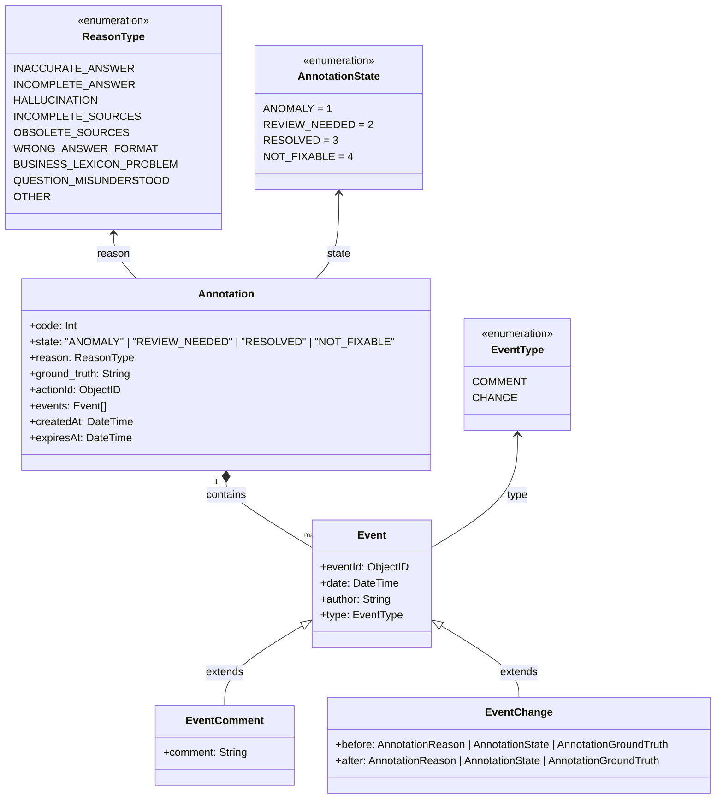

# Gestion des Annotations et Événements - DERCBOT-1309

**Epic Jira** : [*DERCBOT-1309*](http://go/j/DERCBOT-1309)


## Contexte et objectif de la feature

Ce document de design définit la gestion des annotations et des événements liés aux réponses du bot. L'objectif est d'offrir aux administrateurs et développeurs les outils nécessaires pour évaluer, annoter, et tracer les anomalies ainsi que leurs résolutions.

### Périmètre de la fonctionnalité
Les annotations permettent :
- Aux **administrateurs** de marquer une anomalie, de l’analyser et d’y associer des états et raisons spécifiques.
- Aux **développeurs** de filtrer et de suivre les résolutions des anomalies.

## Cas d'usages

### Rôle Administrateur de bot
* *UC1* - En tant qu' **administrateur de bot** je souhaite pouvoir **ajouter une annotation** sur une réponse du bot afin d’indiquer un problème.
* *UC2* - En tant qu' **administrateur de bot** je souhaite pouvoir **modifier les annotations existantes** pour refléter les changements d’état, les raisons, ou ajouter des commentaires.
* *UC3* - En tant qu' **administrateur de bot** je souhaite **suivre l'historique des événements liés à une annotation** comme les changements d'état et les commentaires, pour garder une trace complète des décisions.

### Rôle Développeur
* *UC1* - En tant que **développeur** je souhaite pouvoir **filtrer les réponses** en fonction des états et des raisons des anomalies pour identifier les cas nécessitant une attention immédiate.
* *UC2* - En tant que **développeur** je souhaite pouvoir **annoter les réponses avec un état précis** (e.g., "RESOLVED", "NOT_FIXABLE") pour suivre les problèmes identifiés et les décisions prises.
---

## Modèle de données

Pairage Label - Code :
ANOMALY = 1
REVIEW_NEEDED = 2
RESOLVED = 3
NOT_FIXABLE = 4



### Exemple de document stocké dans la collection :

Les événements (`events`) sont toujours retournés dans l'ordre chronologique, triés par date (`date`).

```json
{
  "_id": ObjectId("65a1b2c3d4e5f6a7b8c9d0e1"),
  "actionId": ObjectId("65a1b2c3d4e5f6a7b8c9d0e2"),
  "code": 1,
  "state": "ANOMALY",
  "reason": "INACCURATE_ANSWER",
  "ground_truth": "La date butoire de souscription au contrat est le 1er Janvier 2025",
  "events": [
    {
      "eventId": ObjectId("65a1b2c3d4e5f6a7b8c9d0e3"),
      "type": "CHANGE",
      "date": ISODate("2023-10-01T10:00:00Z"),
      "author": "USER",
      "before": {
        "state": null
      },
      "after": {
        "state": "ANOMALY"
      }
    },
    {
      "eventId": ObjectId("65a1b2c3d4e5f6a7b8c9d0e4"),
      "type": "COMMENT",
      "date": ISODate("2023-10-01T10:05:00Z"),
      "author": "USER",
      "comment": "La date donnée est incorrecte."
    },
    {
      "eventId": ObjectId("65a1b2c3d4e5f6a7b8c9d0e5"),
      "type": "CHANGE",
      "date": ISODate("2023-10-01T11:00:00Z"),
      "author": "ADMIN",
      "before": {
        "state": "ANOMALY"
      },
      "after": {
        "state": "REVIEW_NEEDED"
      }
    }
  ],
  "createdAt": ISODate("2023-10-01T10:00:00Z"),
  "expiresAt": ISODate("2023-12-01T10:00:00Z")
}
```

# API Routes Documentation

## Liste des Routes

#### POST /rest/admin/annotations
Crée une nouvelle annotation. Un événement de changement d'état est automatiquement créé pour passer de `null` à l'état initial `ANOMALY`.

**Request Body:**
```json
{
  "actionId": "65a1b2c3d4e5f6a7b8c9d0e2",
  "code": 1,
  "state": "ANOMALY",
  "reason": "INACCURATE_ANSWER",
  "ground_truth": null
}
```

**Response:**
```json
{
  "_id": "65a1b2c3d4e5f6a7b8c9d0e1",
  "actionId": "65a1b2c3d4e5f6a7b8c9d0e2",
  "code": 1,
  "state": "ANOMALY",
  "reason": "INACCURATE_ANSWER",
  "ground_truth": null,
  "events": [
    {
      "eventId": "65a1b2c3d4e5f6a7b8c9d0e3",
      "type": "CHANGE",
      "date": "2023-10-01T10:00:00Z",
      "author": "USER",
      "before": {
        "state": null
      },
      "after": {
        "state": "ANOMALY"
      }
    }
  ],
  "createdAt": "2023-10-01T10:00:00Z",
  "expiresAt": "2023-12-01T10:00:00Z"
}
```

#### POST /rest/admin/annotations/{annotationId}/comment/create
Ajoute un commentaire à une annotation.

**Request Body:**
```json
{
  "comment": "Le problème vient de la source de données X",
}
```

**Response Example:**
```json
{
  "eventId": "65a1b2c3d4e5f6a7b8c9d0e3",
  "type": "COMMENT",
  "date": "2025-01-01T12:00:00Z",
  "author": "USER",
  "comment": "Le problème vient de la source de données Z"
}
```

#### POST /rest/admin/annotations/{annotationId}/comment/update
Modifie un commentaire.

**Request Body:**
```json
{
  "eventId": "65a1b2c3d4e5f6a7b8c9d0e3",
  "comment": "Le problème vient de la source de données X",
}
```

**Response Example:**
```json
{
  "eventId": "65a1b2c3d4e5f6a7b8c9d0e3",
  "type": "COMMENT",
  "date": "2025-01-01T12:00:00Z",
  "author": "USER",
  "comment": "Le problème vient de la source de données X"
}
```

#### POST /rest/admin/annotations/{annotationId}/state/update
#### POST /rest/admin/annotations/{annotationId}/reason/update
#### POST /rest/admin/annotations/{annotationId}/ground_truth/update
Met à jour le state, la raison ou la ground_truth d'une annotation.

**Request Body:**
```json
{
  "ground_truth": "La nouvelle date butoire est le 15 Février 2025."
}
```

**Response Example:**
```json
{
  "eventId": "65a1b2c3d4e5f6a7b8c9d0e5",
  "type": "CHANGE",
  "date": "2025-01-02T12:20:00Z",
  "author": "USER",
  "before": {
    "ground_truth": "La date butoire de souscription au contrat est le 1er Janvier 2025"
  },
  "after": {
    "ground_truth": "La date butoire de souscription est le 15 Février 2025."
  }
}
```