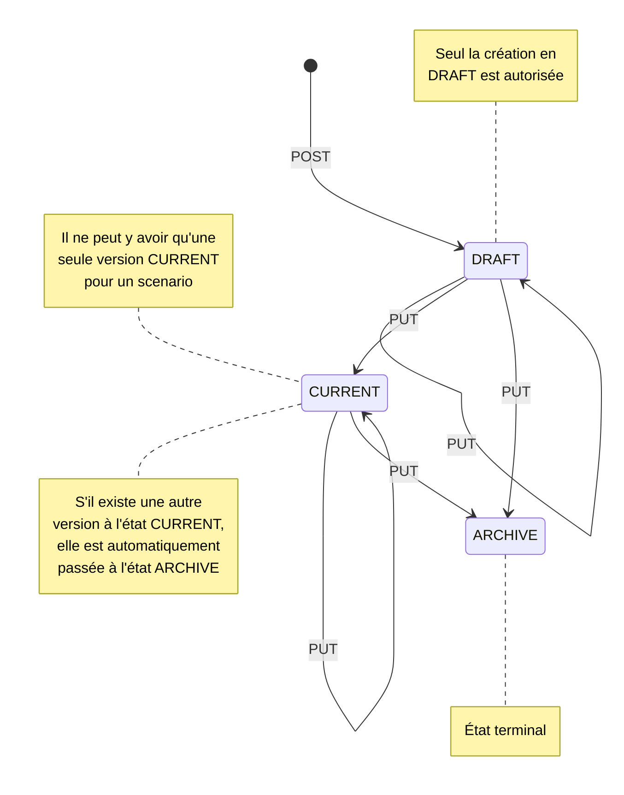

# Exemple d'appel aux API Scenario

Voir la collection postman [scenario.postman_collection.json](./scenario.postman_collection.json)

# Manipulation des Scenarios

## Scenario
Un Scenario est constitué d'un ID et d'un ensemble de donnée versionnée.
Cet ID est mappé en "sagaId" pour le front.
L'ensemble des données est une liste de ScenarioVersion dont l'identifiant est un numéro de version unique pour l'ensemble des scenarios.
Le numéro de version est mappé en "id" (de scenario) pour le front.
D'une manière générale, chaque version est mappée en un scenario unique pour les besoins de l'API.

### ScenarioVersion
```Kotlin
val version: String?
val name: String
val category: String?
val tags: List<String>
val applicationId: String
val createDate: ZonedDateTime?
val updateDate: ZonedDateTime?
val description: String?
val data: String?
val state: ScenarioState //[DRAFT, CURRENT, ARCHIVE]
```

***Réflexion*** :
_Il est possible de déplacer une partie du contenu d'un ScenarioVersion dans le Scenario. Normalement, le name, la category, les tags, l'applicationId et la description ne devrait pas varier d'une version à l'autre (à confirmer). Il ne devrait subsister que la version, la createDate, l'updateDate, la data et le state. Cette modification nécessiterait de modifier les API pour manipuler clairement d'une part des scenarios, et de l'autre des versions. Il faudrait que l'ajout ou la suppression de version se fasse par des PATCH explicites._

## Read
**GET /scenarios** et **/sagas** retourne l'ensemble des versions présentes en base de données (sans pagination). Retourne une liste vide s'il n'y en a aucune.<br>
_Erreur 500_ : une version ou un scénario est mal formaté ou n'a pas d'id.<br>
<br>
**GET /scenarios/active** retourne les versions au status **DRAFT** ou **CURRENT** présentes en base de données (sans pagination). Retourne une liste vide s'il n'y en a aucune, ou qu'ils sont tous au status **ARCHIVE**.<br>
_Erreur 500_ : une version ou un scénario est mal formaté ou n'a pas d'id.<br>
<br>
**GET /scenarios/_[version id]_** retourne une version référencée par son numéro de version unique.<br>
_Erreur 404_ : il n'y a aucune version pour l'id passé en paramètre.<br>
_Erreur 500_ : la version est mal formatée ou n'a pas d'id.<br>
_Erreur 500_ : il y a plus d'une version pour l'id.<br>
<br>
**GET /sagas/_[scenario id]_** permet de consulter l'ensemble de toutes les versions d'un scénario en utilisant l'id de scénario.<br>
_Erreur 404_ : il n'y a aucun scénario, ou un des scénarios ne contient aucune version, pour l'id passé en paramètre.<br>
_Erreur 500_ : une version ou un scénario est mal formaté ou n'a pas d'id.<br>
<br>
**GET /sagas/_[scenario id]_/current** retourne la version du scenario id passé en paramètre, dont le state est **CURRENT**. Cette version à la particularité d'être celle actuellement utilisée pour la tick story.<br>
_Erreur 404_ : il n'y a aucune version **CURRENT** pour l'id passé en paramètre.<br>
_Erreur 500_ : il y a plus d'une version **CURRENT** pour l'id.<br>
_Erreur 500_ : une version ou un scénario est mal formaté ou n'a pas d'id.<br>
<br>
**GET /sagas/_[scenario id]_/active** retourne les versions du scenario id passé en paramètre, dont le state est **DRAFT** ou **CURRENT**. Retourne une liste vide s'il n'y en a aucune, ou qu'ils sont tous au status **ARCHIVE**<br>
_Erreur 500_ : une version est mal formatée ou n'a pas d'id.<br>


## Create
**POST /scenarios** créé la version passée en body. Si l'id de scénario est renseigné, la version est rattachée au scénario existant, sinon, un nouveau scénario est créé.<br>
La date de création est initialisée à la date courante du serveur, la date de mise à jour est initialisée à null.<br>
Retourne uniquement la version créée.<br>
_Erreur 404_ : un id de scénario est renseigné, mais le scénario n'a pas été trouvé en base de donnée.<br>
_Erreur 404_ : problème de sauvegarde, la version créée n'est pas en base de donnée.<br>
_Erreur 409_ : le status de l'une des versions à créer n'est pas **DRAFT**<br>
_Erreur 409_ : l'une des versions à créer a un id.<br>
_Erreur 500_ : il y a plus d'une version retournée.<br>
_Erreur 500_ : la version ou le scénario est mal formaté ou n'a pas d'id.<br>
### techniquement:
Le service supporte la création en même temps de plusieurs versions pour un scénario, mais pas l'API qui est bloqué à une seule à la fois.<br>
Si un id de scénario est renseigné dans le body, le service trouve le scénario, et en extrait les versions. Les versions existantes sont ajoutées aux nouvelles versions, puis le scénario est PATCH en base de donnée. L'opération ne PATCH ne réalise aucun contrôle de cohérence d'id lors de la sauvegarde.<br>
Si aucun id de scénario n'est renseigné dans le body, le scénario est CREATE en base de donnée. L'opération de CREATE vérifie que ni le scénario, ni aucune version n'a d'id.<br>
Les id non renseignés sont créés lors de la sauvegarde.<br>
Étant donné que la réponse de la couche DAO inclus toutes les versions du scénario, le service filtre les versions qui étaient déjà présentes avant la création, et retourne un scénario avec les seules versions créées. Du fait que l'API ne gère la création que d'une seule version à la fois, alors le service doit ne retourner qu'une version dans l'état actuel de l'implémentation de la feature.<br>


## Update
**PUT /scenarios/_[scenario id]_** met à jour la version passée en body, et dont l'id est donné en paramètre.<br>
La date de mise à jour est modifiée par la date courante du serveur, la date de création est celle déjà enregistrée en base de donnée.<br>
Retourne uniquement la version mise à jour.<br>
_Erreur 409_ : la version ne correspond pas à l'id de l'URL.<br>
_Erreur 404_ : l'id de version n'a pas été trouvée en base de donnée.<br>
_Erreur 404_ : problème de sauvegarde, la version mise à jour n'est pas en base de donnée.<br>
_Erreur 409_ : le status de l'une des versions à mettre à jour est **ARCHIVE** en base de donnée. La mise à jour n'est pas autorisée.<br>
_Erreur 409_ : le status de l'une des versions à mettre à jour est **DRAFT**, mais il est **CURRENT** en base de donnée. La mise à jour n'est pas autorisée.<br>
_Erreur 409_ : l'une des versions à créer n'a pas d'id.<br>
_Erreur 500_ : il y a plus d'une version retournée.<br>
_Erreur 500_ : la version ou le scénario est mal formaté ou n'a pas d'id.<br>
### techniquement:
Le service supporte la mise à jour de plusieurs versions en même temps pour un scénario, mais pas l'API qui est bloqué à une seule à la fois.<br>
L'update implique une concordance entre l'id de l'URI, et l'id de l'objet. L'API manipulant uniquement des versions, le service est bridé pour réaliser un contrôle de concordance sur une seule version. Pour s'affranchir de cette limitation, il faudrait adresser les scénarios directement.<br>
Pour faire la mise à jour, le service extrait de la base de donnée toutes les versions qui ne sont pas à mettre à jour. Puis recopie les dates de créations de toutes les versions existantes en base de donnée et remplace la date de mise à jour par la date courante du serveur. Les versions qui ne sont pas à mettre à jour sont ajoutées tel quel au scénario qui est mis à jour.<br>
Si l'une des versions à mettre à jour est CURRENT, alors s'il existe une version CURRENT en base de donnée, cette dernière est changée au status ARCHIVE, sans modification de sa date de mise à jour.<br> 
Lors de l'appel au DAO, un contrôle est réalisé pour s'assurer que le scénario et chaque version dispose d'un id valide.<br>
Étant donné que la réponse de la couche DAO inclus toutes les versions du scénario, le service filtre les versions qui n'ont pas été mises à jour, et retourne un scénario avec les seules versions mises à jour. Du fait que l'API ne gère la mise à jour que d'une seule version à la fois, alors le service doit ne retourner qu'une version dans l'état actuel de l'implémentation de la feature.<br>


## Delete
**DELETE /sagas/_[scenario id]_** suppression de toutes les versions d'un scénario.<br>
Si le scénario n'existe pas en base de donnée, il est considéré comme n'ayant pas déjà été supprimé, aucune erreur n'est levée.<br>
Retourne un status 204 no content en cas de succès.<br>
**DELETE /scenarios/_[version id]_** suppression d'une version d'un scénario.<br>
Si le scénario ne contient qu'une seule version : suppression du scénario.<br>
Si le scénario contient plusieurs versions : seule la version ciblée est supprimée.<br>
Si la version n'existe pas en base de donnée, elle est considérée comme ayant déjà été supprimée, aucune erreur n'est levée.<br>
Retourne un status 204 no content en cas de succès.<br>
### techniquement:
La suppression d'une version d'un scénario en contenant plusieurs, consiste à trouver le scénario contenant la version ciblée, de retirer la version de la liste des versions du scénario, puis de mettre à jour le scénario. La mise à jour réutilise le service de mise à jour, tous les contrôles d'une mise à jour sont appliqués.<br>


## Graph
