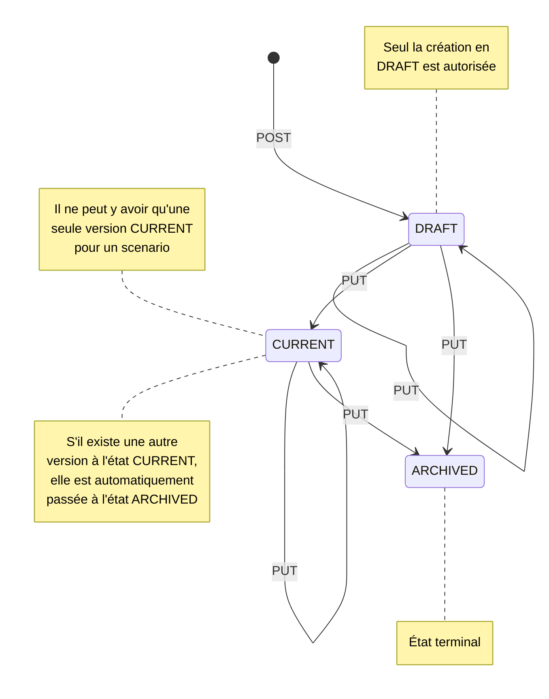

# Example call to API scenarios

View postman collection [scenario.postman_collection.json](../scenario.postman_collection.json)

# Manipulation of Scenarios

## Scenario Group
A Scenario is defined by a ScenarioGroup for a bot application (botId) and a versioned dataset (ScenarioVersion).
Thus a ScenarioGroup constitutes the description of a scenario and a set of versions.
This data is versioned in order to establish which version to use when using the bot, there can be draft (DRAFT), current and therefore in use (CURRENT), and archived (ARCHIVED) versions.
There can be multiple scenarios for a single bot application.

```Kotlin
class ScenarioGroup(
      val botId: string,
      value name: string,
      val category: String?,
      val tags: List<String>,
      value description: string?,
      val creationDate: ZonedDateTime,
      val updateDate: ZonedDateTime,
      val versions: List<ScenarioVersion>,
      @Transient
      val enabled: boolean? = null
)
```

### Script version
A ScenarioVersion is linked to a ScenarioGroup via "scenarioGroupId"
```Kotlin
class ScenarioVersion(
      val _id: ID<ScenarioVersion>,
      val scenarioGroupId: Id<ScenarioGroup>,
      val creationDate: ZonedDateTime,
      val updateDate: ZonedDateTime,
      value data: any?,
      val state: ScenarioVersionState, //[DRAFT, CURRENT, ARCHIVED]
      val comment: string,
)
```
Each scenario is associated with a bot application so the Uri begins by determining on which bot resource, via its botId (the application name) is requested.

## Read
### Scenarios
**GET /bot/_[botId]_/scenarios/groups**
Returns all the scenarios and the versions without their detailed data, present in the database (ScenarioGroupResponse) (without pagination).
Returns an empty list if there is none.  
_Error 400_: No configuration was found for the bot linked to _botId_  
_Error 500_: Server error

**GET /bot/_[botId]_/scenarios/groups/_[groupId]_** returns a scenario and the versions without their detailed data, present in the database (ScenarioGroupResponse) (without pagination). Returns an empty list if there is none.  
_Error 400_: No configuration was found for the bot linked to _botId_  
_Error 404_: Scenario group not found  
_Error 500_: Server error  

**GET /bot/_[botId]_/scenarios/groups/_[groupId]_/versions**
Returns all the versions of the scenario with their detailed data, presented in the database (ScenarioVersionResponse) (without pagination).
Returns an empty list if there is none.
_Error 400_: No configuration was found for the bot linked to _botId_
_Error 404_: Scenario group not found  
_Error 500_: Server error

**GET /bot/_[botId]_/scenarios/groups/_[groupId]_/versions/_[versionId]_**
Returns the version of the scenario with the detailed data, represented in database (ScenarioVersionResponse) (without pagination).
Returns an empty list if there is none.
_Error 400_: No configuration was found for the bot linked to _botId_
_Error 404_: there is no version for the id passed as a parameter, or there is no id for the scenario group.
_Error 409_: Scenario version and grouping not matching
_Error 500_: Server error

## Create
**POST /bot/_[botId]_/scenarios/groups**
Create a scenario group with an initial version "Initial Version" without data defined in draft mode **DRAFT**
The creation and update date is initialized to the current server date.
Returns only the created group scenario and an HTTP 201 code if successful.
_Error 400_: No configuration was found for the bot linked to _botId_
_Error 409_: A scenario group already exists.
_Error 500_: Server error

**POST /bot/_[botId]_/scenarios/groups/_[groupId]_/versions**
Create a scenario version with its data and associated with a scenario group within a bot.
To be able to use this endpoint it is necessary to have created a scenario group beforehand, (see previous endpoint) in order to have its id.
The data element is created mostly with the frontend so the answers and intents would not be created here if you directly call the api. You would have to "publish" it in frontend.
The creation and update date is initialized to the current server date.
Returns only the created group scenario and an HTTP 201 code if successful.
_Error 400_: No configuration was found for the bot linked to _botId_
_Error 404_: Scenario group not found
_Error 409_: Version and ScenarioGroup does not match
_Error 409_: The status of the build to build is not **DRAFT** (needed to edit or build)
_Error 500_: Server error

**POST /bot/_[botId]_/scenarios/import/groups/**
Import of a scenario group with its versions.
_Error 400_: No configuration was found for the bot linked to _botId_
_Error 409_: Scenario group to be imported without versions
_Error 409_: For a scenario group to import, the versions do not have the same scenario group
_Error 409_: An imported scenario group must not have a version in the **CURRENT** state
_Error 409_: Duplicate scenariœo group / already exists
_Error 500_: Server error

**POST /bot/_[botId]_/scenarios/import/groups/_[groupId]_/versions**
(Not yet used in frontend)
Import versions only of a scenario group.
_Error 400_: No configuration was found for the bot linked to _botId_
_Error 404_: Scenario group / scenario group not found
_Error 409_: Scenario group to be imported without versions
_Error 409_: For a scenario group to import, the versions do not have the same scenario group
_Error 409_: An imported scenario group must not have a version in the **CURRENT** state
_Error 500_: Server error

## Update

**PUT /bot/_[botId]_/scenarios/groups/_[groupId]_/versions**
Updating a ScenarioGroup with its data and associated with a ScenarioGroup within a bot.
The update date is updated to the current server date.
_Error 400_: No configuration was found for the bot linked to _botId_
_Error 404_: Scenario group not found
_Error 500_: Server error

**PUT /bot/_[botId]_/scenarios/groups/_[groupId]_/versions/_[versionId]_**
Updating a scenario version with its data and associated with a ScenarioGroup within a bot.
Returns an empty list if there is none.
_Error 400_: No configuration was found for the bot linked to _botId_
_Error 404_: there is no version for the id passed as a parameter, or there is no id for the scenario grouping.
_Error 409_: the status of the version to modify is not **DRAFT** (required to modify or create)
_Error 409_: Scenario version and grouping does not match
_Error 500_: Server error

### Technically:
If one of the versions to be updated is CURRENT, then if there is a CURRENT version in the database, the latter is changed to ARCHIVE status, without modifying its update date.<br>
When calling the DAO, a check is made to ensure that the scenario and each version has a valid id.<br>
Since the response from the DAO layer includes all versions of the scenario, the service filters out the versions that have not been updated, and returns a scenario with only the updated versions. Since the API only handles updating one version at a time, then the service should only return one version in the current state of the feature implementation.<br>

## Delete
**DELETE **GET /bot/_[botId]_/scenarios/groups/_[groupId]_** deletion of a scenario grouping and all its versions.
If the scenario does not exist in the database, it is considered as not having already been deleted, no error is raised.
_Error 400_: No configuration was found for the bot linked to _botId_
Returns HTTP status 200 on success.

**DELETE /bot/_[botId]_/scenarios/groups/_[groupId]_/versions/_[versionId]_** deletion of a version of a scenario.<br>
If the scenario contains only one version: deletion of the scenario.<br>
If the scenario contains several versions: only the targeted version is deleted.<br>
If the version does not exist in the database, it is considered to have already been deleted, no error is raised.<br>
_Error 400_: No configuration was found for the bot linked to _botId_
Returns HTTP status 200 on success.<br>
### Technically:
Deleting a scenario, consists in finding the scenario containing the targeted version, removing the version from the list of versions of the scenario, then updating the scenario.  

## Graph of the different states (DRAFT, CURRENT, ARCHIVED) for scenarios


### Action handlers
The action handlers are process managers executed during the actions, they make it possible to establish the input and output contexts generated by the action.  
**GET /bot/_[botId]_/scenarios/dialog-manager/action-handlers** returns all action handlers  
```Kotlin
class ActionHandler(
    val id: String,
    val namespace: HandlerNamespace,
    val name: String = "${namespace.key}:${id.lowercase()}",
    val description: String?,
    val inputContexts: Set<String>,
    val outputContexts: Set<String>,
    private val handler: (Map<String, String?>) -> Map<String, String?>,
)
```