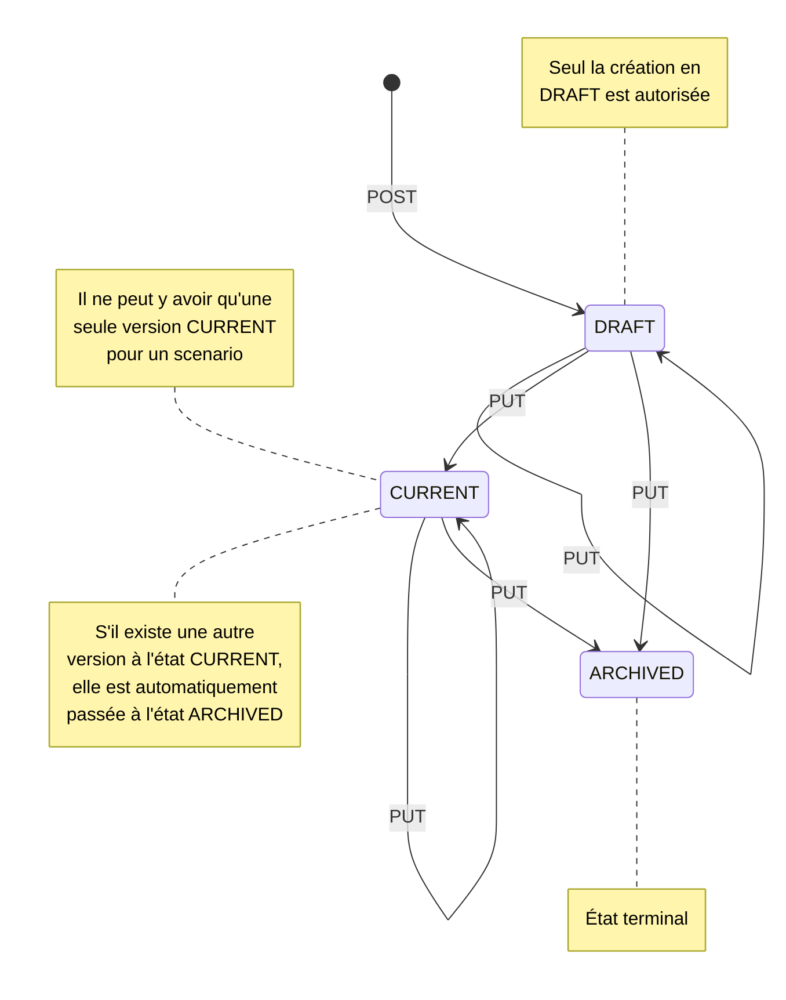

# Exemple d'appel aux API Scenario

Voir la collection postman [scenario.postman_collection.json](../scenario.postman_collection.json)

# Manipulation des Scenarios

## ScenarioGroup
Un Scenario est défini par un ScenarioGroup pour une application bot (botId) et d'un ensemble de données versionnée (ScenarioVersion).
Ainsi un ScenarioGroup constitue la description d'un scénario et d'un ensemble de versions.
Ces données sont versionnées afin d'établir quelle version utiliser lors de l'utilisation du bot, il peut y avoir des brouillons de versions (DRAFT), actuelle et donc en cours d'utilisation (CURRENT), et archivée (ARCHIVED).
Il peut y avoir plusieurs scénarios pour une même bot application.

```Kotlin
class ScenarioGroup(
    val botId: String,
    val name: String,
    val category: String?,
    val tags: List<String>,
    val description: String?,
    val creationDate: ZonedDateTime,
    val updateDate: ZonedDateTime,
    val versions: List<ScenarioVersion>,
    @Transient
    val enabled: Boolean? = null
)
```

### ScenarioVersion
Un ScenarioVersion est lié à un ScenarioGroup via "scenarioGroupId"
```Kotlin
class ScenarioVersion(
    val _id: Id<ScenarioVersion>,
    val scenarioGroupId: Id<ScenarioGroup>,
    val creationDate: ZonedDateTime,
    val updateDate: ZonedDateTime,
    val data: Any?,
    val state: ScenarioVersionState, //[DRAFT, CURRENT, ARCHIVED]
    val comment: String,
)
```
Chaque scenario est associé à une bot application donc l'Uri commence par déterminer sur quelle ressource bot, via son botId (le nom d'application) est sollicité.

## Read
### Scenarios
**GET /bot/_[botId]_/scenarios/groups**  
Retourne l'ensemble des scenarios et les versions sans leurs données en détail, présentes en base de données (ScenarioGroupResponse) (sans pagination).  
Retourne une liste vide s'il n'y en a aucune.<br>
_Erreur 400_ : Aucune configuration n'a été trouvé pour le bot lié au _botId_  
_Erreur 500_ : Erreur serveur  

**GET /bot/_[botId]_/scenarios/groups/_[groupId]_** retourne un scenario et les versions sans leurs données en détail, présentes en base de données (ScenarioGroupResponse) (sans pagination). Retourne une liste vide s'il n'y en a aucune.<br>
_Erreur 400_ : Aucune configuration n'a été trouvé pour le bot lié au _botId_  
_Erreur 404_ : Scenario group / groupement de scénario non trouvé
_Erreur 500_ : Erreur serveur  

**GET /bot/_[botId]_/scenarios/groups/_[groupId]_/versions**  
Retourne toutes les versions du scénario avec leurs données détaillées, présentes en base de données (ScenarioVersionResponse) (sans pagination).    
Retourne une liste vide s'il n'y en a aucune.  
_Erreur 400_ : Aucune configuration n'a été trouvé pour le bot lié au _botId_  
_Erreur 404_ : Scenario group / groupement de scénario non trouvé
_Erreur 500_ : Erreur serveur  

**GET /bot/_[botId]_/scenarios/groups/_[groupId]_/versions/_[versionId]_**  
Retourne la version du scénario avec les données détaillées, présentes en base de données (ScenarioVersionResponse) (sans pagination).  
Retourne une liste vide s'il n'y en a aucune.  
_Erreur 400_ : Aucune configuration n'a été trouvé pour le bot lié au _botId_  
_Erreur 404_ : il n'y a aucune version pour l'id passé en paramètre, ou il n'y a pas d'id pour le groupement de scénarios.
_Erreur 409_ : Scenario version et groupement ne correspondent pas
_Erreur 500_ : Erreur serveur  

## Create
**POST /bot/_[botId]_/scenarios/groups**  
Crée un groupement de scénario avec une version initiale "Initial Version" sans données définie en mode brouillon **DRAFT**  
La date de création et de mise à jour est initialisée à la date courante du serveur.  
Retourne uniquement le scénario groupe créée et une code HTTP 201 si succès.  
_Erreur 400_ : Aucune configuration n'a été trouvé pour le bot lié au _botId_  
_Erreur 409_ : un groupement de scénario existe déjà.
_Erreur 500_ : Erreur serveur  

**POST /bot/_[botId]_/scenarios/groups/_[groupId]_/versions**
Crée une version de scénario avec ses données et associée à un groupement de scénario au sein d'un bot.
Pour pouvoir utiliser cet endpoint il est nécessaire d'avoir créé un groupement de scénario au préalable, (cf endpoint précédent) afin de disposer de son id.
Les données sont pour la plupart créées dans le frontend ainsi les réponses (answers) et les intentions (intents) ne seront pas créées si vous appelez l'api ici. Vous devez vous rendre dans l'interface du Tock Studio et cliquer sur publish sur le scénario.
La date de création et de mise à jour est initialisée à la date courante du serveur.  
Retourne uniquement le scénario groupe créée et une code HTTP 201 si succès.  
_Erreur 400_ : Aucune configuration n'a été trouvé pour le bot lié au _botId_
_Erreur 404_ : Scenario group / groupement de scénario non trouvé 
_Erreur 409_ : Version et Groupement ne correspondent pas
_Erreur 409_ : le status de la version à créer n'est pas **DRAFT** (nécessaire pour modifier ou créer)
_Erreur 500_ : Erreur serveur 

**POST /bot/_[botId]_/scenarios/import/groups/**
Import d'un groupement de scénario avec ses versions.
_Erreur 400_ : Aucune configuration n'a été trouvé pour le bot lié au _botId_
_Erreur 409_ : Scenario group à importer sans versions
_Erreur 409_ : Pour un groupement de scénario à importer, les versions n'ont pas le même groupement de scénarios
_Erreur 409_ : Un groupement de scénario importé ne doit pas disposer d'une version en l'état **CURRENT**  
_Erreur 409_ : Scenario group dupliqué / existe déjà  
_Erreur 500_ : Erreur serveur  


**POST /bot/_[botId]_/scenarios/import/groups/_[groupId]_/versions**
(pas encore utilisé en Front)
Import des versions uniquement d'un groupement de scénario.
_Erreur 400_ : Aucune configuration n'a été trouvé pour le bot lié au _botId_
_Erreur 404_ : Scenario group / groupement de scénario non trouvé
_Erreur 409_ : Scenario group à importer sans versions
_Erreur 409_ : Pour un groupement de scénario à importer, les versions n'ont pas le même groupement de scénarios
_Erreur 409_ : Un groupement de scénario importé ne doit pas disposer d'une version en l'état **CURRENT** 
_Erreur 500_ : Erreur serveur  

## Update

**PUT /bot/_[botId]_/scenarios/groups/_[groupId]_/versions**
Mise à jour d'un groupement de scénario avec ses données et associée à un groupement de scénario au sein d'un bot.
La date de mise à jour est mise à jour à la date courante du serveur.  
_Erreur 400_ : Aucune configuration n'a été trouvé pour le bot lié au _botId_
_Erreur 404_ : Scenario group / groupement de scénario non trouvé
_Erreur 500_ : Erreur serveur

**PUT /bot/_[botId]_/scenarios/groups/_[groupId]_/versions/_[versionId]_**  
Mise à jour d'un groupement de scénario version de scénario avec ses données et associée à un groupement de scénario au sein d'un bot.
Retourne une liste vide s'il n'y en a aucune.  
_Erreur 400_ : Aucune configuration n'a été trouvé pour le bot lié au _botId_  
_Erreur 404_ : il n'y a aucune version pour l'id passé en paramètre, ou il n'y a pas d'id pour le groupement de scénarios.
_Erreur 409_ : le status de la version à modifier n'est pas **DRAFT** (nécessaire pour modifier ou créer)
_Erreur 409_ : Scenario version et groupement ne correspondent pas
_Erreur 500_ : Erreur serveur

### Techniquement:
Si l'une des versions à mettre à jour est CURRENT, alors s'il existe une version CURRENT en base de donnée, cette dernière est changée au status ARCHIVE, sans modification de sa date de mise à jour.<br> 
Lors de l'appel au DAO, un contrôle est réalisé pour s'assurer que le scénario et chaque version dispose d'un id valide.<br>
Étant donné que la réponse de la couche DAO inclus toutes les versions du scénario, le service filtre les versions qui n'ont pas été mises à jour, et retourne un scénario avec les seules versions mises à jour. Du fait que l'API ne gère la mise à jour que d'une seule version à la fois, alors le service doit ne retourner qu'une version dans l'état actuel de l'implémentation de la feature.<br>

## Delete
**DELETE **GET /bot/_[botId]_/scenarios/groups/_[groupId]_** suppression dun groupement de scenario et de toutes ses versions.  
Si le scénario n'existe pas en base de donnée, il est considéré comme n'ayant pas déjà été supprimé, aucune erreur n'est levée.  
_Erreur 400_ : Aucune configuration n'a été trouvé pour le bot lié au _botId_  
Retourne un status HTTP 200 en cas de succès.    

**DELETE /bot/_[botId]_/scenarios/groups/_[groupId]_/versions/_[versionId]_**  suppression d'une version d'un scénario.<br>
Si le scénario ne contient qu'une seule version : suppression du scénario.<br>
Si le scénario contient plusieurs versions : seule la version ciblée est supprimée.<br>
Si la version n'existe pas en base de donnée, elle est considérée comme ayant déjà été supprimée, aucune erreur n'est levée.<br>
_Erreur 400_ : Aucune configuration n'a été trouvé pour le bot lié au _botId_  
Retourne un status HTTP 200 en cas de succès.<br>
### Techniquement:
La suppression d'une version d'un scénario en contenant plusieurs, consiste à trouver le scénario contenant la version ciblée, de retirer la version de la liste des versions du scénario, puis de mettre à jour le scénario.  

## Graph des différents états (DRAFT, CURRENT, ARCHIVED) des scénarios


### Handlers d'action
Les handlers d'action sont des gestionnaires de processus exécutés lors des actions, ils permettent d'établir les contextes d'entrée et de sorties générés par l'action.
**GET /bot/_[botId]_/scenarios/dialog-manager/action-handlers** retourne tous les handlers d'action
```Kotlin
class ActionHandler(
    val id: String,
    val namespace: HandlerNamespace,
    val name: String = "${namespace.key}:${id.lowercase()}",
    val description: String?,
    val inputContexts: Set<String>,
    val outputContexts: Set<String>,
    private val handler: (Map<String, String?>) -> Map<String, String?>,
)
```