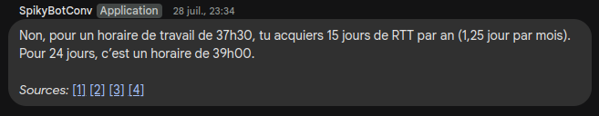

## 1. Prerequisites

1. **Create and publish a Google Chat bot**  
   Follow the instructions here:  
   https://developers.google.com/hangouts/chat/how-tos/bots-publish  
   ⚠️ Each connector requires its own Google Cloud Project, as the Chat API settings (e.g. bot avatar, display name, endpoint) are project-specific.

2. **IAM Google Cloud Permissions**
   - `chat.bots.get`
   - `chat.bots.update`  
     👉 We recommend creating a specific role with those permissions and assigning it to a service account.

3. **Retrieve the following from the Google Cloud Console**:
   - **Bot project number** — the numeric ID of your project (e.g. `37564789203`)
   - **JSON credentials** — create a service account with the permissions above, then download the credentials file.

4. **Configure the Google Chat API**
   - Go to [Google Chat API (Marketplace)](https://console.cloud.google.com/marketplace/product/google/chat.googleapis.com)
   - Click **Manage**, then go to the [Configuration tab](https://console.cloud.google.com/apis/api/chat.googleapis.com/hangouts-chat)
   - Set:
      - `HTTP endpoint URL` → your ngrok URL + Tock REST path (e.g. `https://area-simple-teal.ngrok-free.app/io/app/assistant/google_chat`)
      - `Authentication Audience` → Select **Project Number**

---

⚠️ **Limitations:**  
Dialogs will reset every 24 hours due to database filtering, as defined in [`UserTimelineMongoDAO.kt#L77`](https://github.com/theopenconversationkit/tock/blob/tock-25.3.9/bot/storage-mongo/src/main/kotlin/UserTimelineMongoDAO.kt#L77).

---

## 2. Tock Configuration

1. In the Tock admin UI, go to **Settings > Configuration > New Configuration**

2. Create a Google Chat configuration with the following values:

| Field | Description |
|-------|-------------|
| **Connector type** | `google_chat` |
| **Application base URL** | Your ngrok URL (e.g. `https://area-simple-teal.ngrok-free.app`) |
| **Bot project number** | e.g. `37564789203` |
| **Service account credential json content** | Paste the raw JSON content of the credential file |
| **Use condensed footnotes** | `1 = condensed`, `0 = detailed`. See below for examples |

---

## 3. Footnote Display Examples

### Condensed mode (`useCondensedFootnotes = 1`)



---

### Detailed mode (`useCondensedFootnotes = 0`)


---

## 4. Markdown Support

The connector includes a converter to transform standard Markdown into a simplified format compatible with Google Chat.

### Supported Conversions

| Markdown Input                         | Google Chat Output                 |
|----------------------------------------|------------------------------------|
| **bold**                               | *bold*                             |
| _italic_                               | _italic_                           |
| ~~strikethrough~~                      | ~~strikethrough~~ (unchanged)     |
| `inline code`                          | `inline code`                      |
| ``` (code block)                       | ```code block```                   |
| # Heading                              | *Heading*                          |
| * list item                            | * list item                        |
| [Label](https://link.com)              | <https://link.com|Label>          |
| [](https://link.com)                   | <https://link.com|https://link.com> |

> ⚠️ Google Chat does **not** support full Markdown. Formatting is simplified.

---

## 5. Bot Behavior

When running in a Google Chat room:

- The bot replies in the **same thread** as the user message.
- If no thread is available (e.g. direct message or system event), it starts a **new thread**.
- We use `REPLY_MESSAGE_FALLBACK_TO_NEW_THREAD` to ensure delivery in both cases.

---

## 6. Local Development (Integrated Mode)

To test your bot locally with Google Chat:

1. Set your bot's URL in the Google Cloud Console.  
   It must match the path configured in the Tock configuration.

2. Expose your local bot endpoint securely using a tunnel.  
   Example with [ngrok](https://ngrok.com/):

   ```sh
   ngrok http 8080
