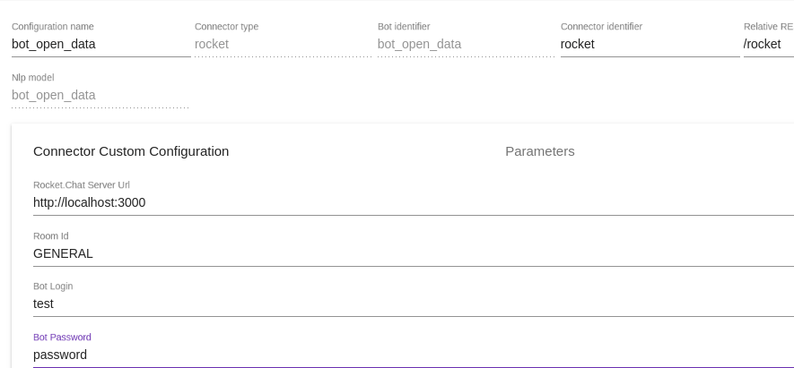
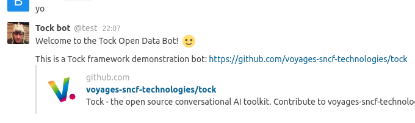

# RocketChat Tock Connector

First version for Tock [RocketChat](https://rocket.chat/) connector.

## Install

- Install a rocket chat server: https://rocket.chat/docs/installation/ 
- Create a RocketChat bot user: https://rocket.chat/docs/bots/creating-bot-users/

- Start Tock admin - please notice, if you install both Rocket and Tock on the same instance,
that RocketChat and Tock use MongoDB with replicaset, but with a different replicaset.
So you can't mutualize the Mongo instances and you need to change the Tock Mongo's ports or RocketChat Mongo's port.

- Configure a new Bot Configuration

 
 
You can now start do talk to the Bot!

 
