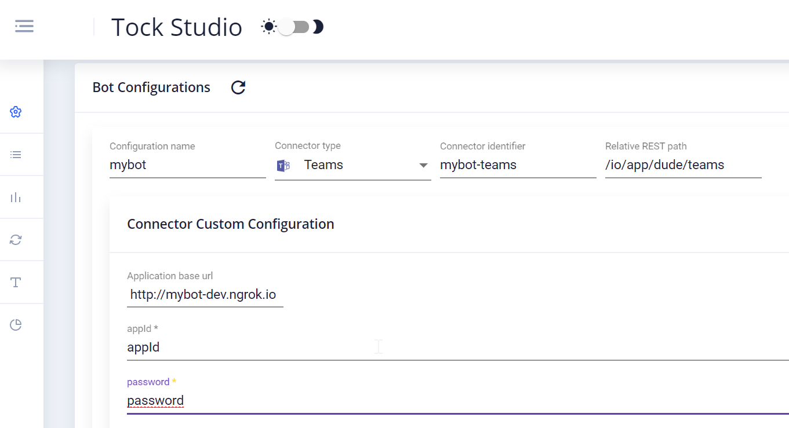

# Tock Teams Connector

This connector enables you to speech with a bot in private conversation in Teams, the Microsoft solution for chat, unsing the [REST API](https://docs.microsoft.com/en-us/azure/bot-service/rest-api/bot-framework-rest-connector-api-reference?view=azure-bot-service-4.0)


## Create your bot
[https://voyages-sncf-technologies.github.io/tock/en/](https://voyages-sncf-technologies.github.io/tock/en/)

The microsoft library used is [Microsoft Bot Framework Connector for Java](https://github.com/microsoft/botbuilder-java/tree/master/libraries/bot-connector)

### Cards available
When using the connector teams, you can create [cards](https://docs.microsoft.com/en-us/microsoftteams/platform/concepts/cards/cards-reference) to personnalize content. Those available in this connector are :

* Action Card, a card to usually display buttons
```kotlin
class TeamsCardAction(
    val actionTitle: String,
    val buttons: List<CardAction>)
```
* Hero Card, a card that typically contains a single large image, one or more buttons and text. 
```kotlin
class TeamsHeroCard(
    val title: String,
    val subtitle: String?,
    val attachmentContent: String,
    val images: List<CardImage>?,
    val buttons: List<CardAction>?,
    val tap: CardAction?
)
```
* Carousel, to display a carousel of cards
```kotlin
class TeamsCarousel(val listMessage: List<TeamsBotMessage>)
```

## Deploy your bot on localhost
[Ngrok](https://ngrok.com/) is your friend. Prefer the Basic offer, to have a custom subdomain in order to avoid to have to change the endpoint every time you reboot ngrok.

## Create an ApplicationId for your bot
[https://dev.botframework.com/bots/new](https://dev.botframework.com/bots/new)

## Configure the connector Teams in Tock Studio
You'll need your local endpoint, your appId and your password.



## Talk to your bot on teams
[https://docs.microsoft.com/fr-fr/microsoftteams/add-bots#upload-your-bot-for-personal-chat](https://docs.microsoft.com/fr-fr/microsoftteams/add-bots#upload-your-bot-for-personal-chat)