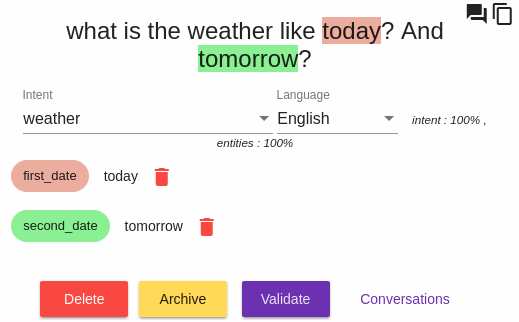

# Build a New NLU (Natural Language Understanding) Model

## Overview

Seven tabs are available:

1. **Try it** : add (or test) a new sentence
2. **Inbox** : not yet qualified sentences
3. **Archive** : the set of archived sentences, i. e. marked as not yet recognized by the model.
4. **Search** : an advanced search interface that lets you search for sentences, whether or not they are qualified.
5. **Intents** : the list of the model's intentions
6. **Entities** : the list of model entities
7. **Logs** : the last queries requested via the NLP API 

The user is redirected by default to *Inbox*.

## Add and Qualify Sentences

### Add a New Sentence

Click on the *New Sentence* menu and enter the new sentence. The add a new user intent by selecting "Create a New Intent" in the "Intent" selection list.

 
### Declaring Entities
 
If necessary, you can specify the entities of this new intent, by selecting the text of these entities, and then clicking on the "Add New Entity" button that has just appeared.

 
It's up to you to choose an existing entity type, or create a new one, and then give that entity a role.

### Built-in Entities

In the window "Add Entity", you can see that there are already pre-existing entities (prefixed by **duckling**). These are the entities recognized by the eponymous library. These entities will be recognized and valued automatically if you specify them in at least one sentence of the intent.

### Validate a Sentence

If you think that the sentence is  qualified correctly, you just have to click on "Validate" to confirm that the sentence is ok. If this is not the case, it's up to you to correct the meaning before validating it.

You are building your first model!

## Explore the Model

### The Search Tab

The **Search** tab allows you to browse all the sentences of the model. The most used criterion is the full text search input (regular expressions are allowed).

You can then consult the sentences that are part of your model, and also change the qualifications of these sentences over time.

### States of a Sentence

Each sentence has a state:

* **Inbox** : The sentence has not been qualified yet and is not included in the model
* **Validated** : The sentence has been validated but is not yet included in the NLP model (this can take some time for large models)
* **Included in model** : The sentence has been validated and is included in the model

## Advanced Features

By clicking on the "Applications"menu, you get the list of existing applications.

Then click of the *edit* button of the application you want to configure.

### Nlp Engine Selection

You can select the NLP library used by this application with the "NLP engine" radio button:

### Use Built-in Entity Models

This option allows you to reuse built-in entity models (ie duckling) in your new intent. For example, if you create an intent with a duckling:datetime entity, the dates will automatically be recognized for that intent in all new sentences assigned to that intent (Internally, a merge is performed between the info given by the built-in entity models and the info of your own model).

This option is enabled by default, it can be useful to disable it for very large models, for which the NER detection will perform better in almost all cases.

### Use sub-entities

If you enable this option, you will be able to qualify multiple levels of entities:

The number of levels is not limited, but it is advisable not to specify more than 3 or 4.

### Use predefined values

An entity can have predefined values : you just have to click on "Entities" tab, and select an entity.
A small icon next to the delete icon shows the types of entities you can edit as shown in the picture below:

