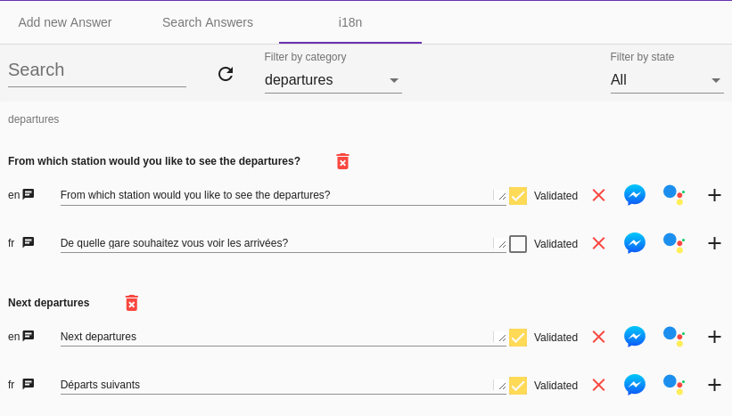

# Translate bot responses

## Activation

The Tock framework provides an internationalization framework.
It is disabled by default.

To activate it, add this code when starting the bot:

```kotlin
    Translator.enabled = true
```

or set the system property ```-Dtock_i18n_enabled=true```.

## How to develop for more than one locale

### Let's Code

The code does not change once the internationalization is activated. For example: 

```kotlin
     send("Arrival at {0}", time)
```
is a valid code whether the module is activated or not.

On the other hand, at runtime, the behavior differs significantly.

If internationalization is enabled, the following operations will be performed:

1. A key will be generated from the text passed in parameter, according to the namespace (the organization of the creator of the bot)
 and the story in which this wording is requested. In the case above, it will look like ```app_arrivals_arrival_Arrival at {0}``` where *app* is the namespace and
*arrivals* the main intention of the story.

2. The framework checks if this key is already present.
    * If this is the case, it uses the label present in the database for the requested locale to find the most appropriate translation (the connector or the type of interface can also be taken into account)
    * Otherwise, a key is created with the default label ("Arrival at {0}" in our example) used for the current locale
  
3. It is then possible to consult and modify this label in the administration interface:



### Supported format

The supported format is the standard i18n java format used by [MessageFormat](https://docs.oracle.com/javase/10/docs/api/java/text/MessageFormat.html)
and [ChoiceFormat](https://docs.oracle.com/javase/10/docs/api/java/text/ChoiceFormat.html) :

```kotlin
    send("There {0,choice,0#are no files|1#is one file|1<are {0,number,integer} files}.", 2)  
```

In addition, Tock provides a *by* extension for dates that allows you to specify a dedicated format for the parameters:

```kotlin
    send("Departure at {0}", departureDateTime by timeFormat) 
``` 

### User Locale

* When possible, the user locale is imported from the user account of the connector. For example, if the Messenger account is configured in French, French will be automatically
used as the user locale by Tock.

* If there is no account locale, the ```defaultLocale``` value is taken into account.
You can modify this default value with a system property: ```-Dtock_default_locale=fr```
  
* Finally it is possible to modify the locale of the user in the bot itself:

```kotlin
    userPreferences.locale = Locale.FRENCH
```  

### Points of attention

* Tock's internationalization module is effective, but some practices, yet intuitive in Kotlin,
are to be banished.

For example, this code works perfectly well with the disabled i18n module.

```kotlin
    send("There are $nb files") //DANGER!! 
```

but is problematic if i18n is enabled. A new label will be inserted for each different value of the *nb* variable!
 

If it is necessary to send "not to translate" answers, use
*BotBus.sendRaw*, *BotBus.endRaw*, or *String.raw* methods. 

```kotlin
    send("There are $nb files".raw) //CORRECT 
```

```kotlin
    send("There are {0} files", nb) //BETTER 
```      

The risk of collision between two labels is low since the main intention of the story is part of the key.
However, if you want to avoid any risk, you can use the *i18nKey* method:    
    
```kotlin
    send(i18nKey("my_unique_key", "There are {0} files", nb)) 
```  

### Test internationalization

An example of an i18n test is available in the
[open data bot source code](https://github.com/theopenconversationkit/tock-bot-open-data/tree/master/src/test/kotlin/fr/vsct/tock/bot/open/data/rule).
You need to use a custom [test extension](https://github.com/theopenconversationkit/tock-bot-open-data/blob/master/src/test/kotlin/fr/vsct/tock/bot/open/data/rule/OpenDataJUnitExtension.kt)
to indicate the [label translations](https://github.com/theopenconversationkit/tock-bot-open-data/blob/master/src/test/kotlin/fr/vsct/tock/bot/open/data/rule/TranslatorEngineMock.kt).

And the test looks like:
 
```kotlin

    @Test
    fun `search story asks for departure date WHEN there is a destination and an origin but no departure date in context`() {
        ext.newRequest("Recherche", search, locale = Locale.FRENCH) {
            destination = lille
            origin = paris

            run()

            firstAnswer.assertText("Quand souhaitez-vous partir?")
        }
    }
``` 

## Administration interface

### The different variants

Each label has a default value for each language of the bot.

It is also possible to indicate specific answers:

- by connector type (Messenger, Google Assistant, Slack, etc.)
- by type of interface (Text or voice) - this is useful for example in the case of Google Assistant to support
 the voice only use cases.
 
Finally, you can specify *alternatives*.
In this case, the bot uses one of the possible alternatives at random, each time it sends a response to the user.

### Import and export of data

Labels import/export (json or csv format) is available. When importing, only
labels indicated as *validated* are taken into account.
    