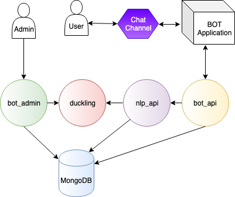

# Développer en mode _Tock Bot API_

Le mode _Bot API_ de Tock permet de développer des bots en se connectant à une plateforme _NLU_ Tock d'une manière peu 
couplée car n'ayant pas accès à la base de données (MongoDB), contrairement au mode _Bot Framework_.



C'est donc le mode de développement Tock recommandé pour démarrer, ainsi que dans des scenarios ou l'accès partagé à la 
base de données serait un problème.

> Par exemple, seul le mode _Bot API_ est autorisé sur la [plateforme de démonstration](https://demo.tock.ai/)
>publique Tock (pour des raisons de sécurité évidentes).

Cette page présente le développement de bots Tock en mode _Bot API_ en [Kotlin](https://kotlinlang.org/). 
Notez qu'il est possible de développer dans n'importe quel langage via la _Bot API_ - _une documentation pour un autre langage devrait bientôt arriver._

> Une autre section présente le mode [_Bot Framework_](bot-integre.md), plus intégré mais aussi plus couplé à la plateforme Tock.

## Développer en _Bot API_ en Kotlin

### Pré-requis / Architecture

Pour utiliser le mode _Bot API_ de Tock, un module spécifique doit être déployé avec la plateforme. Généralement appelé 
`bot-api` dans les descripteurs Docker Compose par exemple, ce service a pour rôle :

* D'exposer la _Bot API_ aux clients potentiels quelque soit leur langage de programmation
* D'accepter des connexions en _WebSocket_

Le guide [Déployer Tock avec Docker](../guide/plateforme.md) ou encore le chapitre 
[Installation](../admin/installation.md) montrent comment déployer ce module si nécessaire.

> Le module `bot-api` est déjà déployé sur la [plateforme de démonstration Tock](https://demo.tock.ai/).

### Activer le mode WebSocket

C'est le mode à privilégier au démarrage car le plus simple à mettre en oeuvre.

Pour utiliser le client websocket, il faut ajouter la dépendance `tock-bot-api-websocket` à votre application/projet [Kotlin](https://kotlinlang.org/).

Par exemple dans un projet [Maven](https://maven.apache.org/) :

```xml
        <dependency>
            <groupId>ai.tock</groupId>
            <artifactId>tock-bot-api-websocket</artifactId>
            <version>19.3.3</version>
        </dependency>
```

Ou dans un projet [Gradle](https://gradle.org/) :

```gradle
      compile 'fr.vsct.tock:tock-bot-api-websocket:19.3.3'
```

### Activer le mode WebHook

Pour utiliser le client _WebHook_, il faut ajouter la dépendance `tock-bot-api-webhook` à votre application/projet [Kotlin](https://kotlinlang.org/).

Par exemple dans un projet [Maven](https://maven.apache.org/) :

```xml
        <dependency>
            <groupId>ai.tock</groupId>
            <artifactId>tock-bot-api-webhook</artifactId>
            <version>19.3.3</version>
        </dependency>
```

Ou dans un projet [Gradle](https://gradle.org/) :

```gradle
      compile 'fr.vsct.tock:tock-bot-api-webhook:19.3.3'
```

Dans ce cas, contrairement au mode _WebSocket_, il faut que l'application/bot démarrée soit joignable par la 
 plateforme Tock. Son URL doit être indiquée dans le champ _webhook url_ dans la vue _Configuration_ > _Bot Configurations_ 
 de l'interface _Tock Studio_.
 
### Paramétrer la clé d'API
 
Dans _Tock Studio_, après avoir configuré un bot, allez dans _Configuration_ > _Bot Configurations_ et copiez 
la clé d'API du bot auquel vous souhaitez vous connecter.
 
Vous pourrez saisir/coller cette clef dans le code Kotlin (voir ci-dessous).
 
### Créer des parcours en Kotlin 
 
Pour le moment, les composants suivants sont supportés pour les réponses :
 
* Texte brut
* Format "carte"
* Formats spécfiques aux différents canaux intégrés
 
Voici un exemple de bot simple avec quelques parcours déclarés : 
 
```kotlin
fun main() {
    start(
        newBot(
            "PUT-YOUR-TOCK-APP-API-KEY-HERE", // Get your app API key from Bot Configurations in Tock Studio
             newStory("greetings") { // Intent 'greetings'
                 end("Bonjour!") // Raw text answer
             },
             newStory("location") { // Intent 'location'
                 end(
                     newCard(
                         "Le titre de la carte",
                         "Un sous-titre",
                         newAttachment("https://url-image.png"),
                         newAction("Action 1"),
                         newAction("Action 2", "http://redirection") // Anwser with a card - including text, image and actions
                     )
                 )
             },
             newStory("goodbye") { // Intent 'goodbye'
                 end {
                     // Answer with Messenger-specific button/quick reply
                     buttonsTemplate("Etes-vous sûr(e) de vouloir partir ?", nlpQuickReply("Je reste"))
                 } 
             },
             unknownStory {
                 end("Je n'ai pas compris. Mais j'apprends tous les jours :)") // Default answer
             }
        ),
        "http://localhost:8080" // Local platform URL (default host/port)
    )
}
```
 
### Tester avec la plateforme de démonstration

Plutôt que déployer se propre plateforme Tock, il est possible de tester le mode _WebSocket_ directement sur la
[plateforme de démonstration Tock](https://demo.tock.ai/). 

Pour cela, il suffit de remplacer la méthode `start` par `startWithDemo` (sans préciser l'adresse de la plateforme).

## Développer dans un autre langage

Il est possible de développer dans n'importe quel langage en programmant directement via l'API.
 
> TODO : contrat en cours de stabilisation & documentation à venir.
