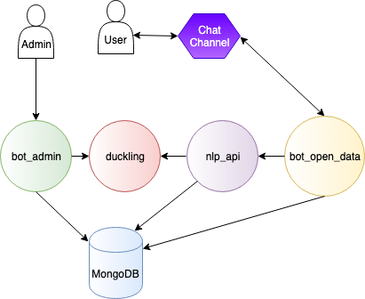

# Développer des bots avec Tock

Pour aller plus loin que les possibilités de _Tock Studio_ pour construire bots & assistants conversationnels, 
on peut programmer des parcours, en [Kotlin](https://kotlinlang.org/) ou dans d'autres langages.

Deux modes / frameworks / architectures sont proposés :

## Le mode _Bot API_

Le mode _Tock Bot API_ (recommandé pour la plupart des cas) permet de développer en [Kotlin](https://kotlinlang.org/) 
ou un autre langage à travers l'API conversationnelle de Tock :

Ce mode est le seul disponible sur la [plateforme de démonstration Tock](https://demotock-production-admin.vsct-prod.aws.vsct.fr/). 
C'est aussi le seul mode permettant de développer dans n'importe quel langage de programmation, via l'API.

Pour en savoir plus, voir la page [_Bot API_](bot-api.md).

## Le mode _Bot intégré_

Dans ce mode, vous pouvez accéder à toutes les fonctionnalités et possibilités du framework Tock pour développer un bot. 

> C'est le mode de développement historique de Tock, et actuellement la plupart des bots publiés par les concepteurs de Tock.
sont développés de cette manière. 
 
La mise en place de la solution est plus complexe que le mode _Bot API_ et nécessite notamment que le composant bot 
accède directement à la base de données MongoDB. Il est donc nécessaire pour utiliser ce mode :

- D'installer une plateforme (généralement avec [Docker](https://www.docker.com/)) sur son poste ou sur un serveur
- De partager la connexion à la base MongoDB entre les poste de développement et les autres composants 
de la plateforme Tock utilisée
- De maîtriser le langage de programmation [Kotlin](https://kotlinlang.org/)

Pour en savoir plus, voir la page [_Bot intégré_](bot-integre.md).
