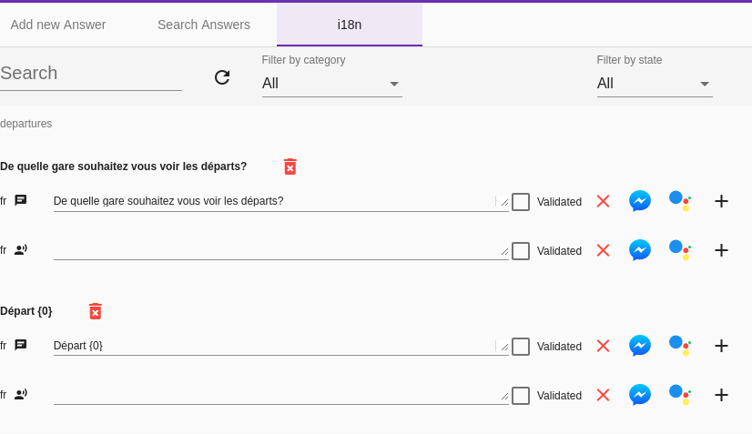

# Comment développer un Assistant

## Ajouter une première réponse - Le menu "Build"'

### Créer une Story via l'interface d'administration

Dans le menu "Build" il est possible de créer une réponse à une intention du modèle.

#### Réponse simple

Dans l'onglet "New Story", indiquez une phrase d'exemple, la réponse attendue,
 puis sur le bouton "Create Story".
 
Il est maintenant possible de tester (via le menu "Test") que le bot répond correctement
à la phrase d'exemple.

#### Réponses Complexes

Il est possible d'indiquer plusieurs réponses et également des réponses "riches" appelées "Media Message".

Cela permet, quel que soit le canal d'afficher des images, des titres, des sous-titres et des boutons d'action.

#### Entités obligatoires

Il est possible, avant d'afficher la réponse principale, de vérifier si certaines entitées
sont renseignées, et si ce n'est pas le cas, d'afficher la question adéquate.

L'option correspondante est appellée "Mandatory Entities".

Par exemple, supposons que nous ayons besoin de connaître la destination de l'utilisateur.
Si il ne l'a pas déjà indiquée, Nous allons lui poser la question "Pour quelle destination ?"  

#### Actions

Les actions sont présentées comme des suggestions quand le canal le permet.
Il est possible de présenter une arborescence d'actions pour construire un arbre de décision.

### Bot Flow

Cet onglet permet de visualiser les différents arbres de décisions configurés,
et également de visualiser tout ce qui a été réellement effectué par les utilisateurs.

### Modification des réponses et internationalisation

Enfin il est possible de modifier chaque réponse du bot par type d'interface (chat/voix), par type de connecteur et par langue
via l'onglet **i18n**.

Il est aussi possible de rajouter des réponses alternatives ( à chaque fois une réponse de la liste sera choisie au hasard) via cette interface.

## Le menu Test

Via ce menu, vous pouvez commencer à tester le bot :

L'interface est minimale car il s'agit d'un mode de test. 

L'objectif reste de faire dialoguer vos utilisateurs avec le bot via des canaux comme Messenger, Google Assistant...
ou vos sites ou applications.

## Le menu Monitoring

Il est ensuite possible de consulter la discussion que vous venez d'avoir avec le bot via l'onglet Monitoring

Ici, le canal est indiqué comme étant celui de Messenger puisque il a été simulé une conversation Messenger.

## Deux possibilités de développement

Pour aller plus loin dans le développement d'un assistant, il va nécessaire d'utiliser des scripts
ou du code. 

### Assistant Tock

Dans ce mode, vous accès à l'intégralité des fonctionnalités que met à disposition Tock
 pour développer un Bot. C'est de cette manière que sont développés aujourd'hui les bots publiés par
 les concepteurs de Tock. 
 
Cependant la phase de mise en place de la solution est assez complexe.
Il est en effet nécessaire :

- D'installer une stack docker sur son poste ou sur son serveur
- De permettre la connexion partagée à la base MongoDB entre les poste de dev et la stack Tock utilisée
- De maîtriser le langage Kotlin

### Assistant via API

Si vous souhaitez évaluer la solution Tock, il est conseillé d'utiliser les APIs (actuellement en phase béta) 
mises à disposition par Tock. Deux options s'offrent à vous.

#### Installer Tock sur votre serveur

Vous installez la stack docker de Tock sur votre serveur. 

Vous conservez ainsi l'ensemble de vos données. 
Vos développeurs utilisent l'API pour se connecter à Tock. Ils n'ont donc pas besoin d'avoir accès à la base de données de Tock.

#### Utiliser la plateforme de démonstration 

Vous pouvez également utiliser la [plateforme de démonstration mutualisée de Tock](https://demotock-production-admin.vsct-prod.aws.vsct.fr).

Dans ce cas, il n'est pas nécessaire d'installer Tock sur vos serveurs.

A noter cependant que cet usage convient pour un environnement de développement 
et en aucun cas pour un environnement de production.