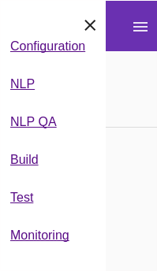

# Commencer à utiliser Tock

## Un exemple de bot

Un bot d'exemple utilisant Tock est mis à disposition sur github : [https://github.com/voyages-sncf-technologies/tock-bot-open-data](https://github.com/voyages-sncf-technologies/tock-bot-open-data).
 
Il se base sur les [API Open Data de la SNCF](https://data.sncf.com/), et présente des fonctionnalités minimales permettant de démontrer l’usage de Tock. 

Il s'agit d'un bon point de départ, puisque il comporte également un modèle NLP très simple.
Bien entendu, comme le modèle n'est pas complet, la qualité du bot est faible, mais suffit cependant à démontrer le principe de l'outil.

Dans la suite de la documentation, nous nous référerons à cet exemple pour couvrir l'ensemble des fonctionnalités. 

## Images Docker

Des images docker sont mises à disposition pour faciliter le démarrage.

Ces images sont disponibles dans le [Hub Docker](https://hub.docker.com/r/tock/).

Le code source utilisé pour construire ces images, ainsi que les fichiers [docker-compose](https://docs.docker.com/compose/) 
utilisés pour démarrer l'ensemble de la boite à outils *Tock* sont disponibles dans le repository github [https://github.com/voyages-sncf-technologies/tock-docker](https://github.com/voyages-sncf-technologies/tock-docker).

### Démarrer l'interface d'administration

```sh 
    #get the last docker-compose file
    curl -o docker-compose.yml https://raw.githubusercontent.com/voyages-sncf-technologies/tock-docker/master/docker-compose.yml
    #get the last tag
    curl -o .env https://raw.githubusercontent.com/voyages-sncf-technologies/tock-docker/master/.env
    #launch the stack
    docker-compose up
``` 

L'interface d'administration NLP est maintenant disponible sur le port 80 : [http://localhost](http://localhost)

l'identifiant par défaut est *admin@app.com* et le mot de passe *password*.

### Bot d'exemple basé sur les API Open Data

Une image docker est mis à disposition pour le lancer directement.
Les instructions pour la démarrer sont précisées dans le [projet github contenant les images docker](https://github.com/voyages-sncf-technologies/tock-docker#user-content-run-the-open-data-bot-example).

## Menu de l'interface d'administration

Le menu à gauche permet d'accéder aux différentes fonctionnalités.

le menu **Configuration** permet de créer de nouveaux modèle et de paramétrer les options importantes.

Les menus **NLP** et **NLP QA** sont dédiés à la construction de modèles.

Les menus **Build**, **Test** et **Monitoring** sont eux utilisés dans le cadre de la construction de bots ou d'assistants.

