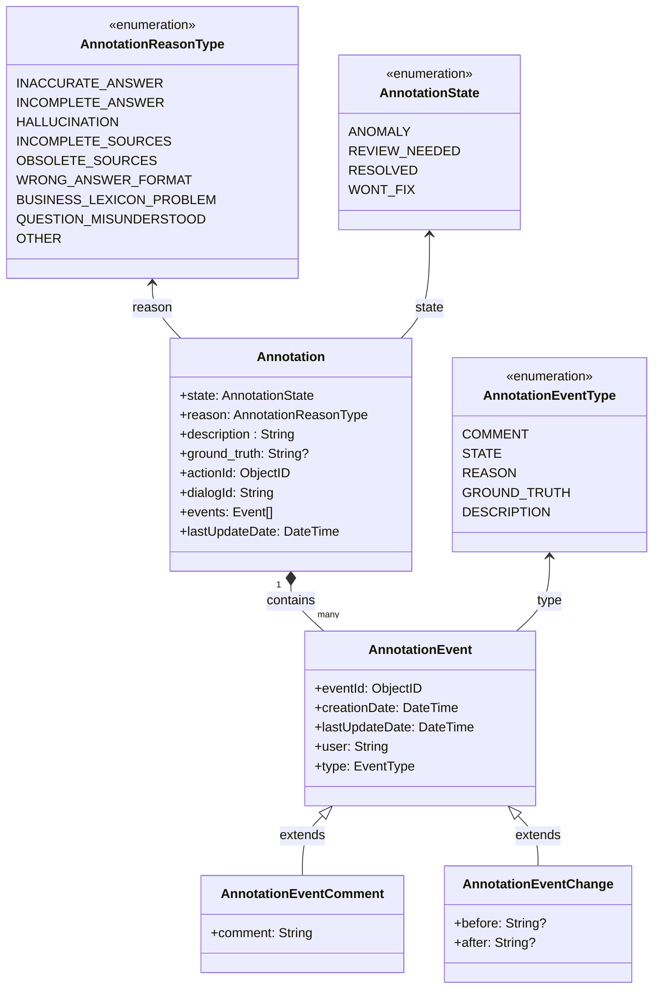

# Gestion des Annotations et events - DERCBOT-1309

**Epic Jira** : [*DERCBOT-1309*](http://go/j/DERCBOT-1309)


## Contexte et objectif de la feature

Ce document de design définit la gestion des annotations et des events liés aux réponses du bot. L'objectif est d'offrir aux administrateurs et développeurs les outils nécessaires pour évaluer, annoter, et tracer les anomalies ainsi que leurs résolutions.

### Périmètre de la fonctionnalité
Les annotations permettent :
- Aux **administrateur de bot** de marquer une anomalie, de l’analyser et d’y associer des états et raisons spécifiques.
- Aux **administrateur de bot** de filtrer et de suivre les résolutions des anomalies.

## Cas d'usages

### En tant qu'administrateur de bot (rôle: botUser) :
* *UC1* - Je souhaite pouvoir **ajouter une annotation** sur une réponse du bot afin d’indiquer un problème.
* *UC2* - Je souhaite pouvoir **modifier les annotations existantes** pour refléter les changements d’état, les raisons, ou ajouter des commentaires.
* *UC3* - Je souhaite **suivre l'historique des events liés à une annotation** comme les changements d'état et les commentaires, pour garder une trace complète des décisions.
* *UC4* - Je souhaite pouvoir **filtrer les réponses** en fonction des états et des raisons des anomalies pour identifier les cas nécessitant une attention immédiate.
* *UC5* - Je souhaite pouvoir **modifier** un commentaire existant.
* *UC6* - Je souhaite pouvoir **supprimer** un commentaire existant.
---

## Modèle de données

### Structure et stockage des annotations

Chaque annotation est un sous-document unique associé à une action spécifique (`actionId`) au sein d'un dialogue (`dialogId`).
- Une action ne peut contenir **qu’une seule annotation** à la fois.
- L’annotation est **nullable**, ce qui signifie qu’une action peut exister sans annotation.
- Lorsqu’une annotation est supprimée, elle est simplement retirée de l’action sans affecter les autres données du dialogue.
- La suppression ou la modification d’une annotation suit la même logique que celle appliquée aux dialogues (ex. expiration alignée sur la purge des dialogues).




### Exemple de document stocké dans la collection :

Les events (`events`) sont toujours retournés dans l'ordre chronologique, triés par date.

Une purge sera mise sur les annotations, alignée sur la logique de purge des dialogs.

```json
{
  "_id": ObjectId("65a1b2c3d4e5f6a7b8c9d0e1"),
  "actionId": ObjectId("65a1b2c3d4e5f6a7b8c9d0e2"),
  "dialogId": "65a1b2c3d4e5f6a7b8c9d0e0",
  "state": "ANOMALY",
  "reason": "INACCURATE_ANSWER",
  "description": "La date donnée est incorrecte.",
  "ground_truth": "La date butoire de souscription au contrat est le 1er Janvier 2025",
  "events": [
    {
      "eventId": ObjectId("65a1b2c3d4e5f6a7b8c9d0e3"),
      "type": "STATE",
      "creationDate": ISODate("2023-10-01T10:00:00Z"),
      "lastUpdateDate": ISODate("2023-10-01T10:00:00Z"),
      "user": "USER192",
      "before": {
        "state": null
      },
      "after": {
        "state": "ANOMALY"
      }
    },
    {
      "eventId": ObjectId("65a1b2c3d4e5f6a7b8c9d0e4"),
      "type": "COMMENT",
      "creationDate": ISODate("2023-10-01T10:05:00Z"),
      "lastUpdateDate": ISODate("2023-10-01T10:05:00Z"),
      "user": "USER192",
      "comment": "La date donnée est incorrecte."
    },
    {
      "eventId": ObjectId("65a1b2c3d4e5f6a7b8c9d0e5"),
      "type": "STATE",
      "creationDate": ISODate("2023-10-01T11:00:00Z"),
      "lastUpdateDate": ISODate("2023-10-01T11:00:00Z"),
      "user": "ADMIN1",
      "before": {
        "state": "ANOMALY"
      },
      "after": {
        "state": "REVIEW_NEEDED"
      }
    }
  ],
  "createdAt": ISODate("2023-10-01T10:00:00Z"),
  "lastUpdateDate": ISODate("2023-10-01T11:00:00Z"),
}
```

# API Routes Documentation


**[POST] /rest/admin/bots/:botId/dialogs/:dialogId/actions/:actionId/annotation**

Crée une nouvelle annotation.
Un event de changement d'état est automatiquement créé pour passer de `null` à l'état initial `ANOMALY`.  
Une annotation ne peut pas être créée si un event existe déjà pour la même `actionId`.

**Path Parameter**
- `botId` : Identifiant unique du bot.
- `dialogId` : Identifiant unique du dialogue.
- `actionId` : Identifiant unique de l’action.

**Request Body:**

- `actionId`: Obligatoire
- `state`: Obligatoire
- `description`: Obligatoire
- `user`: Obligatoire
- `reason`: Facultatif
- `ground_truth`: Facultatif

**Response:**
```json
{
  "_id": "65a1b2c3d4e5f6a7b8c9d0e1",
  "actionId": "65a1b2c3d4e5f6a7b8c9d0e2",
  "dialogId": "65a1b2c3d4e5f6a7b8c9d0e0",
  "state": "ANOMALY",
  "reason": "INACCURATE_ANSWER",
  "description": "Pas la bonne date de souscription",
  "ground_truth": null,
  "events": [
    {
      "eventId": "65a1b2c3d4e5f6a7b8c9d0e3",
      "type": "STATE",
      "creationDate": "2023-10-01T10:00:00Z",
      "lastUpdateDate": "2023-10-01T10:00:00Z",
      "user": "USER192",
      "before": null,
      "after": {
        "state": "ANOMALY"
      }
    }
  ],
  "createdAt": "2023-10-01T10:00:00Z",
  "lastUpdateDate": "2023-10-01T10:00:00Z",
  "expiresAt": "2023-12-01T10:00:00Z"
}
```

**[POST] /rest/admin/bots/:botId/dialogs/:dialogId/actions/:actionId/annotation/:annotationId/events**

Crée un nouvel event associé à une annotation spécifique.

**Path Parameters** :
- `botId` : Identifiant unique du bot.
- `dialogId` : Identifiant unique du dialogue.
- `actionId` : Identifiant unique de l’action.
- `annotationId` : Identifiant unique de l'annotation.

**Request Body:**
- `type`: Type de l'event (par exemple, COMMENT, STATE, REASON, GROUND_TRUTH).
- `user`: Utilisateur ayant créé l'event.
- `comment`: (Facultatif) Commentaire associé à l'event.
- `before`: (Facultatif) État précédent pour les events de modification.
- `after`: (Facultatif) Nouvel état pour les events de modification.

**Response Example (COMMENT):**
```json
{
  "eventId": "65a1b2c3d4e5f6a7b8c9d0e3",
  "type": "COMMENT",
  "creationDate": "2025-01-01T12:00:00Z",
  "lastUpdateDate": "2025-01-01T12:00:00Z",
  "user": "USER192",
  "comment": "Le problème vient de la source de données Z"
}
```

**Response Example (STATE):**
```json
{
  "eventId": "65a1b2c3d4e5f6a7b8c9d0e5",
  "type": "STATE",
  "creationDate": "2023-10-01T11:00:00Z",
  "lastUpdateDate": "2023-10-01T11:00:00Z",
  "user": "ADMIN1",
  "before": {
    "state": "ANOMALY"
  },
  "after": {
    "state": "REVIEW_NEEDED"
  }
}
```

**Response Example (GROUND_TRUTH):**
```json
{
  "eventId": "65a1b2c3d4e5f6a7b8c9d0e7",
  "type": "GROUND_TRUTH",
  "creationDate": "2023-10-01T13:00:00Z",
  "lastUpdateDate": "2023-10-01T13:00:00Z",
  "user": "ADMIN1",
  "before": {
    "ground_truth": "La date butoire de souscription au contrat est le 1er Janvier 2025"
  },
  "after": {
    "ground_truth": "La date butoire de souscription est le 15 Février 2025."
  }
}
```

**[PUT] /rest/admin/bots/:botId/dialogs/:dialogId/actions/:actionId/annotation/events/:eventId**

Met à jour un event.  
On ne peut mettre à jour qu'un event de type `comment`.

Une mise à jour de lastUpdateDate sera faite lors de chaque modification.
Une comparaison sera faite sur le back-end entre l'objet stocké et l'objet retourné pour déterminer les changements opérés sur le front-end.

**Path Parameters** :
- `botId` : Identifiant unique du bot.
- `dialogId` : Identifiant unique du dialogue.
- `actionId` : Identifiant unique de l’action.
- `annotationId` : Identifiant unique de l'annotation.
- `eventId` : Identifiant unique de l'event.

**Response Example:**
```json
{
  "eventId": "65a1b2c3d4e5f6a7b8c9d0e3",
  "type": "COMMENT",
  "lastUpdateDate": "2025-01-01T12:00:00Z",
  "user": "USER192",
  "comment": "Le problème vient de la source de données X"
}
```

**[DELETE] /rest/admin/bots/:botId/dialogs/:dialogId/actions/:actionId/annotation/events/:eventId**

Supprime un event.  
On ne peut supprimer qu'un event de type `comment`.

**Path Parameter**
- `botId` : Identifiant unique du bot.
- `dialogId` : Identifiant unique du dialogue.
- `actionId` : Identifiant unique de l’action.
- `annotationId` : Identifiant unique de l'annotation.
- `eventId` : Identifiant unique de l'event.

**Response Example:**
```json
{
  "message": "Event deleted successfully"
}
```

The endpoint /dialogs/search will also reply with the action annotations.


### Sample d'utilisation :

**[POST] /rest/admin/bots/:botId/dialogs/:dialogId/actions/:actionId/annotation**

**Request Example:**
```json
{
  "actionId": "65a1b2c3d4e5f6a7b8c9d0e2",
  "state": "ANOMALY",
  "description": "La réponse donnée est incorrecte.",
  "user": "USER192",
  "reason": "INACCURATE_ANSWER"
}
```

**Response Example:**
```json
{
  "_id": "65a1b2c3d4e5f6a7b8c9d0e1",
  "actionId": "65a1b2c3d4e5f6a7b8c9d0e2",
  "dialogId": "65a1b2c3d4e5f6a7b8c9d0e0",
  "state": "ANOMALY",
  "description": "La réponse donnée est incorrecte.",
  "user": "USER192",
  "events": [],
  "createdAt": "2025-01-01T12:00:00Z",
  "lastUpdateDate": "2025-01-01T12:00:00Z"
}
```

**[POST] /rest/admin/bots/:botId/dialogs/:dialogId/actions/:actionId/annotation/:annotationId/events**

**Request Example:**
```json
{
  "type": "COMMENT",
  "user": "USER192",
  "comment": "L'erreur semble venir d'une mauvaise compréhension de la question."
}

```

**Response Example:**
```json
{
  "eventId": "65a1b2c3d4e5f6a7b8c9d0e3",
  "type": "COMMENT",
  "creationDate": "2025-01-01T12:05:00Z",
  "lastUpdateDate": "2025-01-01T12:05:00Z",
  "user": "USER192",
  "comment": "L'erreur semble venir d'une mauvaise compréhension de la question."
}
```

**[POST] /rest/admin/bots/:botId/dialogs/:dialogId/actions/:actionId/annotation/:annotationId/events**

**Request Example:**
```json
{
  "type": "STATE",
  "user": "ADMIN1",
  "before": {
    "state": "ANOMALY"
  },
  "after": {
    "state": "REVIEW_NEEDED"
  }
}
```

**Response Example:**
```json
{
  "eventId": "65a1b2c3d4e5f6a7b8c9d0e5",
  "type": "STATE",
  "creationDate": "2025-01-01T12:30:00Z",
  "lastUpdateDate": "2025-01-01T12:30:00Z",
  "user": "ADMIN1",
  "before": {
    "state": "ANOMALY"
  },
  "after": {
    "state": "REVIEW_NEEDED"
  }
}
```