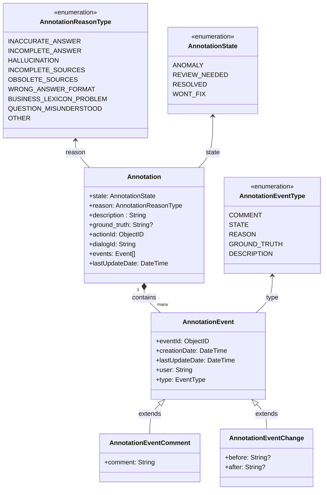

# Gestion des Annotations et events - DERCBOT-1309

**Epic Jira** : [*DERCBOT-1309*](http://go/j/DERCBOT-1309)


## Contexte et objectif de la feature

Ce document de design définit la gestion des annotations et des events liés aux réponses du bot. L'objectif est d'offrir aux administrateurs et développeurs les outils nécessaires pour évaluer, annoter, et tracer les anomalies ainsi que leurs résolutions.

### Périmètre de la fonctionnalité
Les annotations permettent :
- Aux **administrateur de bot** de marquer une anomalie, de l’analyser et d’y associer des états et raisons spécifiques.
- Aux **administrateur de bot** de filtrer et de suivre les résolutions des anomalies.

## Cas d'usages

### En tant qu'administrateur de bot (rôle: botUser) :
* *UC1* - Je souhaite pouvoir **ajouter une annotation** sur une réponse du bot afin d’indiquer un problème.
* *UC2* - Je souhaite pouvoir **modifier une annotation existante** pour refléter les changements d’état, les raisons, ou ajouter des commentaires.
* *UC3* - Je souhaite **suivre l'historique des events liés à une annotation** comme les changements d'état et les commentaires, pour garder une trace complète des décisions.
* *UC4* - Je souhaite pouvoir **filtrer les réponses** en fonction des états et des raisons des anomalies pour identifier les cas nécessitant une attention immédiate.
* *UC5* - Je souhaite pouvoir **modifier** un commentaire existant.
* *UC6* - Je souhaite pouvoir **supprimer** un commentaire existant.
---

## Modèle de données

### Structure et stockage des annotations

Chaque annotation est un sous-document unique associé à une action spécifique (`actionId`) au sein d'un dialogue (`dialogId`).
- Une action ne peut contenir **qu’une seule annotation** à la fois.
- L’annotation est **nullable**, ce qui signifie qu’une action peut exister sans annotation.
- Lorsqu’une annotation est supprimée, elle est simplement retirée de l’action sans affecter les autres données du dialogue.
- La suppression ou la modification d’une annotation suit la même logique que celle appliquée aux dialogues (ex. expiration alignée sur la purge des dialogues).




### Exemple de document stocké dans la collection :

Une purge sera mise sur les annotations, alignée sur la logique de purge des dialogs.

```json
{
  "annotation": {
    "_id": "67980231d6fe5b49dd565613",
    "actionId": "6797fc4fe8fd32779aa7cae7",
    "dialogId": "6797fc4de8fd32779aa7cae0",
    "state": "ANOMALY",
    "reason": "INACCURATE_ANSWER",
    "description": "Il devrait suggérer de bloquer la carte en urgence.",
    "groundTruth": null,
    "events": [
      {
        "eventId": "67980231d6fe5b49dd565614",
        "creationDate": {
          "$date": "2025-01-27T22:01:21.853Z"
        },
        "lastUpdateDate": {
          "$date": "2025-01-27T22:01:21.853Z"
        },
        "user": "admin@app.com",
        "before": null,
        "after": "ANOMALY",
        "type": "STATE"
      },
      {
        "eventId": "6798080853bf0c3beaab8827",
        "creationDate": {
          "$date": "2025-01-27T22:26:16.237Z"
        },
        "lastUpdateDate": {
          "$date": "2025-01-27T22:26:16.237Z"
        },
        "user": "admin@app.com",
        "comment": "Le problème est en cours de traitement",
        "type": "COMMENT"
      }
    ],
    "createdAt": {
      "$date": "2025-01-27T22:01:21.853Z"
    },
    "lastUpdateDate": {
      "$date": "2025-01-27T22:26:16.241Z"
    }
  }
}
```

# API Routes Documentation


**[POST] /rest/admin/bots/:botId/dialogs/:dialogId/actions/:actionId/annotation**

Crée une nouvelle annotation.
Une annotation ne peut pas être créée si une annotation existe déjà pour la même `actionId`.

**Path Parameter**
- `botId` : Identifiant unique du bot.
- `dialogId` : Identifiant unique du dialogue.
- `actionId` : Identifiant unique de l’action.

**Request Body:**

- `state`: Obligatoire
- `description`: Obligatoire
- `reason`: Facultatif
- `groundTruth`: Facultatif

**Corps:**
```json
{
  "state": "ANOMALY",
  "description": "Il devrait suggérer de bloquer la carte en urgence.",
  "reason": "INACCURATE_ANSWER"
}
```
**Response:**
```json
{
  "_id": "679b8c1d0d0fbf25765d05f8",
  "actionId": "679b7f3fab395066f2740f7e",
  "dialogId": "679b7f19ab395066f2740f6c",
  "state": "RESOLVED",
  "reason": "INACCURATE_ANSWER",
  "description": "Test Description",
  "groundTruth": "GTTEST",
  "events": [
    {
      "eventId": "679b8c1d0d0fbf25765d05f9",
      "creationDate": "2025-01-30T14:26:37.886678871Z",
      "lastUpdateDate": "2025-01-30T14:26:37.886682153Z",
      "user": "admin@app.com",
      "after": "RESOLVED",
      "type": "STATE"
    }
  ],
  "createdAt": "2025-01-30T14:26:37.886665600Z",
  "lastUpdateDate": "2025-01-30T14:26:37.886644088Z"
}
```

**[POST] /rest/admin/bots/:botId/dialogs/:dialogId/actions/:actionId/annotation/events**

Crée un nouvel event de type comment.

**Path Parameters** :
- `botId` : Identifiant unique du bot.
- `dialogId` : Identifiant unique du dialogue.
- `actionId` : Identifiant unique de l’action.

**Request Body:**
- `type`: Type de l'event: COMMENT
- `comment`: Commentaire associé à l'event.

**Corps Example (COMMENT):**
```json
{
  "type": "COMMENT",
  "comment": "Le problème est en cours de traitement"
}
```

**Response Example (COMMENT):**
```json
{
  "eventId": "67989c8a4efa5148b2818ac8",
  "creationDate": "2025-01-28T08:59:54.980977949Z",
  "lastUpdateDate": "2025-01-28T08:59:54.980982209Z",
  "user": "admin@app.com",
  "comment": "Le problème est en cours de traitement",
  "type": "COMMENT"
}
```

**[PUT] /rest/admin/bots/:botId/dialogs/:dialogId/actions/:actionId/annotation/**

Met à jour une annotation.

Une mise à jour de lastUpdateDate sera faite lors de chaque modification.
Une comparaison est faite sur le back-end entre l'objet stocké sur Mongo et l'objet retourné par le front our déterminer les changements opérés.  

**Path Parameters** :
- `botId` : Identifiant unique du bot.
- `dialogId` : Identifiant unique du dialogue.
- `actionId` : Identifiant unique de l’action.

**Corps Example**
```json
{
  "state": "ANOMALY",
  "description": "Test",
  "reason": "INACCURATE_ANSWER",
  "groundTruth" : "Test groundTruth"
}
```

**Response Example:**
```json
{
  "_id": "67a210b8f8a965501c20eab0",
  "state": "ANOMALY",
  "reason": "INACCURATE_ANSWER",
  "description": "Test",
  "groundTruth": "Test groundTruth",
  "events": [
    {
      "eventId": "67a210b8f8a965501c20eab1",
      "creationDate": "2025-02-04T13:06:00.055Z",
      "lastUpdateDate": "2025-02-04T13:06:00.055Z",
      "user": "admin@app.com",
      "after": "RESOLVED",
      "type": "STATE"
    },
    {
      "eventId": "67a210f3f8a965501c20eab2",
      "creationDate": "2025-02-04T13:06:59.476430153Z",
      "lastUpdateDate": "2025-02-04T13:06:59.476433924Z",
      "user": "admin@app.com",
      "before": "RESOLVED",
      "after": "ANOMALY",
      "type": "STATE"
    }
  ],
  "creationDate": "2025-02-04T13:06:00.055Z",
  "lastUpdateDate": "2025-02-04T13:06:59.476452642Z"
}
```

**[DELETE] /rest/admin/bots/:botId/dialogs/:dialogId/actions/:actionId/annotation/events/:eventId**
Supprime un event de type comment.

**Path Parameter**
- `botId` : Identifiant unique du bot.
- `dialogId` : Identifiant unique du dialogue.
- `actionId` : Identifiant unique de l’action.
- `eventId` : Identifiant unique de l'event.

**Response Example:**
```json
{
  "message": "Event deleted successfully"
}
```

**[PUT] /rest/admin/bots/:botId/dialogs/:dialogId/actions/:actionId/annotation/events/:eventId**
Met à jour un event de type comment.

**Path Parameters** :
- `botId` : Identifiant unique du bot.
- `dialogId` : Identifiant unique du dialogue.
- `actionId` : Identifiant unique de l'action.
- `eventId` : Identifiant unique de l'event.

The endpoint /dialogs/search will also reply with the action annotations.