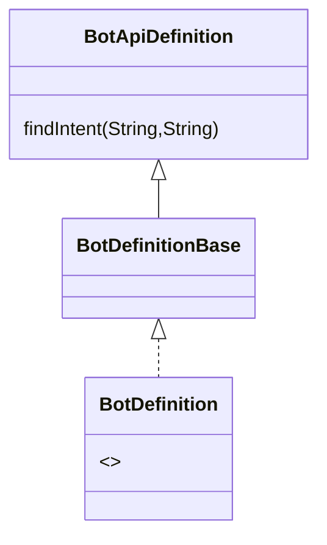
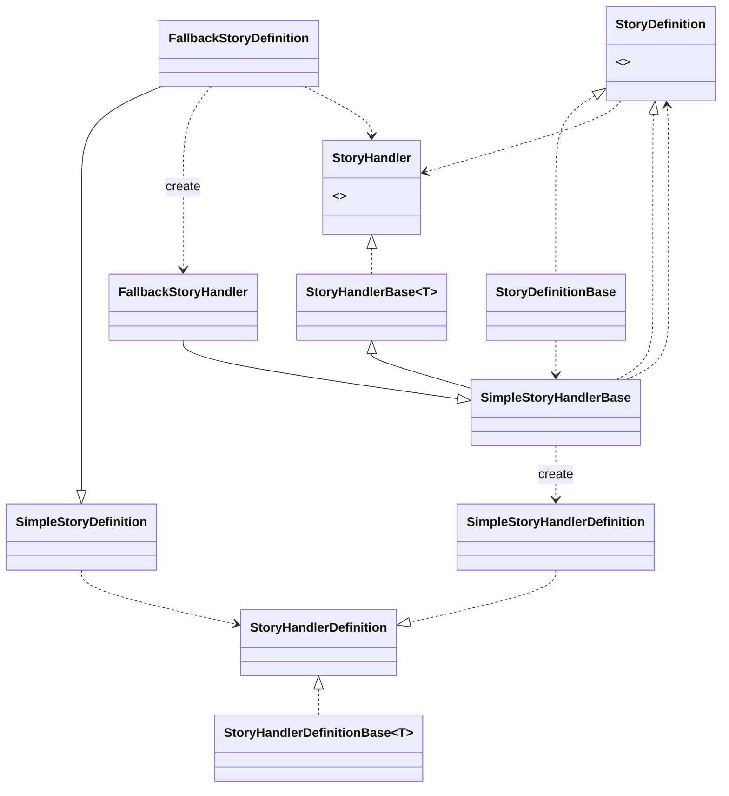

# BotApi
Le client `botApiClient`envoie au bot des `RequestData` et reçoit des `ResponseData`.
La définition du bot est définit par sa `BotConfiguration` qui construit des Story via sa `ClientConfiguration`

## Les échanges avec le botApi

### BotApiDefinition
Hérite d'un `BotDefinitionBase` et implémente un `BotDefinition`
Définit le bot dans le mode Api.

- Soit :

### BotConfiguration
Contient les informations présentes sur la configuration du bot (exemple son apikey, so nom, le modèle de nlp, les localisations supportés, l'url du webhook)

### Une nouvelle story definition et son handler

