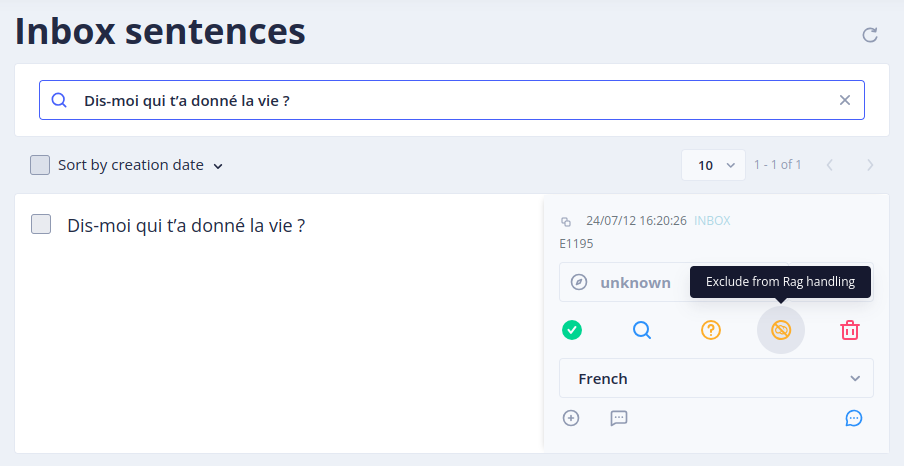
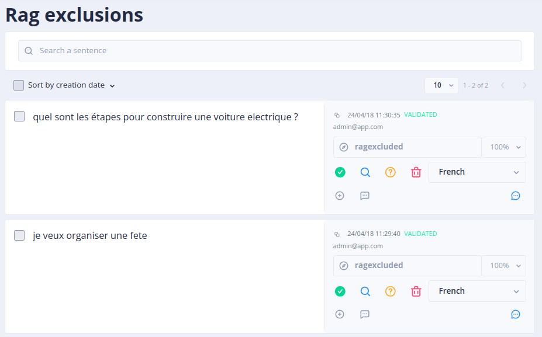

# Le menu _Gen AI / RAG Exclusions_

La "RAG Exclusions" est un concept qui permet à TOCK d'exclure des sujets du périmètre de réponse IA apportée par la RAG.

En complément du prompt, il permet de limiter les réponses du bot afin qu’il reste dans son périmètre d’action et ne crée pas de réponse trop inventive.

Pour ajouter des sujets ou phrases que le bot ne doit pas traiter :
1. Aller dans le menu **_Language Understanding / Inbox_**
2. Sélectionner la phrase que vous souhaitez exclure
3. Cliquer sur “Exclude from RAG handling”

Sur l'écran **_Gen Ai / RAG Exclusions_**, vous verrez toutes les phrases/sujets qui ont été exclus des réponses du Bot.

