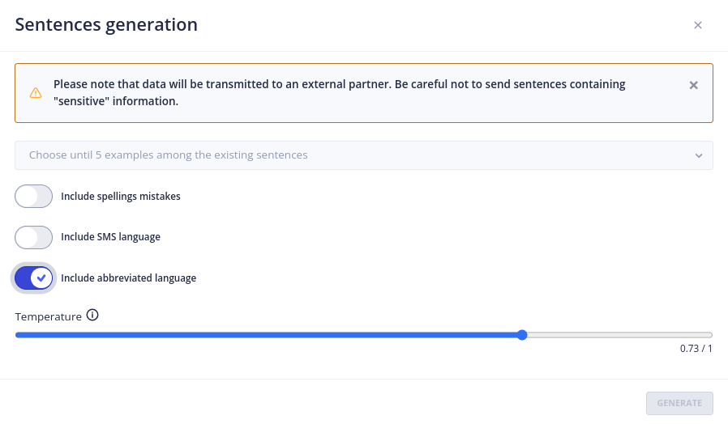

# Le menu _Gen AI - Sentence generation_

## Configuration

Le menu _Gen AI - Sentence Generation Settings_ permet de configurer la fonctionnalité de génération de phrases d'entraînement pour les bots FAQ.

> Pour accéder à cette page il faut bénéficier du rôle **_botUser_**.
>  ( plus de détails sur les rôles dans [securité](../../../../admin/securite.md#rôles) ).

Pour activer la fonction de génération de phrases, vous devez choisir :

**Un provider IA :**
- Voir la [liste des fournisseurs d'IA](../providers/gen-ai-provider-llm-and-embedding.md)

**Une température :**
- C’est la température qui apparaîtra par défaut lors de la création des phrases d'entraînement.
- Elle Permet de définir le degré d’inventivité du modèle utilisé pour générer des phrases.
- Elle est situé entre 0 et 1.0.
    - 0 = pas de latitude dans la création des phrases
    - 1.0 = Plus grande latitude dans la création des phrases.

**Un prompt :**
- Encadré dans lequel inclure le prompt qui permet la génération de nouvelles phrases d'entraînement.

**Le nombre de phrases :**
- Défini le nombre de phrases d'entraînement générées par chaque requête.

**Activation :**
- Permet d'activer ou pas la fonctionnalité.

## Utilisation

Pour utiliser la fonctionnalité de **Generate Sentences**, rendez-vous au menu _FAQs Management_ :

1. Sélectionner **une ou plusieurs phrases** qui serviront de base d'entraînement.
2. Cliquer sur Modifier puis sur l'onglet **Question**
3. Cliquer sur **l’ampoule**, une fenêtre avec de nouveaux paramètres apparaît :

4. Choisir la ou les questions qui serviront de base d'entraînement.
5. Choisir si l’IA doit inclure des fautes d’orthographe, du langage de type SMS et des abréviations.
6. La température par défaut est celle qui a été choisie dans les Settings mais elle peut être modifiée ici selon le besoin.
7. Cliquer sur **Generate**.

L’IA va générer une liste de variantes de la question sélectionnée pour l'entraînement.
Sélectionner les variantes les plus appropriées à la requête et valider la sélection.

Les phrases  issues de la session d'entraînement apparaîtront alors dans les questions de la FAQ.
