# Le menu _Scenarios Management_

Le menu _Scenarios Management_ permet de créer des scénarios représentant des interactions complexes entre un utilisateur et le bot.
Il permet à partir de l'intention initiale de l'utilisateur de déterminer un objectif à atteindre et de l'interroger afin de collecter des informations permettant de répondre de manière optimale à sa demande.

> Cette page est accessible aux utilisateurs ayant les rôles _botUser_. ( plus de détails sur les rôles dans [securité](../../../admin/securite.md#rôles) )
> Note : il est nécessaire de bénéficier du rôle _nlpUser_ afin de pouvoir publier des scénarios

## Définitions

_Action_ : une action peut être de 2 types : 
* Action utilisateur : message envoyé par l'utilisateur qui va être reconnu via une intention
* Action du bot : action exécutée par le gestionnaire de dialogue suite à la réception d'un message utilisateur 

_Context_ : les contextes, (associés ou non à des entités), vont permettre de construire un graphe de contraintes entre les différentes actions du bot et ainsi permettre d'optimiser le parcours en fonction de la collecte des informations lors du déroulement du scénario

_Graph of constraints_ : graphe construit en se basant sur les actions du bot et les contextes d'entrées/sorties associés à ces actions

_State machine_ : machine à états hiérarchique permettant de contrôler le dialogue de manière fine

_Dialog manager_ : gestionnaire de dialogue avancé permettant, via l'utilisation de la state machine combinée à la résolution de graphe par contraintes, d'optimiser le parcours utilisateur dans le déroulement du scénario

_Tick story_ : nouveau type de story permettant l'exécution des scénarios en utilisant le gestionnaire de dialogue avancé. Elles sont crées à la publication d'un scénario

## Bibliothèque de scénarios

Cette page liste l'ensemble des scénarios existants pour ce bot (avec pagination).

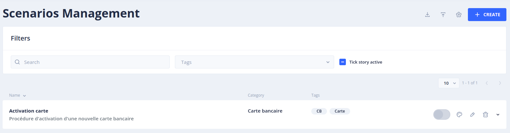

### Bloc de description d'un scénario

Chaque scénario est représenté dans un bloc permettant de consulter :
* Som _nom_
* Une _description_ de l'objet du scénario
* La _catégorie_ à laquelle il est associé
* Un ensemble de _tags_

Pour chaque bloc scénario les actions suivantes sont disponibles :
* _Open latest version_ : ouvrir le designer sur la version la plus récente du scénario. En fonction du statut de la version, le scénario sera ou non modifiable :
    * Scénario publié (CURRENT) : icône _oeil_. Le scénario n'est disponible qu'en lecture seule. Il faut le dupliquer avant de le modifier
    * Scénario en cours de design (DRAFT) : icône _palette_. Le scénario est modifiable dans le designer 
* _Edit scenario group_ : permet d'éditer les éléments de description du scénario (Nom, Catégorie, Description et Tags)
* _Delete scenarios group and corresponding story_ : permet de supprimer l'intégralité des versions du scénario ainsi que la TickStory associée (s'il y en a une) 

### Versionning des scénarios

Pour chaque bloc il est possible de dérouler l'historique des versions du scénario.

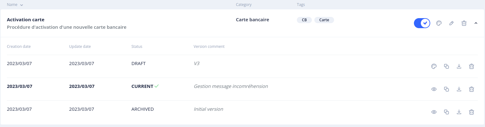

Un scénario peut avoir 3 statuts différents :
* DRAFT : scénario en cours de design, il ne peut être exécuté car aucune TickStory n'y est associée.
* CURRENT : scénario publié. C'est celui qui sera réellement exécuté. Une TickStory y est associée.
* ARCHIVED : scénario archivé. Toute nouvelle publication d'un scénario entraine l'archivage automatique de la version CURRENT existante.

Sur chaque version d'un scénario les actions suivantes sont disponibles :
* _Open scenario version_ : permet d'accéder au designer de scénario pour cette version. Seuls les scénarios en version DRAFT sont modifiables
* _Copy and edit a new version_ : duplique la version sélectionnée pour en créer une nouvelle en DRAFT afin d'effectuer des modifications
* _Export scenario version_ : exporte la description complète du scénario au format JSON. 
* _Delete scenario version_ : supprime cette version du scénario. Si le scénario est en Statut CURRENT, la TickStory associée sera elle aussi supprimée

### Filtres

Il est possible de rechercher un scénario en saisissant du texte dans le champ _Search_.

Il est possible de filtrer la liste des scénarios en sélectionnant un ou plusieurs tags dans la liste déroulante _Tags_.

Il est enfin possible de ne voir que les scénarios publiés en fonction de leur statut d'activation avec _Tick story active_

### Export des scénarios

Il y a deux options pour exporter un scénario :
* Exporter un groupe de scénarios. Deux options sont disponibles :
    * Exporter l'intégralité des versions du scénario
    * Exporter uniquement la version CURRENT ou la plus récente DRAFT

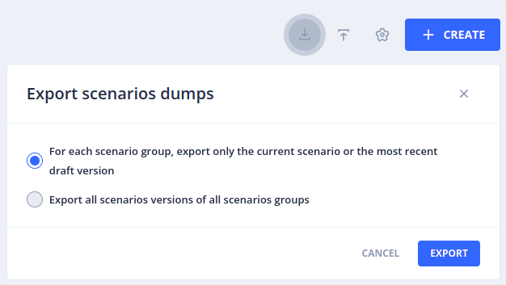

* Exporter une version spécifique d'un scénario : en cliquant sur l'icone d'export correspondant à la version requise depuis la l'historique des versions

### Import des scénarios

Pour importer un scénario ou un groupe de scénarios, il suffit de sélectionner le fichier JSON corresondant 

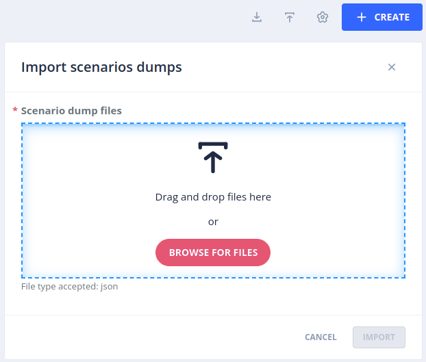

### Paramètres des scénarios

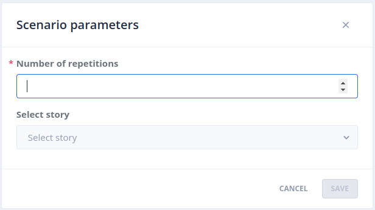

Dans ce menu vous pouvez spécifier :
* Un nombre maximum de répétition d'une même action d'affilée (indiquant que le bot et l'utilisateur ne se comprennent pas)
* Une Story à exécuter en cas de dépassement du nombre maximal de répétitions permettant d'éviter à l'utilisateur de tourner en boucle sur une même action

### Création d'un scénario

Pour créer un nouveau scénario, cliquer sur le bouton _+ Create_.

Les informations suivantes sont à renseigner :
* _Name_ (Obligatoire) : nom du scénario
* _Category_ : catégorie associée au scénario
* _Description_ : description de la finalité du scénario
* _Tags_ : ensemble de tags permettant de regrouper les scénarios

Il existe 3 options pour la sauvegarde du scénario :
* _Save_ : enregistre les informations du scénario et reste sur la page courante 
* _Save & Design_ : enregistre les informations du scénario et bascule dans le designer
* _Cancel_ : annule la création du scénario

## Scenario Designer

Le designer permet de modéliser le parcours conversationnel pour un cas d'usage donné.
Cette modélisation se fait en 4 étapes : writing, casting, production et publishing.

### Writing

Lors de cette phase, vous allez décrire la conversation telle qu'elle pourrait exister entre le bot et l'utilisateur en la modélisant sous forme d'un arbre.

Chaque interaction va être représentée par une carte qui peut avoir 2 types :
* Carte représentant un message utilisateur
* Carte représentant une action du bot (message, appel au SI...)

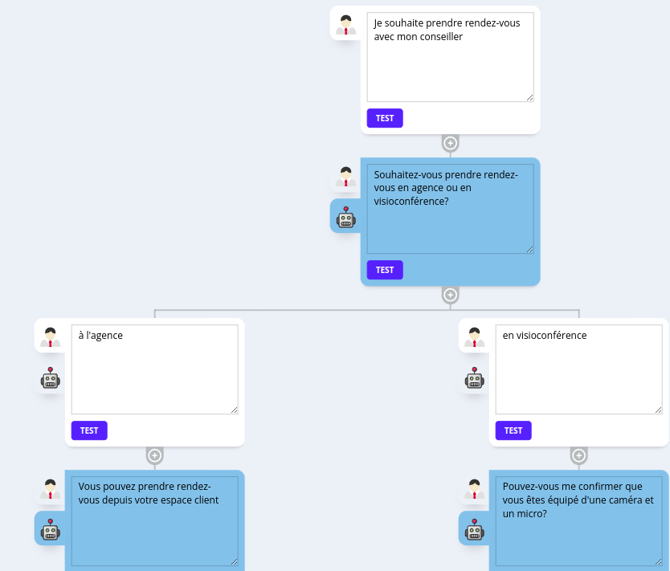

> Note : la représentation sous forme d'arbre n'est que visuelle afin de se projeter dans la conversation. A l'exécution du scénario, l'enchainement des actions est dynamique et fonction des éléments qu'aura pu collecter le bot.

### Casting

Cette phase permet d'identifier les différents ingrédients qui vont permettre le bon déroulement du scénario :

**Pour une action utilisateur l'affectation d'une intention se fait en 2 temps :**
  1- Création d'une nouvelle intention ou réutilisation d'une intention existante : en cliquant sur _DEFINE INTENT_ une recherche va être effectuée parmis les intentions existantes afin de voir s'il y en a une qui se rapproche afin de pouvoir l'utiliser.
  Si des intentions approchantes sont trouvées alors on propose d'utiliser une des intentions proposées. Il faut cliquer sur _USE THIS INTENT_ pour utiliser l'intention existante dans le cadre de ce scénario.
  Il reste possible de forcer la création d'une nouvelle intention en cliquant sur _CREATE A NEW INTENT_

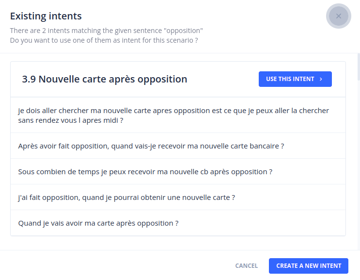

  Sinon, il sera proposé de créer une nouvelle intention en précisant les éléments suivants :
  * _Label_ (Obligatoire) : libellé de l'intention
  * _Name_ (Obligatoire) : nom de l'intention. Il est généré par défaut automatiquement à partir du libellé mais peut être surchargé.
  * Category : catégorie à laquelle appartient l'intention
  * Description : description de ce que l'intention permet de reconnaître

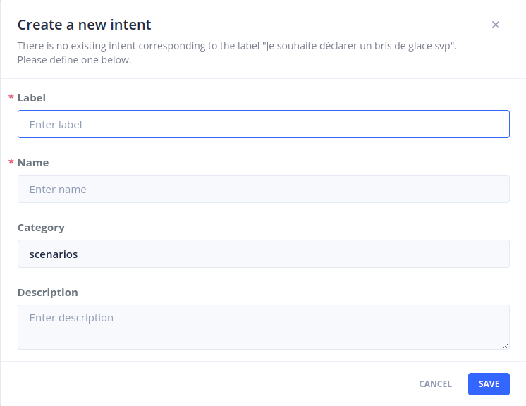

> Attention : ne pas utiliser une intention existante qui serait primaire sur une autre story en tant qu'intention primaire du scénario, il ne sera pas possible de le publier, une intention ne pouvant être primaire que pour une seule story.
  
2- Ajout des phrases d'entrainement et des contextes en sortie : une fois l'intention définie, vous allez pouvoir ajouter des phrases d'entrainement, associer des entités que vous pourrez lier à des contextes et définir des contextes qui seront produits en sortie une fois l'intention reçue.
Les informations suivantes sont récapitulées dans la fenêtre :
* _Name_ (Read only) : nom de l'intention permettant de comprendre la question/réponse qu'aura envoyé l'utilisateur
* _Primary intent_ : permet de définir si l'intention est primaire ou secondaire (les intentions primaires déclenchent la story sous-jacente alors que les intentions secondaires ne sont reconnues qu'une fois entré dans la story)
* _Sentences matching this Intent_ : un ensemble de phrases permettant d'entrainer l'intention. Sur les phrase, il est possible d'associer des entités en sélectionnant un mot et en cliquant sur _Add entity_. Il est possible d'associer un contexte à une entité en cliquant sur le mot et en choisissant le contexte à associer. Si, à la réception du message utilisateur, l'entité est détectée alors le contexte associé sera créé avec comme valeur le texte de l'entité.
* _Output contexts_ : Associer un contexte en sortie : permet de définir un contexte lorsque l'intention est suffisante pour déterminer qu'un contexte peut être créé sans nécessiter la détection d'une entité associée à l'intention (ex : les intentions génériques type 'oui' ou 'non')

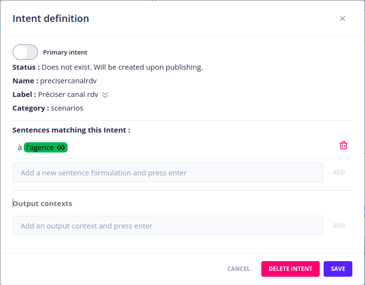

**Pour une action du bot les éléments suivants doivent être définis :** 
* _Name_  (Obligatoire) : le nom de l'action
* _Description_ : description textuelle de ce que fait l'action
* _Answer_ : réponse envoyée à l'utilisateur à l'exécution de l'action
* _Api handler_ : code métier qui sera exécuté lors de l’exécution de l'action. L'exécution d'une action comportant un handler ne rend pas la main à l'utilisateur mais déclenche un nouveau round du gestionnaire de dialogue, l’exécution du code métier ayant potentiellement produit de nouvelles informations utiles à l'avancée du scénario 
* _Event_ : évènement interne qui se traduira par une transition dans la machine à état. Uniquement disponible pour les actions qui possèdent un handler (qui ne rendent pas la main à l'utilisateur)
* _Input contexts_ : contextes nécessaires à l'exécution de l'action. Une action ne peut s'exécuter que si tous les contextes définis en entrée existent.
* _Output contexts_ : contextes pouvant être générés lors de l'exécution de l'action : 
  * soit directement via l'exécution d'un handler (par exemple un Api handler) qui va produire ce contexte
  * soit indirectement par la réponse de l'utilisateur suite à l'exécution de cette action
* _Target story_ : permet de forcer le switch vers une autre story
* _Question for unknown answer_ : permet d'envoyer un message d'erreur ciblé sur la question portée par cette action si suite à l'exécution de l'action la réponse de l'utilisateur n'est pas reconnue (intent unknown reçue)

> Note relative aux contextes : pour l'optimisation du parcours par la résolution du graphe, c'est l'existance d'un contexte qui est primordiale indépendamment de la valeur qui peut lui être associée. Souvent, des contextes seront créés sans avoir de valeur associée, ces derniers ne servant qu'à dérouler le dialogue. Ce sera souvent le cas de contextes créés suite à la reconnaissance d'une intention sans qu'il y ait d'entités associées.

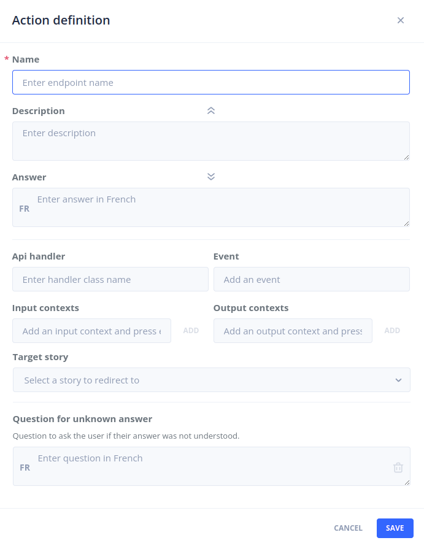

### Production

Cette phase va permettre de décrire la machine à états permettant de gérer la conversation.
La machine à état peut être construite de plusieurs manières : 
* _Classique_ : les transitions vont d'une action A vers une action B déterminée. Cette modélisation ne permet pas de bénéficier de l'optimisation par contrainte, le flow de la conversation étant ici géré directement par la machine à états
* _Orienté objectif_ : dans cette modélisation, nous allons utiliser les machines à état hiérarchiques pour spécialiser des moments de la conversation à un instant T. Chaque "boîte" va rassembler un ensemble cohérent d'actions qui vont permettre de résoudre un sous-ensemble de la problématique utilisateur qui sera représentée par un objectif (action de bot spécifique). 

Exemple de machines à état dans les 2 modes pour le même cas d'usage (Activation d'une carte bancaire) :
* Modélisation classique 
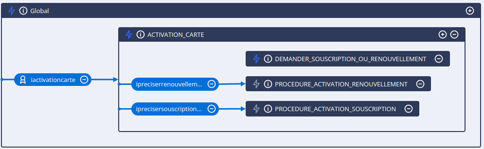

* Modélisation orientée objectif
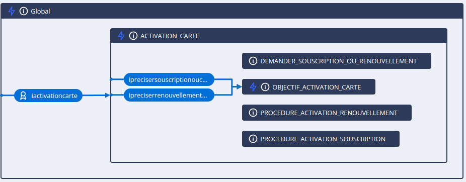

> Tips : à retenir pour la modélisation sous forme d'objectif, pour une "boîte" donnée, il doit y avoir une action représentant l'objectif à atteindre ainsi que toutes les actions participant à la résolution de cet objectif. Au sein d'une "boîte", toutes les transitions (sauf rare exception) ramènent vers l'objectif à atteindre, c'est le solveur du graphe qui déterminera à chaque round de la conversation quelle est la meilleure action à exécuter compte tenu des informations disponibles.  

### Publishing

Cette dernière phase permet de récapituler les éléments qui vont être créés au moment de la publication dont :
* Les nouvelles intentions
* Les nouvelles réponses
* Les nouvelles réponses à envoyer en cas d'incompréhension
* La TickStory permettant d'exécuter le scénario

Des contrôles de cohérence sont effectués au moment de la publication afin d'éviter les problèmes au moment de l'exécution de la story.

## Continuer...

Rendez-vous dans [_Guides utilisateur_](../../guides) pour la suite du manuel utilisateur.

> Vous pouvez aussi passer directement au chapitre suivant : [Développement](../../../dev/modes). 