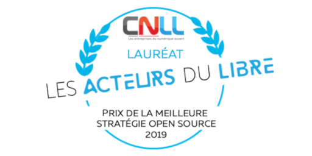
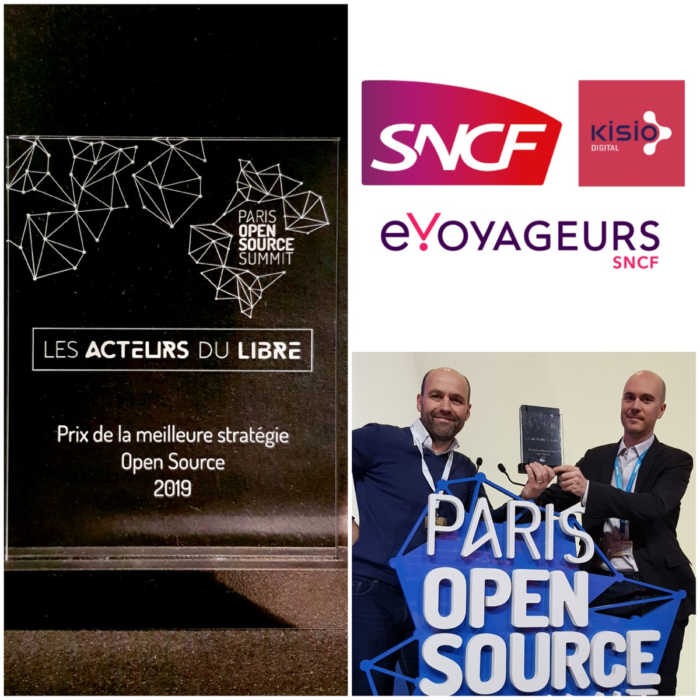
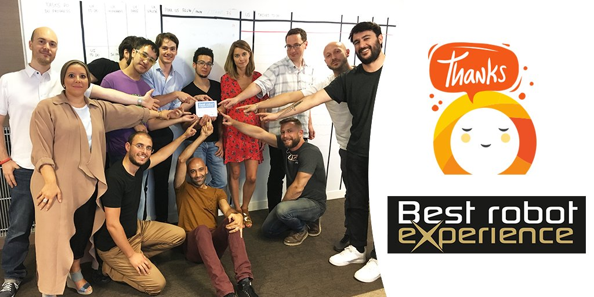

# Awards 

<!-- md:feature toto -->
<!-- md:plugin [tags] – built-in -->
<!-- md:flag multiple -->

From its creation in for [OUI.sncf](https://www.oui.sncf/) in 2016 to the French 
_[AlloCovid](https://www.allocovid.com/)_ service in 2020, both the technical solution 
and [bots designed with Tock](showcase.md) have been awarded.

## *Best Open Source Strategy 2019* (SNCF)

In 2019, the _Acteurs du Libre_ award for the 
[_Best Open Source Strategy_](https://lesacteursdulibre.com/portfolio/prix-meilleure-strategie/)
was given to [SNCF](https://www.sncf.com/) ("French National Railway Company") for creating and sharing open platforms, such as 
[Tock](https://doc.tock.ai/) (e.Voyageurs subsidiary) 
and [Navitia](https://github.com/CanalTP/navitia) (Kisio Digital subsidiary).

[Simon Clavier](https://www.linkedin.com/in/clavier/) and [François Nollen](https://www.linkedin.com/in/francois-nollen-42102782/) 
received the award on December 10th in the Grand Auditorium of [_Paris Open Source Summit_](http://2019.opensourcesummit.paris/).
Several [photos](https://www.flickr.com/photos/186089225@N03/albums/72157712273229483) and a 
[video recording](https://www.youtube.com/watch?v=7vodelxCZyI) (in French) are available.

To find out more, see [_Les Acteurs Du Libre_](https://lesacteursdulibre.com/portfolio/prix-meilleure-strategie/) (French).

## *Best Robot Experience 2019* (OUI.sncf)

In 2019, _OUIbot_ was awarded the 
_[Best Robot Experience](https://blog-cultures-services.com/2019/07/09/ouibot-de-ouisncf-laureat-prix-best-robot-experience-2019/)_
 for the 2nd time in a row.

Received by [Caroline Chupin](https://www.linkedin.com/in/caroline-chupin-2790bb51/) and 
 [Evelyne Papon](https://www.linkedin.com/in/evelyne-papon-2b895945/) for OUI.sncf,
 the award was the result of ranking 31 robots, chatbots and voicebots. 

An interview is [available](https://www.youtube.com/watch?v=viRFqrpJvc4) (in French).
More on the [Cultures Services](https://blog-cultures-services.com/2019/07/09/ouibot-de-ouisncf-laureat-prix-best-robot-experience-2019/) blog (in French too).

## *Best Robot Experience 2018* (OUI.sncf)

In 2018, _OUIbot_ (the [OUI.sncf](https://en.oui.sncf/en/) assistant, with 10.000 users a day) 
received the _[Best Robot Experience](https://www.sensduclient.com/2018/04/ouibot-ouisncf-est-le-gagnant-de-best.html)_
 award from the [Académie du Service](http://www.academieduservice.com/) / [Sens du client](http://www.sensduclient.com/).
 
Given to [Caroline Chupin](https://www.linkedin.com/in/caroline-chupin-2790bb51/) for OUI.sncf,
the award assessed mutliple criteria to rank 24 virtual agents from prestigious organizations (companies, GAFAM, public sector). 

To find out more, visit the [Sens du client](https://www.sensduclient.com/2018/04/ouibot-ouisncf-est-le-gagnant-de-best.html) blog.

