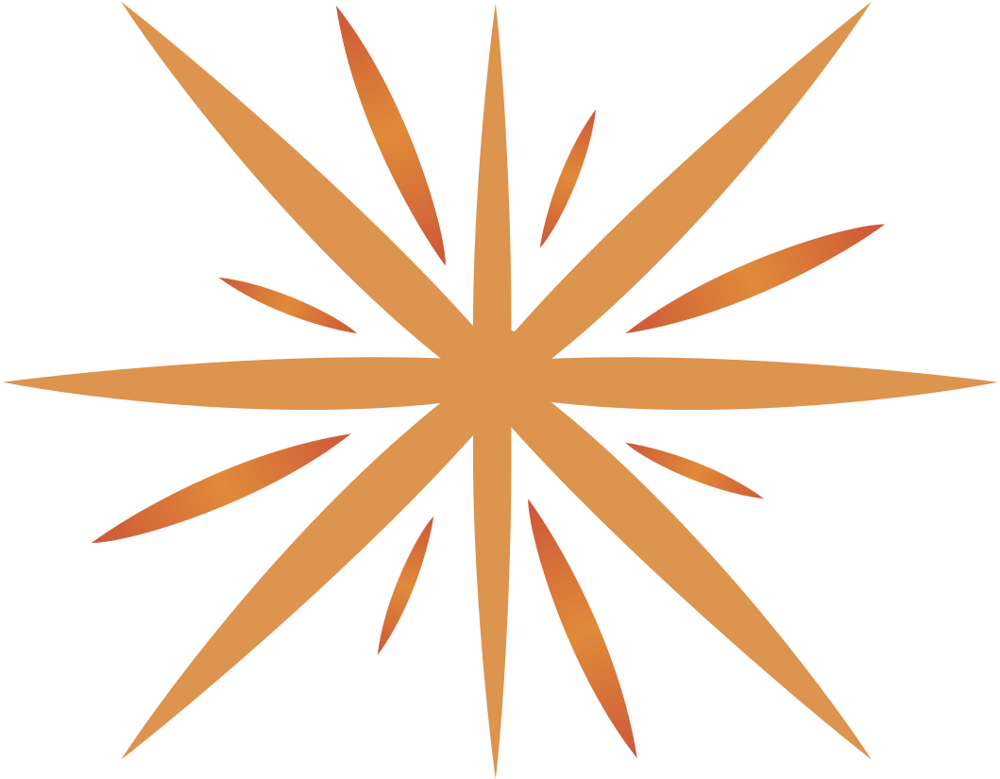

# Community

Tock has been designed to remain an open platform shared with the community.  
To know more, see [why Tock](why.md).

The Tock community is open to contribution: every feedback, _issue_, _feature request_ and obviously 
 _pull request_ is more than welcome!

## Join the community (Gitter)

Many Tock users and contributors meet on [Gitter](https://gitter.im/tockchat/Lobby) chatrooms. 
Join them to see how much the community is active and open.
 
* [Tock community on Gitter](https://gitter.im/tockchat/Lobby)
* [Tock releases thread](https://gitter.im/tockchat/tock-news)

<a href="https://gitter.im/tockchat/Lobby"
target="gitter">
{style="width:75px;"}

</a>

## Follow Tock news

To find Tock news, new projects, conferences, releases and more please visit the homepage:

* [Tock.ai](https://doc.tock.ai)

Specific news can be found on these topics:

* [Known users & projects](https://doc.tock.ai/tock/master/about/showcase.html)
* [Presentations & conferences](https://doc.tock.ai/tock/master/about/ressources.html)
* [Awards](https://doc.tock.ai/tock/master/about/awards.html)

For releases & features:

* [Releases & features thread](https://gitter.im/tockchat/tock-news)
* [Release Notes](https://github.com/theopenconversationkit/tock/releases)
* [Roadmap](https://github.com/theopenconversationkit/tock/milestones)

## Code & Contribution (GitHub)

The Tock platform and tools are available on 
[GitHub](https://github.com/theopenconversationkit/tock)
under the [Apache 2 license](https://github.com/theopenconversationkit/tock/blob/master/LICENSE).

* [Sources & projects](https://github.com/theopenconversationkit/)
* [License](https://github.com/theopenconversationkit/tock/blob/master/LICENSE)
* [Issues](https://github.com/theopenconversationkit/tock/issues)
* [Contributors](https://github.com/theopenconversationkit/tock/graphs/contributors)

To know more about repository structure, coding conventions, etc. refer to the [contribute to Tock](contribute.md) section.
For other types of contribution, don't hesitate to use GitHub [_issues_](https://github.com/theopenconversationkit/tock/issues) 
and [join the community](https://gitter.im/tockchat/Lobby) directly on Gitter.

<a href="https://github.com/theopenconversationkit/tock/">

{style="width:100px;"}
</a>

## TOSIT association

The Tock solution is currently being assessed by the _TOSIT (The Open Source I Trust)_,
 an association dedicated to support Open Source and Free Software, as part of the _Chatbots_ Work Group.

> Founded by Carrefour, EDF, Enedis, Orange, Pôle Emploi and SNCF, TOSIT now gathers other important members,
>such as the (French) Ministère des Armées, Société Générale or MAIF.

Several TOSIT members, including SNCF, already use or experiment Tock.

To know more about TOSIT, please visit [http://tosit.fr/](http://tosit.fr/)

{style="width:100px;"}

## Public Demo hosting

The public Live Demo helps newcomers try and experiment with the solution. A dedicated user guide is available 
to make one's first steps with Tock and bots.
Thanks to [e.Voyageurs SNCF](https://www.sncf.com/fr/groupe/newsroom/e-voyageurs-sncf) for hosting and maintaining the 
public Live Demo platform.

* [Live Demo](https://demo.tock.ai/) 
* [Guide _Create your 1st bot with Tock_](https://doc.tock.ai/tock/master/guides/studio.html)

## Help

Feel free to [contact us](contact.md).

