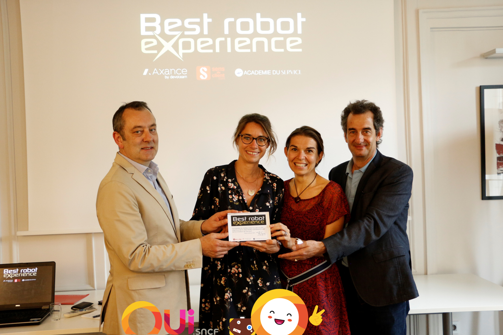
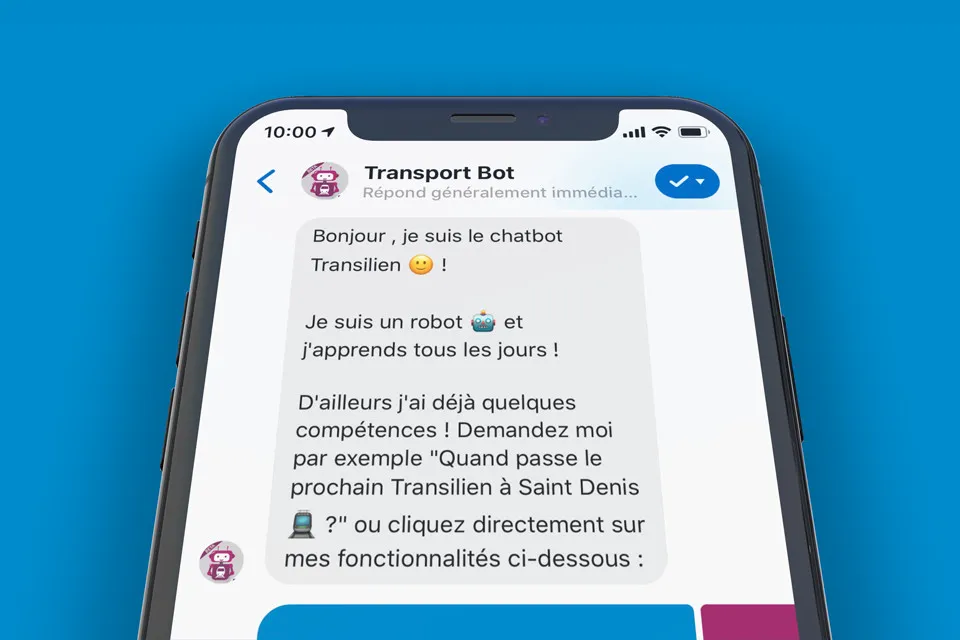
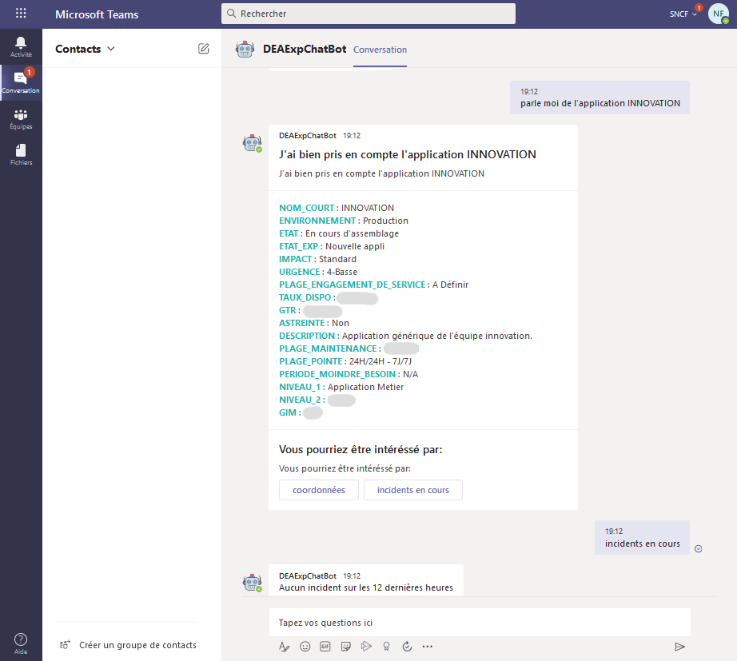
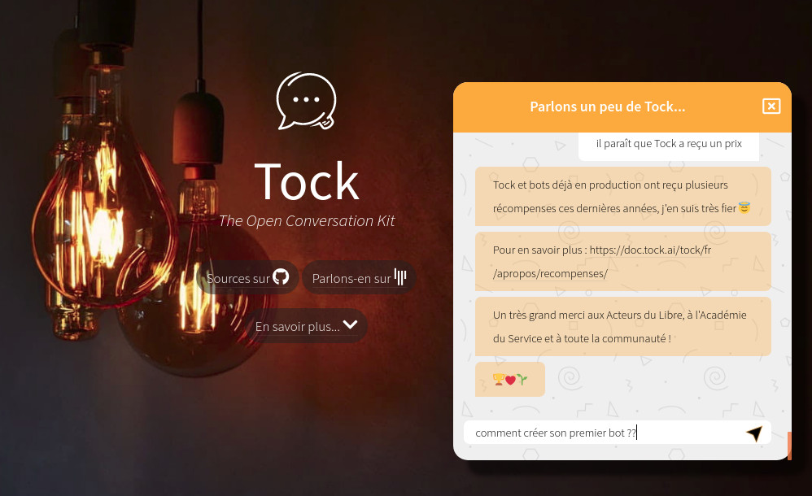

# User showcase

From its creation for [OUI.sncf](https://en.oui.sncf/en/) in 2016 to the French 
_[AlloCovid](https://www.allocovid.com/)_ service in 2020, Tock has been used by 
more and more teams and organizations to build conversational bots and services for various use cases :

* healthcare, transport, energy, e-commerce examples
* _business to customer_ as well as _business to business_ 
* FAQ and _"0 code"_ decision trees
* assistance, selfcare and live chat compatible
* text & voice channels: Web & mobile, messaging, smart devices, telephone services

This page presents various assistants and products built and powered by Tock,
some of them [awarded](awards.md) by the community.

## Healthcare

### *AlloCovid*

The _[AlloCovid](https://www.allocovid.com/)_ conversational service informs and guides French population 
about the Covid-19.

It results from the collaboration of numerous French experts, tech partners and volunteers.
To find out more about the project, the team and partners, how the bot works, etc. visit 
[www.allocovid.com](https://www.allocovid.com/).

Available by phone, on the Web and WhatsApp, _AlloCovid_ builds around a Tock bot and integrates with additional 
technologies such as [Allo-Media](https://www.allo-media.net/) and [Voxygen](https://www.voxygen.fr/) voice solutions. 

The _AlloCovid_ bot is powered by open source technologies (Tock) and open source itself: its sources are available on 
repository [`allocovid`](https://github.com/theopenconversationkit/allocovid).

> The source repository also includes the [_Allo-Media connector_](../dev/connectors.md), 
> technical details about the bot and its [functional specification](https://github.com/Delegation-numerique-en-sante/covid19-algorithme-orientation).

 
* **Name:** _[AlloCovid](https://www.allocovid.com/)_
* **Date of birth:** in production since spring 2020
* **Field:** health information and guidance
* **Channels:** text & voice, by phone, on WhatsApp and Website

## Transport & e-commerce

### *OUIbot*, the OUI.sncf bot

_[OUIbot](https://www.oui.sncf/services/assistant)_ is the conversational assistant from OUI.sncf. Available since 2016 
on Facebook Messenger, _OUIbot_ was built along with the first versions of Tock.

> _With OUIbot, booking a train ticket has never been easier!_ It assists you in the preparation of your trips,
>allows you to make a complete reservation quickly and easily, from research to purchase (payment included),
>and accompanies you during your trip.

Thanks to the numerous connectors, _OUIbot_ is now available on multiple conversational channels, such as the company 
Website [www.oui.sncf](https://www.oui.sncf/bot), social networks, voice assistants, smart display and even 
 [SmartBrics with JCDecaux](https://ouitalk.oui.sncf/blog/innovation/oui-sncf-signe-une-campagne-d-affichage-pilotee-par-une-intelligence-artificielle)
 devices.

In 2019, _OUIbot_ answers approximately 10.000 users a day. It has been awarded _[Best Robot Experience](https://blog-cultures-services.com/2019/07/09/ouibot-de-ouisncf-laureat-prix-best-robot-experience-2019/)_
 for the second year in a row.

 
* **Name:** _[OUIbot](https://www.oui.sncf/services/assistant)_
* **Date of birth:** in production since 2016
* **Field:** e-commerce/travel, transactions (booking, payment), alerts & push notifications, push messages to an agent
* **Channels:** text & voice, on the company Website, Messenger, WhatsApp, Business Chat (Messages), Google Assistant, 
Google Home, Alexa, JCDecaux SmartBrics

### *L'Assistant SNCF*

_[L' Assistant SNCF](https://www.sncf.com/fr/itineraire-reservation/informations-trafic/application-sncf)_ is
the mobile application for SNCF passengers on Android and iOS, covering both trains and other modes of transport.

> With _L' Assistant_ (the SNCF Assistant), you can plan your itinerary, stay informed in real time, buy your transport tickets
>directly or book a taxi ride. More features are yet to come.

Accessible via the "microphone" in the mobile application, le SNCF Assistant's conversational bot is built with Tock
plus the speech-to-text Android and iOS functions.

* **Name:** _[L' Assistant SNCF](https://www.sncf.com/fr/itineraire-reservation/informations-trafic/application-sncf)_
* **Date of birth:** in production, featuring Tock voice function since 2019
* **Field:** travel & transport (multi-modal route research, etc.)
* **Channels:** voice, on the SNCF mobile application for Android and iOS

### *Tilien*, the Transilien chatbot

_[Tilien](https://www.facebook.com/botsncftransilien/)_ is the Transilien chatbot on Messenger.

> Designed as a personal and friendly travel companion, it informs you about upcoming departures, the service status,
>current and future works, itineraries and much more (route plans, timetables, etc.) on the entire Ile-De-France
>rail network: Metro, RER, Transilien, Tram.

Powered by Tock, the chatbot is waiting for you on Facebook Messenger.

* **Name:** _[Tilien](https://www.facebook.com/botsncftransilien/)_
* **Date of birth:** in production, since 2018 with Tock
* **Field:** transport & assistance (route research, route plans, traffic conditions, etc.)
* **Channels:** text, on Messenger ([_botsncftransilien_](https://www.facebook.com/botsncftransilien/))

### *Mon Assistant TGV INOUI*

_[Mon Assistant](https://www.facebook.com/TGVINOUI/)_ advises customers and travellers of the TGV INOUI brand before,
during and after their journey.

> The chatbot can tell you all about the service status, train departure platforms, customer seats, onboard services
>(bar, electrical outlets, etc.). It also allows you to talk with a SNCF agents while remaining in the same conversation.

Located on the _TGV INOUI_ Facebook page and the [WiFi Portal](https://www.sncf.com/en/passenger-offer/tgv-inoui/stay-connected-during-your-journey)
aboard the train, the assistant is based on Tock and the [`tock-react-kit`](../dev/connectors.md#developing-your-own-connector).

* **Name:** _[Mon Assistant TGV INOUI](https://www.facebook.com/TGVINOUI/)_
* **Date of birth:** in production since 2019
* **Field:** assistance & passenger information (dock information, current travel information, on-board services),
  relay to an agent
* **Channels:** text, on Messenger ([_TGV INOUI_](https://www.facebook.com/TGVINOUI/)) and the
  [WiFi Portal](https://www.sncf.com/en/passenger-offer/tgv-inoui/stay-connected-during-your-journey) aboard the train

### *L' Agent virtuel SNCF*

L' _[Agent virtuel SNCF](https://www.facebook.com/SNCFOFFICIEL/)_ (SNCF Virtual Assistant) presents passenger information
and any disruptions on all trains (TGV, Intercites, TER, Eurostar, etc.) in a conversational manner.

> Query the bot by train number, passenger file, next departures, etc. to get the latest information and traffic status.

Accessible via the SNCF Facebook page, Twitter and [_sncf.com_](https://www.sncf.com/fr/itineraire-reservation/info-trafic/),
the _Agent virtuel_ leverages Tock and the [`tock-react-kit`](../dev/connectors.md)

* **Name:** _[Agent virtuel SNCF](https://www.facebook.com/SNCFOFFICIEL/)_
* **Date of birth:** in production since 2019
* **Field:** travel & transport (traffic situation, works, next departures), relay to an agent
* **Channels:** text, on [_sncf.com_](https://www.sncf.com/fr/itineraire-reservation/info-trafic/)
  ([direct link](https://bot.assistant.sncf/)), Messenger ([_SNCFOFFICIEL_](https://www.facebook.com/SNCFOFFICIEL))
  and Twitter ([_@sncf_](https://twitter.com/SNCF))

## Energy

### *EDF Callbot*

As a _POC (Proof Of Concept)_ to test a use case, a callbot has been created by the _Direction des
Systèmes d'Informations et du Numérique (DSIN)_ of [EDF (Electricité de France) Commerce](https://www.edf.fr/).

> The callbot is designed to integrate with the contact center solution ([Genesys](https://www.genesys.com))
> in order to route customer calls toward the right skill, either human or automated.  
> It also forwards the conversation context between the customer and the callbot
> to the advisor.

The callbot is powered by Tock using the [_Allo-Media connector_](../user/guides/canaux.md#allo-media).
The _Speech-To-Text (STT)_ solution is [Allo-Media](https://www.allo-media.net/), and the _Text-To-Speech (TTS)_
is [Voxygen](https://www.voxygen.fr/).

* **Name:** _EDF Callbot_
* **Date of birth:** January 2021
* **Field:** Customer Service / Contact Center
* **Channels:** voice, by phone

### *Enedis Chatbots*

Several [Enedis](https://www.enedis.fr/) chatbots are built with Tock.

The _Enedis Client Chatbot_ gives the 35 millions clients an easy way to get answers about energy, 
without the need to contact a customer advisor.

> The conversational agent provides level-1 client support by answering simple and non-personalized questions 
> on different subjects such as online account, Linky (the communicating meter), electric connection, 
> troubleshooting, etc.  
> Also, clients have the possibility to be redirected to a Live Chat and talk with an advisor 
> in case of misunderstanding from the chatbot.

Co-developped with Enedis experts on TOCK solution, this chatbot is available 
on the company Website [Enedis.fr](https://www.enedis.fr/).

* **Name:** _Enedis Client Chatbot_
* **Date of birth:** in production from february 2021
* **Field:** all subjects about energy distribution
* **Channels:** text, on the company Website [Enedis.fr](https://www.enedis.fr/)

> Also in production since 2020, the [_Enedis internal Chatbot_](showcase.md#enedis-internal-chatbot) 
> for internal logistics services is also built with Tock.

## Bank

### *MaxBot*, bank bot for Aumax pour moi

[Aumax pour moi](https://www.aumaxpourmoi.fr/) is an application that allows you to gather your cards in one and only place. Your every day is eased by using only one application and an unique card. To support you every day, Aumax allow you to :

* earn cashback ;
* send and receive money ;
* use a concierge service ;
* ask for financial advice, plan for life's projects, etc.
* and so much more !

Through the app, the Aumax pour moi's bot, based on Tock, assists you through every question you may have on the app, your accounts or on your card.

The bot is available on the [Aumax pour moi](https://www.aumaxpourmoi.fr/)'s app.
Aumax pour moi takes care and answers up to 5 000 requests a day.

* **Name:** _Aumax pour moi_
* **Date of birth:** in production since 2019
* **Field:** banking, services, personal assistant
* **Channels:** text, on the mobile app

## Personal Assistants

### *LinTO by Linagora*

The _[LinTO](https://linto.ai/enterprises)_ platform is an Open Source toolbox designed to address professional
and industry needs by enabling the development and integration of voice operated processes.

> _LinTO_ is a smart Open Source assistant designed by LINAGORA: based only on
> Open Source technologies, LinTO is cloud enabled but GAFAM-free (Google-Amazon-Facebook-Apple-Microsoft),
> and respects your privacy as it doesn’t share your data for commercial use.
>
> LinTO is designed to reduce time-consuming & stressful tasks, using a smart AI program to understand your voice and
> help you all along the office day even during meetings: agenda management, reminders, notetaking, e-mails,
> weather forecast, traffic, words definition, newspaper headlines, etc.
>
> The research project, which is funded by the French government's PIA (for “Future Investment Program”)
> as part of the Grands Défis du Numérique, is a collaboration between French companies, LINAGORA and ZELROS, and
> French research laboratories, IRIT, LaaS and LIX.

The _LinTO NLU (Natural Language Understanding)_ system is based on Tock to support the use of several AI models
dedicated to specific use cases. It automatically learns according to one's usage when adding or removing skills from the platform.

{style="width:150px;"}

* **Name:** _[LinTO](https://linto.ai/enterprises)_
* **Date of birth:** in production, leveraging Tock since 2019
* **Field:** Smart Business Assistant (agenda, e-mails, notetaking, etc.)
* **Channels:** voice (portability: Raspberry Pi, ARM, Android, Web...)

## Internal Bots

### *Enedis internal Chatbot*

The _[Enedis](https://www.enedis.fr/) internal Chatbot_ gives the 39 000 employees a simplified means to 
access the company logistics services.

> The conversational agent provides level-1 support by answering frequent employee questions, 
>as well as guiding them to Business service-desk tools. 
It also aims at better understanding employee needs through the analysis of most frequent demands.

Built with Tock, the chatbot is available on an internal company Website.

* **Name:** _Chatbot interne Enedis_
* **Date of birth:** in production since 2020
* **Field:** internal logistics services
* **Channels:** text, on an internal Website

### *Eve*, a versatile internal assistant (SNCF)

_Eve_ is the internal assistant of [e.Voyageurs SNCF](https://www.sncf.com/fr/groupe/newsroom/e-voyageurs-sncf) employees.

> The chatbot answers common questions, refers to the right interlocutors and collaborative tools of the company, 
>automates common requests to IT Support, General Services, Legal Department, etc. DevOps teams can also ask it for 
>production status, next planned operations, or even to manage certain operations directly for greater simplicity 
>and reactivity.

_Eve_ is always listening to the employees, both within the offices and on-the-go using Teams applications with Tock.

* **Name:** _Eve_
* **Date of birth:** in production since 2019
* **Field:** internal & B2B support (FAQ, IT Support, HR, Legal), DevOps automation (monitoring, 
deployments, production management, etc.)
* **Channels:** text & voice, internally within the offices and on-the-go via Teams

### *RocBOT*, an Ops assistant (SNCF)

_RocBOT_ is dedicated to Ops teams at SNCF DEA, available at the office and on-the-go through Teams applications.

> The chabot helps collaborators quickly find information about the applications.
> RocBOT can check, weither alerts were raised by supervision, find on-call duty agenda or people, etc.

_RocBOT_ is available in production since 2020, on Teams desktop and mobile applications through the 
Tock [_Teams connector_](../user/guides/canaux.md#teams).

* **Name:** _RocBOT_
* **Date of birth:** in production since 2020
* **Field:** internal ops management & support (FAQ, Ops Support, ITSM, etc.)
* **Channels:** text & voice, internally within the offices and on-the-go via Teams

## Other

### *Toki*, the bot to discover Tock

_Toki_ helps everyone willing to discover and use Tock. It answers frequently asked questions and keeps learning,
in particular from the [Tock community on Gitter](https://gitter.im/tockchat/Lobby).

> _How to create a first bot?  
> How to install Tock?  
> Where to find the sources or licence?..._  
> Do not hesitate to ask _Toki_. When it doesn't know (yet), try again a few days later ;).  
> Currently _Toki_ speaks only French, but English is coming!

The chatbot has been built with "0 code", leveraging _Tock Studio_. As much a demo bot as a tool for the 
community, _Toki_ lives on the [public demo platform](https://demo.tock.ai/),
leverages the Tock-provided [_Web connector_](../user/guides/canaux.md#web-generic) and 
[_React kit_](../user/guides/canaux.md#react) to integrate with the [Website](https://doc.tock.ai/fr/) (with several 
lines of HTML/JS/CSS).

* **Name:** _Toki_
* **Date of birth:** in production since 2021
* **Field:** community support & FAQ
* **Channels:** text, on the solution [Website](https://doc.tock.ai/fr/)

## What about you?

Various organizations already leverage Tock to build conversational agents, which are not mentionned here 
(among them, several of the [TOSIT](http://tosit.fr/) companies). 
Sometimes these applications are not dedicated to public usage and their organization will not communicate
about them. We will mention them here when it is possible ;)

Do not hesitate to look at the [Gitter](https://gitter.im/tockchat/Lobby) 
community chat to see professionals, students, large and smaller companies
 currently using or experimenting with Tock for their conversational or _NLU_ projects.

As a generic platform, Tock enables numerous use cases and integration of internal as well as external channels.
Please feel free to [contact us](contact.md) in case of doubts or questions about Tock features or possibilities for a new project 
of your own.

_And don't hesitate to share your achievements with the community! 🙂_
