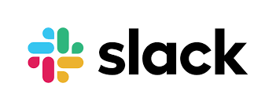
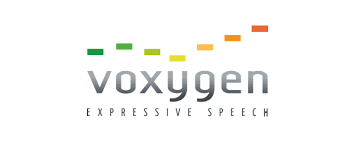

# Building a multichannel bot with Tock

## Notion of *connector*

A Tock _connector_ allows you to integrate a bot into an external communication channel (text or voice).
Aside from the _test connector_ type (used internally by the _Tock Studio_ interface), connectors
are associated with channels external to the Tock platform.

The whole point of Tock connectors lies in the ability to develop conversational assistants
independently of the channel(s) used to talk to it. It is thus possible to create a bot for a channel,
then make it multichannel later by adding connectors.

This page actually lists:

- The [_connectors_](index.md#connectors-provided-with-tock) provided with the Tock distribution:

{style="width:50px;"}
{style="width: 75px;"}
{style="width:50px;"}
{style="width:50px;"}
{style="width:50px;"}
{style="width:50px;"}
{style="width:50px;"}
{style="width:50px;"}

- The [kits using the _Web connector_](index.md#integrations-via-the-web-connector) to integrate other channels:

{style="width:50px;"}
{style="width:50px;"}

- The [possible integrations for voice processing](index.md#voice-technologies):

{style="width:50px;"}
{style="width:50px;"}
{style="width: 100px;"}

## Connectors provided with Tock

| Channel | Type | Connector | Documentation |
|---------|------|-----------|---------------|
| Web (websites, mobile apps) | text | `web` | [Web](web.md) |
| [WhatsApp](https://www.whatsapp.com/) | text | `whatsapp_cloud` | [WhatsApp](whatsapp.md) |
| [Messenger](https://www.messenger.com/) | text | `messenger` | [Messenger](messenger.md) |
| [Microsoft Teams](https://www.microsoft.com/microsoft-teams/) | text | `teams` | [Teams](teams.md) |
| [Slack](https://slack.com/) | text | `slack` | [Slack](slack.md) |
| [Google Chat](https://workspace.google.com/products/chat/) | text | `google_chat` | [Google Chat](google-chat.md) |
| [Mattermost](https://mattermost.com/) | text | `mattermost` | [Mattermost](mattermost.md) |
| [iAdvize](https://www.iadvize.com/) | text | `iadvize` | [iAdvize](iadvize.md) |
| [Alcmeon](https://www.alcmeon.com/) | text | `alcmeon` | [Alcmeon](alcmeon.md) |
| OpenAI-compatible clients (e.g. [Open WebUI](https://docs.openwebui.com/)) | text | `openai` | [OpenAI API](openai.md) |

New connectors are regularly added, depending on the needs of the projects.
The connectors for Alexa, Google Assistant, Twitter, Apple Business Chat and Rocket.Chat are removed in Tock 26.9.1
(see [Upgrading Tock](../operate/upgrade.md#2691)).
To learn more about the bots using these connectors in production, see the [Tock showcase](../project/showcase.md).

The former WhatsApp connector for the _On-Premise API_ (`whatsapp`), sunset by Meta, is still provided but deprecated:
use `whatsapp_cloud` (see [WhatsApp](whatsapp.md)).

The _test_ connector (`rest`, module `connector-rest`) is internal to Tock: it is used to talk to a bot directly
in _Tock Studio_ (_Test_ menu), by emulating the other connectors.

## Integrations via the Web connector

The _Web connector_ exposes a generic API to interact with a Tock bot.
As a result, it allows even more integrations on the "frontend" side, using this API as a gateway.

### React
{style="width:100px;"}

This React component integrates a Tock bot and renders it graphically in a web application.
The web application communicates with the bot via a [Web connector](web.md).

* **Integration** : [React](https://react.dev/) (JavaScript / JSX)
* **Type** : Web applications
* **Status** : Used in production since 2020

For more information, see the sources and the _README_ in the repository
[`tock-react-kit`](https://github.com/theopenconversationkit/tock-react-kit) on GitHub.

### Vue

{style="width:75px;"}

This Vue 3 chat widget integrates a Tock bot and renders it graphically in a web page or application.
It is an alternative to the [React kit](#react): it can be embedded in a plain HTML page as well as in a Vue,
Angular, React or Svelte application. The page communicates with the bot via a [Web connector](web.md).
Its appearance and wording can be customized, for example with the
[Tock Vue Kit Editor](https://github.com/theopenconversationkit/tock-vue-kit-editor).

* **Integration**: [Vue](https://vuejs.org/) 3 (JavaScript / TypeScript)
* **Type**: Web applications and websites
* **Status**: Used in production, published on [npm](https://www.npmjs.com/package/tock-vue-kit),
  see the [demo page](https://doc.tock.ai/tock-vue-kit/)

For more information, see the sources and the _README_ in the
[`tock-vue-kit`](https://github.com/theopenconversationkit/tock-vue-kit) repository on GitHub.

### SharePoint *(archived)*

{style="width:75px;"}

This _WebPart_ component allows you to integrate a Tock bot into a SharePoint site.
It embeds the [tock-react-kit](index.md#react) to communicate with the bot
via a [Web connector](web.md) and manage the graphic rendering of the bot in the SharePoint page.

* **Integration** : [Microsoft SharePoint](https://www.microsoft.com/en-us/microsoft-365/sharepoint/collaboration)
* **Type** : Websites & Intranets
* **Status** : Archived, no longer maintained since 2020

For more information, see the sources and the _README_ in the
[`tock-sharepoint`](https://github.com/theopenconversationkit/tock-sharepoint) repository on GitHub.

## Voice technologies

Tock bots process sentences in text format by default (_chatbots_). However, voice technologies can be
integrated into the bot's "terminals" in order to obtain voice conversations (_voicebots_ and _callbots_):

- Translation of voice into text (_Speech-To-Text_) upstream of the processing by the bot (ie. before the _NLU_ step)
- Translation of text into voice (_Text-To-Speech_) downstream of the processing by the bot (ie. voice synthesis of the bot's response)

Some _connectors_ provided with Tock allow a bot to be integrated into an external channel
managing the STT and TTS voice aspects.

In addition, other voice technologies have been integrated into Tock in recent years.
They are mentioned for information purposes, even when no ready-to-use _connector_ is provided.

### Google / Android

Google's _Speech-To-Text_ and _Text-To-Speech_ functions are used by the voice
functions of the [Microsoft Teams app for Android](https://play.google.com/store/apps/details?id=com.microsoft.teams)
compatible with the [Teams connector](teams.md), as well as within the Android platform
for native mobile developments.

{style="width:75px;"}

{style="width:75px;"}

* **Technology**: STT & TTS Google / Android
* **Status**: used with Tock in production
(via the [Microsoft Teams](teams.md) connector and natively on Android for _on-app_ bots)

### Apple / iOS

Apple's _Speech-To-Text_ and _Text-To-Speech_ functions are used within iOS
for native mobile developments.

{style="width:75px;"}

* **Technology**: STT & TTS Apple / iOS
* **Status**: used with Tock in production (natively on iOS for _on-app_ bots)

### Allo-Media & Voxygen

The company [Allo-Media](https://www.allo-media.net/) offers an AI platform based on phone calls.

[Voxygen](https://www.voxygen.fr/) offers speech synthesis services.

On the occasion of the development of the AlloCovid bot, in 2020, an [Allo-Media connector](https://github.com/theopenconversationkit/allocovid/blob/master/src/main/kotlin/AlloMediaConnector.kt)
was developed to integrate the bot (Tock) with the Allo-Media services:
_Speech-To-Text_ and _Text-To-Speech_ with Voxygen.

{style="width:100px;"}

 {style="width: 100px;"}

* **Technology**: Allo-Media & Voxygen
* **Status**: used with Tock in production for AlloCovid in 2020 (the [`allocovid`](https://github.com/theopenconversationkit/allocovid) repository is archived)

### Nuance

In 2016, [Nuance](https://www.nuance.com) _Speech-To-Text_ was integrated with Tock for voice command experiments.
This integration is no longer maintained.

## Connector architecture & data governance

With a view to _governance_ of conversational models and data, the Tock connector architecture has several advantages:

* The model is built in Tock, it is not shared via connectors
* The choice of a bot's connectors allows you to control the propagation (or not) of conversations

> For example, for a bot internal to a company, you can choose to use only connectors
> to its own channels (website, etc.) or internal to the company (enterprise applications, professional space on
> an Android phone, etc.).

* Even if a bot is connected to several external channels/partners, only the Tock platform has all the
conversations on all these channels.

## Developing your own connector

It is possible to create your own Tock connector, for example to interface a Tock bot with a channel specific to
the organization (often a specific website or mobile application), or when a general public channel
opens to conversational bots and the Tock connector does not yet exist.

The [Developing your own connector](../develop/connectors.md#developing-your-own-connector) section of the Tock developer manual gives instructions for
implementing your own connector.
