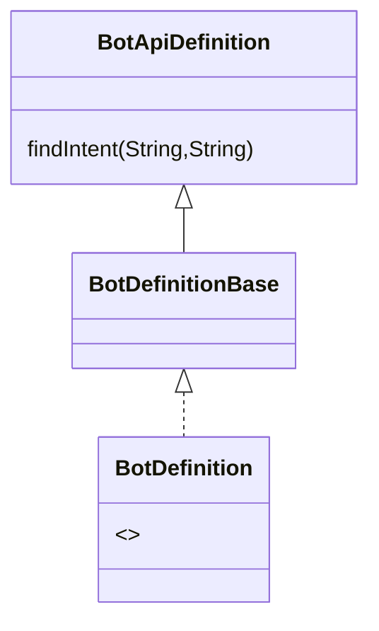
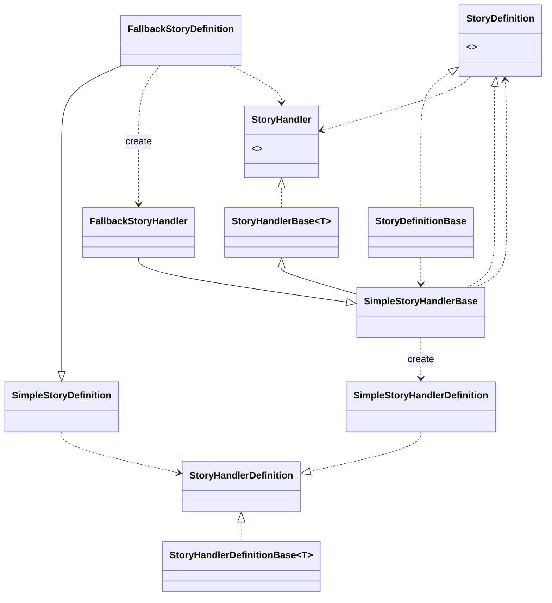

# BotApi
The client `botApiClient` sends `RequestData` to the bot and receives `ResponseData`.
The bot definition is defined by its `BotConfiguration` which builds Stories via its `ClientConfiguration`

## Exchanges with the botApi

### BotApiDefinition
Inherits from a `BotDefinitionBase` and implements a `BotDefinition`
Defines the bot in Api mode.

- Either:

### BotConfiguration
Contains the information present on the bot configuration (example its apikey, its name, the nlp model, the supported locations, the webhook url)

### A new story definition and its handler
