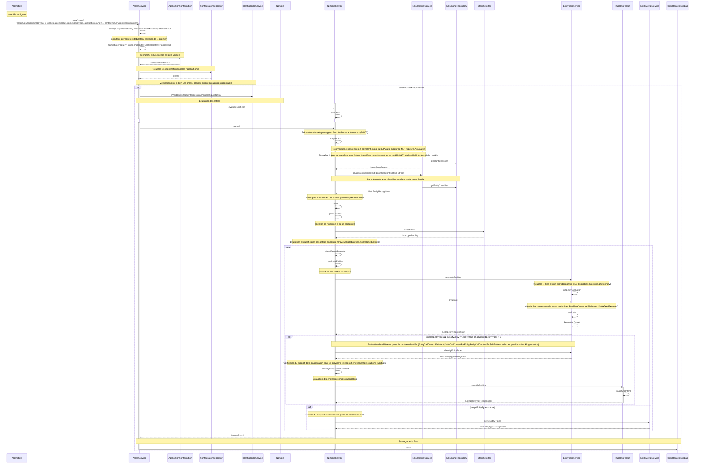

```mermaid
sequenceDiagram
    Note over NlpVerticle : override configure
    
    NlpVerticle->> ParserService: parse(query) <br> ParseQuery(queries=[Je veux 2 cookies au chocolat], namespace=app, applicationName=..., context=QueryContext(language=fr..)
    activate ParserService
    ParserService ->> ParserService: parse(query: ParseQuery, metadata: CallMetadata) : ParseResult
    Note over ParserService : formatage de requete si tabulation/ sélection de la première
    ParserService ->> ParserService: formatQuery(query: string, metadata: CallMetadata) : ParseResult
    Note over ParserService,ApplicationConfiguration : Recherche si la sentence est déjà validée
    ParserService ->> ApplicationConfiguration:  
    ApplicationConfiguration -->> ParserService:  validatedSentences
    Note over ParserService,ConfigurationRepository : Récupère les intentDefinition selon l'application id
    ParserService ->> ConfigurationRepository: 
    ConfigurationRepository -->> ParserService: intents
    deactivate ParserService
    
    activate ParserService
    Note over ParserService,IntentSelectorService : Vérification si on a bien une phrase classifié (intent et/ou entités reconnues)
    alt isValidClassifiedSentence
    ParserService ->> IntentSelectorService: isValidClassifiedSentence(data: ParserRequestData)

    Note over ParserService,NlpCore : Evaluation des entités
    activate NlpCoreService
    ParserService->> NlpCoreService: evaluateEntities()
    NlpCoreService->>NlpCoreService: evalutate
    
    deactivate NlpCoreService
    deactivate ParserService
    
    else
    activate NlpCoreService
    activate ParserService
    ParserService->> NlpCoreService: parse()
    Note over NlpCoreService : Préparation du texte par rapport à un nb de charactères maxi (50000)
    NlpCoreService->>NlpCoreService: prepareText

    Note over NlpCoreService,NlpClassifierService : Reconnaissance des entités et de l'intention par la NLP via le moteur de NLP (OpenNLP ou autre)
    Note over NlpCoreService,NlpClassifierService : Recupère le type de classifieur pour l'intent (classifieur = modèle ou type de modèle NLP) et classifie l'intention via le modèle
    NlpClassifierService->> NlpEngineRepository: getIntentClassifier
    NlpClassifierService -->> NlpCoreService : IntentClassification

    NlpCoreService->> NlpClassifierService: classifyEntities(context: EntityCallContext,text: String)
    Note over NlpCoreService,NlpEngineRepository : Recupère le type de classifieur (via le provider ) pour l'entité
    NlpClassifierService->> NlpEngineRepository: getEntityClassifier
    NlpClassifierService -->> NlpCoreService : List<EntityRecognition

    Note over NlpCoreService : Parsing de l'intention et des entités qualifiées précédemment
    NlpCoreService->>NlpCoreService: parse
    NlpCoreService->>NlpCoreService: parse internal

    Note over NlpCoreService : selection de l'intention et de sa probabilité
    NlpCoreService->>IntentSelector: selectIntent
    IntentSelector-->>NlpCoreService : Intent,probability

    Note over NlpCoreService : Evaluation et classification des entités en double Array[evaluatedEntities, notRetainedEntities]
    loop
        NlpCoreService->>NlpCoreService: classifiyAndEvaluate
        NlpCoreService->>NlpCoreService: evaluateEntities
        
        Note over NlpCoreService : Evaluation des entités reconnues
        NlpCoreService->>EntityCoreService: evaluateEntities

        Note over EntityCoreService : Récupère le type d'entity provider parmis ceux dispnobiles (Duckling, Dictionnary)
        EntityCoreService->>EntityCoreService: getEntityEvaluator
        NlpCoreService->>EntityCoreService: evaluate
        Note over EntityCoreService : Appelle le evaluate dans le parser spécifique (DucklingParser ou DictionnaryEntityTypeEvaluator)
        EntityCoreService->>EntityCoreService: evaluate
        EntityCoreService-->>EntityCoreService: EvaluationResult
    
        EntityCoreService-->>NlpCoreService: List<EntityRecognition>

            alt (mergeEntitytype && classifyEntityTypes) == true && classifiedEntityTypes > 0
            Note over NlpCoreService,EntityCoreService : Evaluation des différents types de contexte d'entités (EntityCallContextForIntent,EntityCallContextForEntity,EntityCallContextForSubEntities) selon les providers (Duckling ou autre)
            NlpCoreService->>EntityCoreService: classifyEntityTypes
            EntityCoreService -->>NlpCoreService: List<EntityTypeRecognition>

            Note over NlpCoreService : Vérification du support de la classification pour les providers détectés et enlèvement de doublons éventuels
            NlpCoreService->>NlpCoreService: classifyEntityTypesForIntent

            Note over NlpCoreService : Evaluation des entités reconnues via Duckling
            NlpCoreService->>DucklingParser: classifyEntities
            activate DucklingParser
            DucklingParser->>DucklingParser : classifyforIntent
            DucklingParser-->>NlpCoreService: List<EntityTypeRecognition>
            deactivate DucklingParser

        end
        alt mergeEntityType == true

            Note over NlpCoreService : Gestion du merge des entités selon poids de reconnaissance
            NlpCoreService->> EntityMergeService: mergeEntityTypes
            EntityMergeService-->>NlpCoreService: List<EntityTypeRecognition>

        end

    end
    

    NlpCoreService-->>ParserService: ParsingResult

    Note over ParserService,ParseRequestLogDao : Sauvegarde du Dao
    ParserService->> ParseRequestLogDao: save
    deactivate ParserService
    deactivate NlpCoreService


    end
```