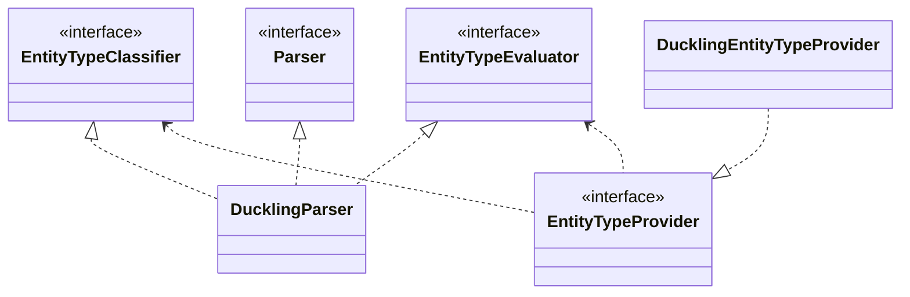
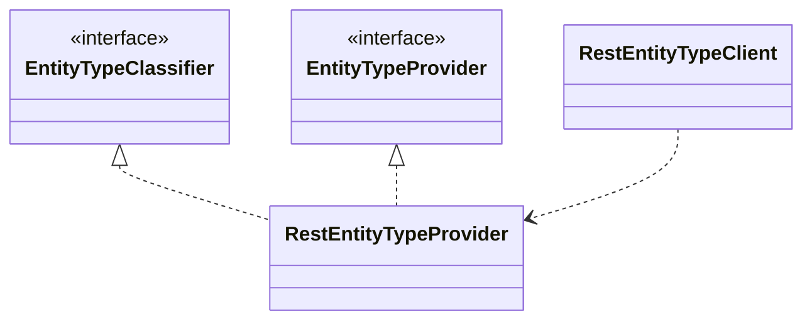

# Les modèles NLP
Il existe différents types de classificateur NLP.
Ceux pour de la détection d'intention et ceux pour la détection d'entities.
Ceux qui viennent des différentes libs de NLP `EngineType` :
- Stanford
- Rasa
- OpenNlp

Pour les entités des implémentations étendent `EntityTypeClassifier`
Ces types sont trouvés notamment lors de `getIntentClassifier` pour les intentions et `getEntityClassifier` dans NlpEngineRepository, définit dans le bot configuration avec le `EngineType` de défini

Le module Nlp par défaut est indiqué dans `ApplicationDefinition.kt` dans `tock-nlp-front-shared` avec valeur `opennlp`.
Les modules de classification ou de la nlp sont chargés via injection de dépendences dans `FrontIoc.kt`, on retrouve dans coreModule dans `tock-nlp-core-service` le module DictionaryRepository et dans ducklingModule le module pour Duckling.

## Providers de modèle Nlp
Les injections de dépendences pour les modèles de NLP participent à leur chargement via SPI via `tock.nlp.model.service.engine.NlpEngineProvider`.

### Astuce : créer un nouveau modèle de NLP
- Exemple : `OpenNlpEngineProvider.kt`
Il semble nécessaire de créer un nouveau provider de NLP et d'implémenter l'interface `NlpEngineProvider` et d'ajouter la définition dans `META-INF/services/ai.tock.nlp.model.service.engine.NlpEngineProvider`

# Les modèles d'entités :
Ls modèles d'entités par défaut dans Tock sont ceux provenant de dictionnaires ou de duckling.

## Les providers d'entités :
Par ailleurs, concernant les entités pour chaque entités exploitable côté duckling ou dictionnaire, il existe un `EntityTypeProvider` qui fonctionne via SPI et d'ajouter la classe dans `ai.tock.nlp.core.service.entity.EntityTypeProvider`

## Les contextes d'entités
Il existe différents types de contexte d'entités reconnus via `EntityCallContext`, le contexte remonte des information concernant la langue, le type de NlpEngineType, le nom de l'application et la date.
- EntityCallContextForIntent : le plus utilisé
- EntityCallContextForEntity
- EntityCallContextForSubEntities

### Astuce créer une nouveau moteur de NLP en s'inspirant de Duckling : 
L'exemple intéressant à suivre le fonctionnement du Duckling `nlp/entity-evaluator/tock-nlp-duckling`:

C'est un bon moyen également pour bypasser l'existant ou ajouter un nouveau module. Il peut-être intéressant de suivre le mode de fonctionnement présent.

## Exemple de l'implémentation de Duckling
### Pour le client

## Utiliser `tock-nlp-entity-rest`
- Ajouter dans le pom.xml de `nlp-api-service` (mode 1) ou `nlp-api-client` (mode 2), `${version}` va prendre la valeur de tock déjà présente dans `nlp-api-service`
```
        <dependency>
            <groupId>ai.tock</groupId>
            <artifactId>tock-nlp-entity-rest</artifactId>
            <version>${version}</version>
        </dependency>
```
- Ou bien Aller dans `Project structure`>`nlp-api-service`> et ajouter le module `tock-nlp-entity-rest`
- Lancer NlpService et si besoin mettre à jour la valeur : `tock_nlp_entity_type_url` (par exemple pour tester avec `tock-flair`) mettre égal à  `http://localhost:5000/api/v1/`

## Structure de RestEntityProvider


- Trois modes de fonctionnement : 

    1. Appel de l'API à chaque échange qui n'est pas unknown.
    - Erreur nominale :
    `2021-12-31T10:50:22.831 [vert.x-worker-thread-1] ERROR ai.tock.nlp.entity.rest.RestEntityTypeClient - Instantiation of [simple type, class ai.tock.nlp.entity.rest.RestEntityTypeClient$EntityTypeDescription] value failed for JSON property name due to missing (therefore NULL) value for creator parameter name which is a non-nullable type` : c'est parce que la phrase a détecté une entité mais n'est pas entraînée et ne sait pas quoi prendre parmi les mots

    2. Pensez à entraîner une phrase avec une entité : exemple "bonjour Jacques" avec Jacques pour `flair:person`, dans le front et dans les logs on observe bien que l'entité reconnue est bien `person`
    - Erreur nominale :
    Ne pas oublier de relancer `botApi` et `botAdmin` si vous constater une erreur de `Response has already been thrown`

    3. Pour gérer l'appel au nlp complémentaire il est possible de faire un appel direct au composant de Nlp :
       `val nlp = restEntityTypeClient.parse(this.message.toString(), this.userLocale)`
       Il peut être utile en cas de bypass total de la NLP, sinon cela peut-être appelé dans un storie spécifique ou un état éventuellement pour préciser la prochaine action.