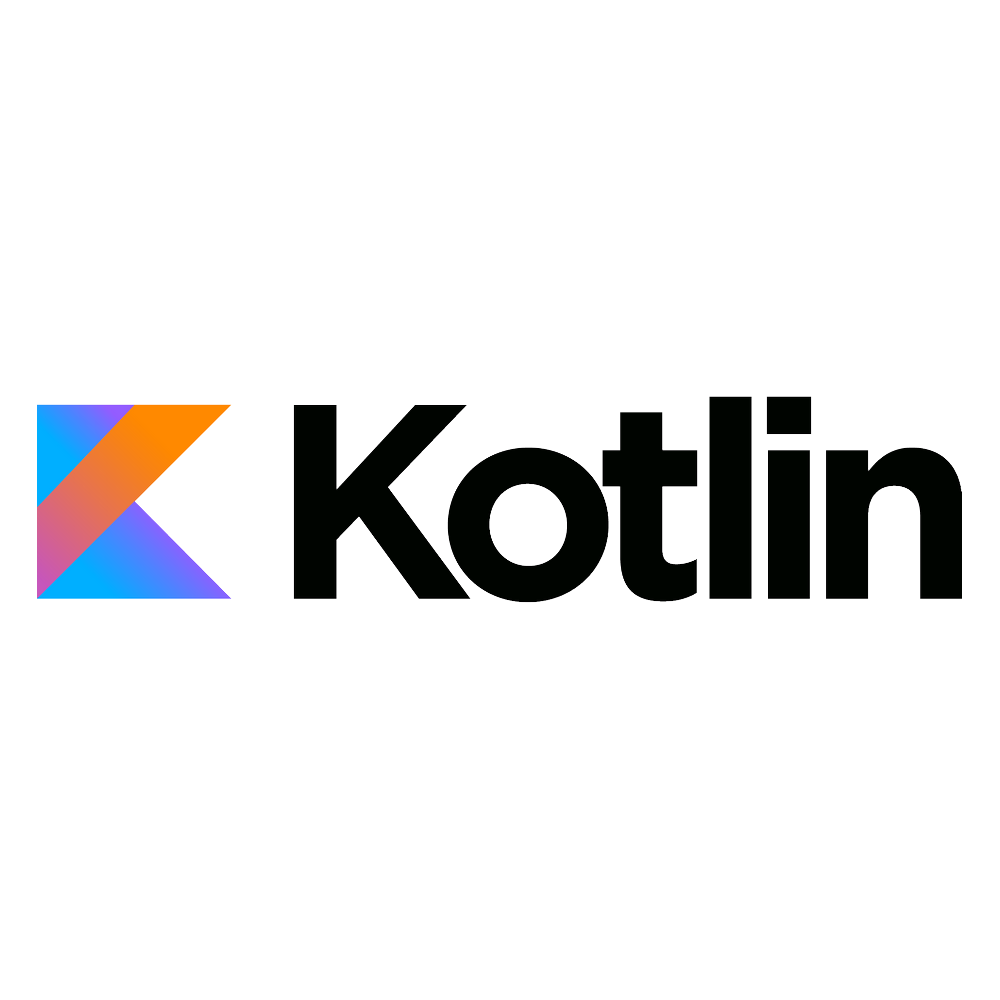

# Developing in Tock Bot API mode

Tock's _Bot API_ mode allows you to develop bots by connecting to a _Tock Studio_ platform using Tock's conversational REST API.

It is therefore the recommended Tock development mode to get started, as well as in scenarios where shared access to the
database would be an issue.

> Only _Bot API_ mode is available on the public Tock [demo platform](https://demo.tock.ai/)
> platform.

This page presents Tock bot development in _Bot API_ mode in [Kotlin](#develop-in-kotlin).
Clients are also available for [Javascript/Node](#developing-in-javascript) and [Python](#developing-in-python).
It is possible to develop Tock courses in any language via the [_Bot API_](#develop-via-api).

{style="width:100px;"}

{style="width:100px;"}

{style="width:100px;"}

{style="width:100px;"}


> Another section presents the [_Bot Framework_](bot-integre.md) mode available for Kotlin only,
> more integrated but also more coupled with the Tock platform.

## Connect to the demo platform

Rather than deploying your own Tock platform, it is possible to test the _WebSocket_ or _Webhook_ modes directly on the
[Tock demo platform](https://demo.tock.ai/).

## Develop in Kotlin

{style="width:100px;"}

### Enable WebSocket mode

This is the mode to use at startup because it is the easiest to implement.

To use the websocket client, you must add the `tock-bot-api-websocket` dependency to your [Kotlin](https://kotlinlang.org/) application/project.

For example in a [Maven](https://maven.apache.org/) project:

```xml
        <dependency>
            <groupId>ai.tock</groupId>
            <artifactId>tock-bot-api-websocket</artifactId>
            <version>25.9.1</version>
        </dependency>
```

Or in a [Gradle](https://gradle.org/) project:

```groovy
compile 'ai.tock:tock-bot-api-websocket:25.9.1'
```

### Enable WebHook mode

Alternatively, you can choose to use the _WebHook_ client, you need to add the dependency `tock-bot-api-webhook` to your [Kotlin](https://kotlinlang.org/) application/project.

For example in a [Maven](https://maven.apache.org/) project:

```xml
        <dependency>
            <groupId>ai.tock</groupId>
            <artifactId>tock-bot-api-webhook</artifactId>
            <version>25.9.1</version>
        </dependency>
```

Or in a [Gradle](https://gradle.org/) project:

```groovy
compile 'ai.tock:tock-bot-api-webhook:25.9.1'
```

In this case, unlike in _WebSocket_ mode, the application/bot started must be reachable by the
Tock platform via a public URL (you can use for example [ngrok](https://ngrok.com/)).

This URL must be specified in the _webhook url_ field in the _Configuration_ > _Bot Configurations_
view of the _Tock Studio_ interface.

### Set the API key

In _Tock Studio_, after configuring a bot, go to _Configuration_ > _Bot Configurations_ and copy
the API key of the bot you want to connect to.

You will be able to enter/paste this key into the Kotlin code (see below).

### Créer des parcours en Kotlin 
 
Pour le moment, les composants suivants sont supportés pour les réponses :
 
* Texte avec Boutons (Quick Reply)
* Format "carte"
* Format "carousel"
* Formats spécifiques aux différents canaux intégrés
 
Voici un exemple de bot simple avec quelques parcours déclarés : 
 
```kotlin

fun main() {
    startWithDemo(
        newBot(
            "PUT-YOUR-TOCK-APP-API-KEY-HERE", // Retrieve the API key from the "Bot Configurations" tab in Tock Studio
            newStory("greetings") { // Intention 'greetings'
                end("Hello!") // Simple text response
            },
            newStory("location") { // Intention 'location'
                end(
                    // Response with a card - including text, an attachment (e.g., an image), and suggested user actions
                    newCard(
                        "Card Title",
                        "A subtitle",
                        newAttachment("https://url-image.png"),
                        newAction("Action 1"),
                        newAction("Action 2", "http://redirection") 
                    )
                )
            },
            newStory("goodbye") { // Intention 'goodbye'
                end {
                    // Messenger-specific response
                    buttonsTemplate("Are you sure you want to leave?", nlpQuickReply("I'll stay"))
                } 
            },
            // Bot response in case of misunderstanding
            unknownStory {
                end("I didn't understand. But I'm learning every day :)")
            }
        )
    )
}
```

The [full source code of the example](https://github.com/theopenconversationkit/tock-bot-demo) is available.

## Developing in Javascript


{style="width:100px;"}

A client is provided to develop Javascript courses with [Nodejs](https://nodejs.org/).
For more information, see the documentation on the [`tock-node`](https://github.com/theopenconversationkit/tock-node) repository.

## Developing in Python

{style="width:100px;"}

A client is provided for developing courses in [Python](https://www.python.org/).
For more information, see the documentation on the [`tock-py`](https://github.com/theopenconversationkit/tock-py) repository.

## Develop via API

{style="width:100px;"}

It is possible to develop Tock courses in any language, by interfacing directly with the
[API](api.md#tock-bot-definition-api).

## Install Bot API on the server side

To use Tock's _Bot API_ mode, a specific module must be deployed with the platform. Generally called
`bot-api` in Docker Compose descriptors for example, this service has the role of:

* Exposing the _Bot API_ to potential clients regardless of their programming language
* Accepting _WebSocket_ connections and/or connecting to the configured webhook

The guide [Deploying Tock with Docker](../guides/platform.md) or the chapter
[Installation](../admin/installation.md) show how to deploy this module if necessary.

The only modification required compared to the example code for the demonstration platform is to replace
the `startWithDemo` method with `start`, specifying if necessary the address of the `bot-api` server.
