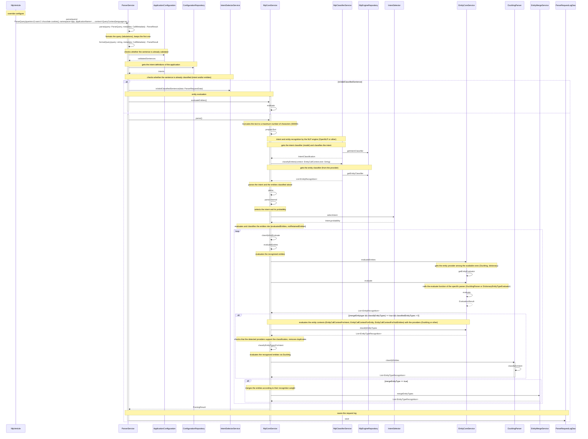

# NLP evaluation

This sequence diagram shows how the NLP API (`nlp_api`) analyzes a sentence: detection of the intent by the NLP
engine, then evaluation of the entities by the entity providers (Duckling, dictionaries) and merge of the results.
See [NLP and entity models](models-and-entity-models.md) for the classifiers and providers involved.

