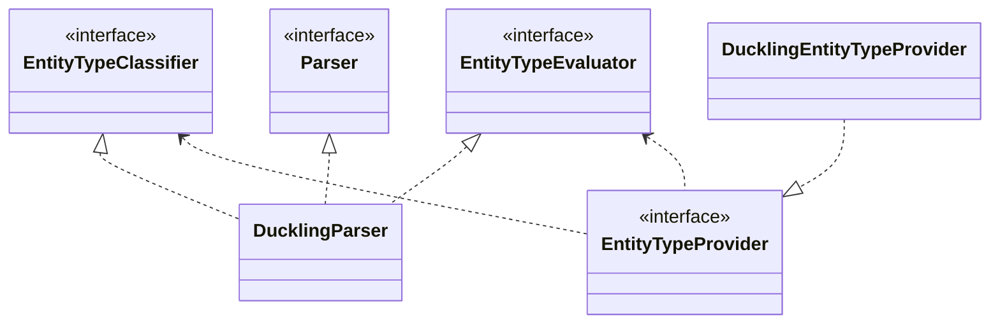
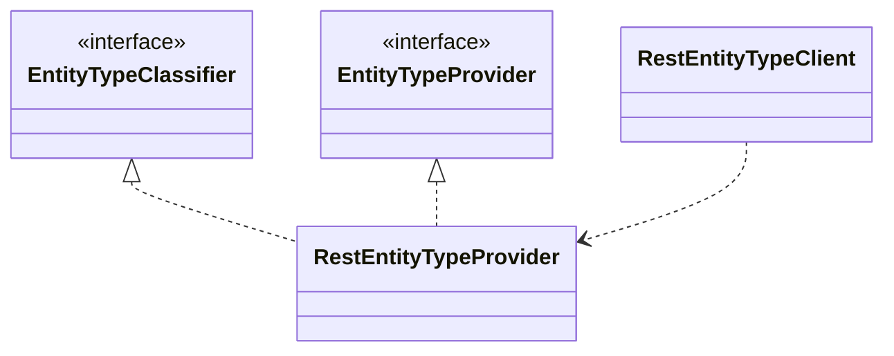

# NLP and entity models

## NLP models
There are different types of NLP classifiers:
those for intent detection and those for entity detection.
The ones coming from the various NLP libraries, `EngineType`:

- Stanford (optional [`tock-corenlp`](https://github.com/theopenconversationkit/tock-corenlp) module)
- Rasa
- OpenNlp

For entities, implementations extend `EntityTypeClassifier`.
These types are retrieved in `NlpEngineRepository`, with `getIntentClassifier` for intents and `getEntityClassifier` for entities, according to the `EngineType` defined in the bot configuration.

The default NLP module is set in `ApplicationDefinition.kt` in `tock-nlp-front-shared`, with the value `opennlp`.
Classification and NLP modules are loaded by dependency injection in `FrontIoc.kt`: `coreModule` in `tock-nlp-core-service` contains the `DictionaryRepository` module, and `ducklingModule` the Duckling module.

### NLP model providers
NLP models are loaded through SPI, with `tock.nlp.model.service.engine.NlpEngineProvider`.

#### Tip: creating a new NLP model

- Example: `OpenNlpEngineProvider.kt`
You need to create a new NLP provider implementing the `NlpEngineProvider` interface, and to declare it in `META-INF/services/ai.tock.nlp.model.service.engine.NlpEngineProvider`.

## Entity models
The default entity models in Tock come from dictionaries or from Duckling.

### Entity providers
For each entity handled by Duckling or by dictionaries, there is an `EntityTypeProvider`, loaded through SPI: the class must be declared in `ai.tock.nlp.core.service.entity.EntityTypeProvider`.

### Entity contexts
There are different types of entity contexts, handled by `EntityCallContext`. The context provides the language, the `NlpEngineType`, the application name and the date.

- EntityCallContextForIntent: the most used
- EntityCallContextForEntity
- EntityCallContextForSubEntities

#### Tip: creating a new NLP engine based on Duckling
Duckling (`nlp/entity-evaluator/tock-nlp-duckling`) is a good example to follow.

It is also a good way to bypass the existing engines or to add a new module, following the same design.

### Example: the Duckling implementation
#### Client side

### Using `tock-nlp-entity-rest`

- Add the dependency in the pom.xml of `nlp-api-service` (mode 1) or `nlp-api-client` (mode 2); `${version}` uses the Tock version already defined in `nlp-api-service`:

```
        <dependency>
            <groupId>ai.tock</groupId>
            <artifactId>tock-nlp-entity-rest</artifactId>
            <version>${version}</version>
        </dependency>
```

- Or go to `Project structure` > `nlp-api-service` and add the `tock-nlp-entity-rest` module.
- Run NlpService and, if needed, update `tock_nlp_entity_type_url` (for instance, to test with `tock-flair`, set it to `http://localhost:5000/api/v1/`).

### RestEntityProvider structure


- Three ways of working:

    1. The API is called for every exchange that is not unknown.
    - Expected error:
    `2021-12-31T10:50:22.831 [vert.x-worker-thread-1] ERROR ai.tock.nlp.entity.rest.RestEntityTypeClient - Instantiation of [simple type, class ai.tock.nlp.entity.rest.RestEntityTypeClient$EntityTypeDescription] value failed for JSON property name due to missing (therefore NULL) value for creator parameter name which is a non-nullable type`: the sentence contains an entity, but it has not been trained, so the model does not know which words to pick.

    2. Remember to train a sentence with an entity: for example "hello Jacques", with Jacques as `flair:person`. The front and the logs then show that the detected entity is `person`.
    - Expected error:
    Don't forget to restart `botApi` and `botAdmin` if you get a `Response has already been thrown` error.

    3. To call the additional NLP, you can call the NLP component directly:
       `val nlp = restEntityTypeClient.parse(this.message.toString(), this.userLocale)`
       This is useful to bypass the NLP entirely; otherwise, it can be called in a specific story, or in a given state to decide the next action.
