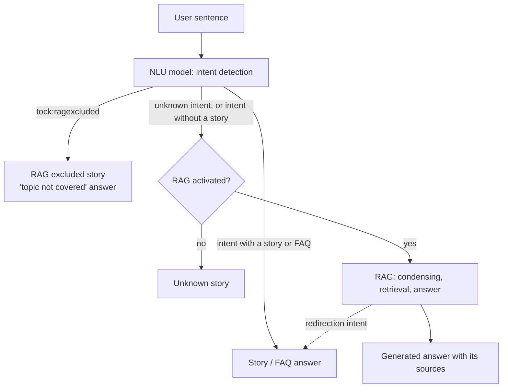

# How the bot answers: stories, FAQs and RAG

A Tock bot combines two ways of answering:

* **deterministic answers**: [stories](../studio/stories-and-answers.md) and [FAQs](../studio/faq.md), written by
  your teams, triggered by the intent that the NLU model detects in the user sentence;
* **generated answers**: the [RAG](rag.md), where an LLM writes the answer from your documents.

The NLU model decides, for each sentence, which of the two applies. This lets you keep control over the sensitive
or transactional journeys (a booking, a claim, a handover to a human agent), and let the LLM handle the long tail of
questions covered by your documents.

## Processing of a user sentence

For each user sentence:

1. The NLU model detects the intent of the sentence (see [Language understanding](../studio/nlu.md)).
2. If a story (or an FAQ) starts with this intent, it answers: the LLM is not called.
3. If the sentence is qualified with the `tock:ragexcluded` intent, the bot answers with its _RAG excluded_ story
   (by default: _"Sorry, I can't answer your question (Topic not covered)"_). See [RAG exclusions](#excluding-topics-from-the-rag).
4. Otherwise, the sentence is unknown or its intent has no story: if the [RAG is activated](rag.md#rag-activation), the
   bot calls the [Gen AI orchestrator](orchestrator-api.md), which condenses the question, retrieves the documents
   and generates the answer (see [how the RAG works](rag.md#how-it-works)). Without RAG, the bot answers with its
   _unknown_ story.

## Keeping control over the generated answers

Several levers, from the lightest to the strongest, restrict what the LLM answers:

| Lever | Where | Effect |
|-------|-------|--------|
| [Covered and excluded topics, business lexicon](rag-prompt-context.md) | _Gen AI_ > _Rag prompt context_ | Injected into the answering prompt: the LLM is asked to stay within the covered topics |
| [Answering prompt](rag-prompt.md) | _Gen AI_ > _Rag settings_ | Rules of the LLM: answer only from the documents, refuse out-of-scope questions, resist prompt injection |
| [Search settings](rag.md#indexing-session) and [compressor](compressor.md) | _Gen AI_ > _Rag settings_, _Compressor settings_ | Choose how documents are retrieved, and drop the least relevant ones before they reach the LLM |
| [RAG exclusions](rag-exclusion.md) | _Language Understanding_ > _Inbox sentences_ | The NLU model recognizes the excluded topics before the LLM is called |
| [Stories and FAQs](../studio/stories-and-answers.md) | _Stories & Answers_ | A written answer, or a full journey, replaces the generated one for a given intent |

### Excluding topics from the RAG

A [RAG exclusion](rag-exclusion.md) qualifies a sentence with the `tock:ragexcluded` intent. Once the NLU model is trained
with enough such sentences, similar sentences are recognized as excluded and never reach the LLM. This is safer than
an instruction in the prompt, because the decision is made before the LLM is called.

### Answering with a story instead of the LLM

When a question calls for a precise, validated answer, create an [FAQ](../studio/faq.md) or a
[story](../studio/stories-and-answers.md) for it: the NLU model detects its intent and the story answers instead of the RAG.
To train the NLU model on a new FAQ quickly, the training sentences can be
[generated by an LLM](sentence-generation.md).

### Redirecting from the RAG to a story

The answering LLM can also hand over to a story. When its JSON answer contains a `redirection_intent`
(see the [prompt output schema](rag-prompt-reference.md#redirection_intent)), the bot sends the generated answer, then switches to the story
started by this intent, for example a handover to a human agent. The intent must have a story, and cannot be `unknown`.

### Restricting the next intents

Inside a journey, a story can restrict the intents that can be detected for the next user sentence
(see [Restricting the scope of intents](../studio/intents-restrictions.md)): the sentences expected by the journey are
then not sent to the RAG.

## See also

* [Improving the answers](improve.md): testing, diagnosing and measuring the quality of the generated answers.
* [Concepts](../concepts.md): intents, stories, and the Gen AI vocabulary.
