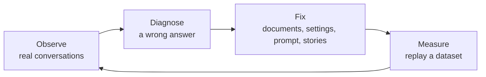

# Improving the generated answers

A RAG bot is never finished on the first try: documents evolve, users ask unexpected questions, and a change of
model or prompt can improve some answers and degrade others. This page describes the improvement loop, and the
_Tock Studio_ tools used at each step.

## 1. Observe

* The [_Dashboard_](../studio/dashboard.md) summarizes the RAG activity: share of the answers grounded in the retrieved
  documents, topics answered, state of the knowledge base, checks of the Gen AI configuration.
* _Analytics_ > [_Dialogs_](../studio/analytics.md#the-dialogs-tab) shows the conversations, with the RAG answer and its sources.
  They can be filtered on the RAG answer status, for example to list the questions answered without relevant documents.
  Enable _Dialogs debug_ in the [RAG settings](rag.md#rag-activation) to also record the condensed question and the documents retrieved.
* The RAG answer status, the topic and the suggested topics returned by the LLM are also recorded as indicators
  (_RAG Status_, _RAG Topics_, _RAG Suggested Topics_), available in the [_Metrics_](../studio/custom-metrics.md) menu.
* With an [observability provider](observability.md) such as Langfuse, each answer links to the trace of its LLM calls:
  exact prompts, documents, token usage and latency.
* [Evaluations](answers-quality.md#evaluations) let business experts review and grade a sample of real conversations.

## 2. Diagnose

From a bot answer in _Analytics_ > _Dialogs_, shortcuts open the question in the retrieval diagnostic or in the
playground, with the values recorded for this exchange. First find out where the chain went wrong:

| Symptom | Likely cause | Tool |
|---------|--------------|------|
| The right document is not among the sources | **Retrieval**: the document is missing from the index, badly chunked, or ranked too low | [Retrieval diagnostic](vector-store-inspection.md#retrieval-diagnostic), [vector store exploration](vector-store-inspection.md#vector-store-exploration) |
| The right document is among the sources, but the answer is wrong or incomplete | **Generation**: prompt, model or context size | [Playground](playground.md), [observability traces](observability.md) |
| The bot answered a question it should not have | **Scope**: topic not excluded, or a validated answer is missing | [RAG exclusions](rag-exclusion.md), [prompt context](rag-prompt-context.md), [FAQ](../studio/faq.md) |
| A question was answered by the wrong story | **NLU**: the sentence was classified in an intent that has a story | [Language understanding](../studio/nlu.md), [model quality](../studio/model-quality.md) |

## 3. Fix

Depending on the cause:

* **Documents**: complete or clean the sources, then [re-index them](indexing.md) and switch the bot to the new
  indexing session. The [vector store exploration](vector-store-inspection.md#vector-store-exploration) reports
  nearly empty chunks, sources without URL and duplicate titles.
* **Retrieval**: change the search type (hybrid search with PGVector), the number of documents retrieved in the
  [RAG settings](rag.md), or the [compressor](compressor.md). Compare the searches in the retrieval diagnostic before and after.
* **Generation**: adjust the [answering prompt](rag-prompt.md) or the model, after trying them in the [playground](playground.md).
* **Scope**: add [covered or excluded topics and business terms](rag-prompt-context.md), [exclude sentences](rag-exclusion.md)
  from the RAG, or answer with an [FAQ](../studio/faq.md) or a [story](../studio/stories-and-answers.md)
  (see [How the bot answers](how-it-works.md)).

## 4. Measure

Before deploying a change, check that it does not degrade other answers:

1. Build a [dataset](answers-quality.md#datasets) of representative questions, including those that were answered badly.
2. [Run it](answers-quality.md#running-a-dataset) before and after the change, and [compare the runs](answers-quality.md#comparing-runs).
3. If needed, [create an evaluation sample from a run](answers-quality.md#creating-an-evaluation-sample-from-a-run)
   so that business experts grade the new answers.

The [_Dashboard_ history](../studio/dashboard.md#history) keeps track of the changes of the Gen AI settings and of the corpus,
to relate a change in the metrics to a change in the configuration.
