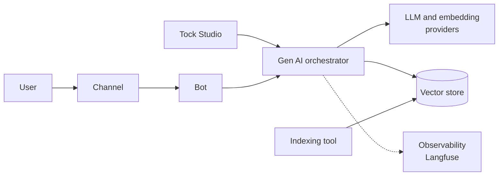

# Gen AI

Tock builds conversational assistants that answer from **your documents** with an LLM (RAG, _Retrieval-Augmented
Generation_), while keeping **control** over what the assistant says: sensitive journeys stay handled by
stories written by your teams, and the quality of the generated answers is measured continuously.

Everything is open source and can run on your own infrastructure, with the LLM, embedding model and vector store
of your choice, including local models.

Demo:

## What you can do

* **Answer from a knowledge base**: [index your documents](indexing.md), then let the [RAG](rag.md) answer the users'
  questions, with links to the sources.
* **Keep control over the answers**: combine the RAG with [stories and FAQs](how-it-works.md), define the
  [covered and excluded topics](rag-prompt-context.md), [exclude sentences](rag-exclusion.md), and write a robust
  [answering prompt](rag-prompt.md).
* **Improve continuously**: [observe, diagnose, fix and measure](improve.md) the answers, with
  [observability traces](observability.md), the [retrieval diagnostic](vector-store-inspection.md),
  and [datasets and evaluations](answers-quality.md).
* **Speed up the NLU model**: [generate training sentences](sentence-generation.md) for the FAQs.

## Getting started

To try it end to end on your machine, follow the tutorial
[Build a RAG bot on the Tock documentation](../getting-started/rag-tutorial.md) (about 30 minutes).

On your own platform:

1. Choose your [LLM and embedding providers](providers/llm-embedding.md) and your [vector store](providers/vector-store.md).
2. [Index your documents](indexing.md) in the vector store.
3. Configure the [vector store](vector-store.md) and the [RAG](rag.md) of the bot in _Tock Studio_.
4. Optionally, configure an [observability provider](observability.md) to trace the LLM calls, and a
   [document compressor](compressor.md).
5. [Test and improve](improve.md) the answers.

## Architecture

The Gen AI features rely on the **Gen AI orchestrator**, a Python ([FastAPI](https://fastapi.tiangolo.com/),
[LangChain](https://www.langchain.com/)) service deployed alongside the Tock platform. _Tock Studio_ and the bots call it;
it calls the LLM, embedding, vector store and observability providers configured for each bot.

* [How the bot answers](how-it-works.md): how the NLU model, the stories and the RAG work together.
* [Gen AI orchestrator API](orchestrator-api.md), and its [configuration](../operate/configuration.md#gen-ai-orchestrator)
  and [deployment](../operate/architecture.md) on your platform.

## _Tock Studio_ menus

| I want to... | _Tock Studio_ menu | Page |
|--------------|--------------------|------|
| Connect the vector store | _Gen AI_ > _Vector DB settings_ | [Vector DB settings](vector-store.md) |
| Check what the knowledge base contains | _Gen AI_ > _Vector store exploration_ | [Vector store inspection](vector-store-inspection.md#vector-store-exploration) |
| Activate the RAG, choose the models and the prompts | _Gen AI_ > _Rag settings_ | [Rag settings](rag.md) |
| Define the covered topics, excluded topics and business lexicon | _Gen AI_ > _Rag prompt context_ | [Rag prompt context](rag-prompt-context.md) |
| Filter the retrieved documents (reranking) | _Gen AI_ > _Compressor settings_ | [Compressor settings](compressor.md) |
| Prevent the RAG from answering some sentences | _Gen AI_ > _Sentences Rag exclusions_ | [Sentences Rag exclusions](rag-exclusion.md) |
| Try a prompt or a model | _Gen AI_ > _Playground_ | [Playground](playground.md) |
| Understand why a document is (or is not) used | _Gen AI_ > _Retrieval diagnostic_ | [Vector store inspection](vector-store-inspection.md#retrieval-diagnostic) |
| Trace the LLM calls | _Gen AI_ > _Observability settings_ | [Observability settings](observability.md) |
| Measure the quality of the answers | _Answers Quality_ | [Datasets and evaluations](answers-quality.md) |
| Generate training sentences for the FAQs | _Gen AI_ > _Sentence generation settings_ | [Sentence generation settings](sentence-generation.md) |
