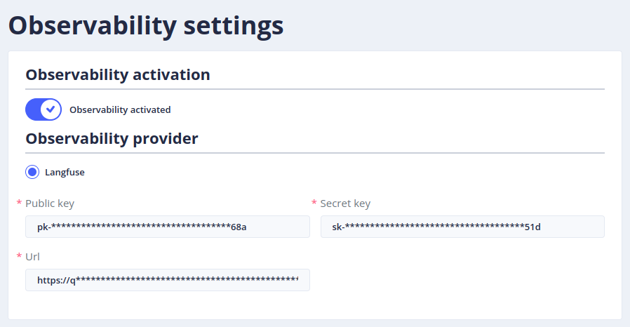

# The _Observability settings_ menu

An LLM observability tool records the calls made by the Gen AI orchestrator for each answer: the condensed question,
the retrieved documents, the prompts sent to the LLM and its answers, with their latency, token consumption and cost.
It helps understand a bad answer, and follow the cost and the performance of the RAG.

> To access this page, you need the **_admin_** role
> (more details on roles in [security](../operate/security.md#roles)).

## Configuration



* **Observability activation**: enables or disables the traces for the bot.
* **Observability provider**: the tool that receives the traces (see the [list of observability providers](providers/observability.md)).
  For [Langfuse](https://langfuse.com/):
    * **Public key** and **Secret key**: the API keys of a Langfuse project (_Settings_ > _API Keys_ in Langfuse),
    * **Url**: the address of the Langfuse server, as reached by the Gen AI orchestrator,
    * **Public url** (optional): the address of the Langfuse server as seen from the users' browser, when it differs
      from **Url** (for instance an internal Docker or Kubernetes host name). It is used for the links to the traces.

The settings can be exported (optionally with sensitive data, such as the keys) and imported, to copy them between
bots or environments, and deleted.

## Viewing the traces

Once observability is enabled, each generated answer has a link to its trace (_View observability details_):

* in [_Analytics_ > _Dialogs_](../studio/analytics.md), on the bot answers,
* in the [playground](playground.md), on the answers of the LLM.

## Running Langfuse with Docker

The [`tock-docker`](https://github.com/theopenconversationkit/tock-docker) repository provides a Docker Compose file
that starts Langfuse (version 3) and its dependencies:

```shell
git clone https://github.com/theopenconversationkit/tock-docker.git && cd tock-docker
docker compose -f docker-compose-langfuse-v3-only.yml up -d
```

Langfuse is then available at [http://localhost:3000](http://localhost:3000): create an account, an organization
and a project, then its API keys. In the observability settings, set **Url** to an address that the orchestrator
container can reach (for instance `http://host.docker.internal:3000`), and **Public url** to `http://localhost:3000`.

> Change the default passwords and secrets of the Compose file before using it beyond a local test.
