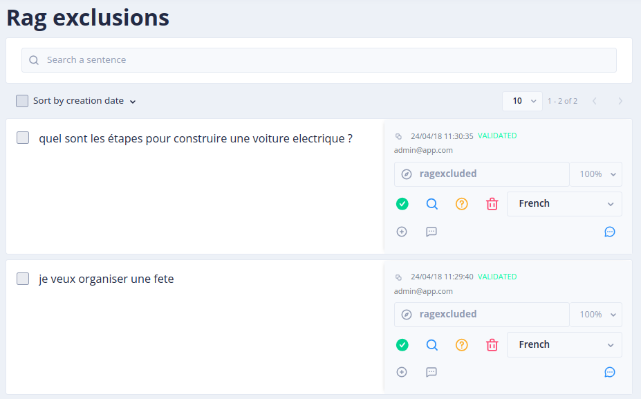

# The _Sentences Rag exclusions_ menu

RAG exclusions remove topics from the scope of the generated answers. A sentence excluded from the RAG is qualified
with the `tock:ragexcluded` intent: once the NLU model has learned enough such sentences, similar user sentences are
recognized as excluded, and the bot answers them without calling the LLM (see [How the bot answers](how-it-works.md#excluding-topics-from-the-rag)).

This is safer than an instruction in the [prompt](rag-prompt.md), since the decision is made before the LLM is called.

## Excluding sentences

1. Go to the _Language Understanding_ > _Inbox sentences_ menu
   (the **_nlpUser_** role is enough, see [security](../operate/security.md#roles))
2. Select the sentence you want to exclude
3. Click on _Exclude from Rag handling_ (or select several sentences and use the _Rag excluded_ batch action)

As for any intent, qualify several varied sentences for each excluded topic: a single sentence is rarely enough
for the model to recognize the other ways of asking the same thing. The model is rebuilt automatically after the
qualification (see [Conversational models](../studio/build-model.md)). Check the result in the [_Test_](../studio/test.md) menu.

## Listing the excluded sentences

The _Gen AI_ > _Sentences Rag exclusions_ screen lists all the sentences excluded from the RAG
(the **_admin_** role is needed, as for the other _Gen AI_ menus).

## Answer to the excluded sentences

By default, the bot answers _"Sorry, I can't answer your question (Topic not covered)"_. This answer is a label of
the bot: translate or change it in _Stories & Answers_ > _Answers_ (see [Internationalization](../studio/i18n.md)).
A bot developed in Kotlin can also replace the whole story with the `ragExcludedStory` of its `BotDefinition`.
