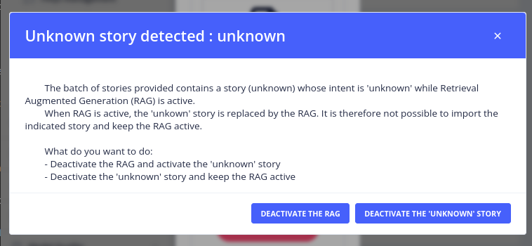
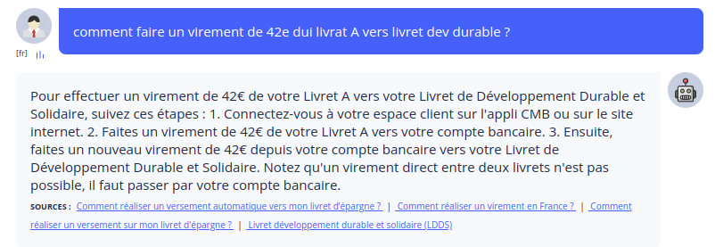

# The _Rag settings_ menu

The _Gen AI_ > _Rag settings_ menu configures the RAG (Retrieval-Augmented Generation) of the bot:
Tock answers user questions with an LLM, based on documents retrieved from a vector database.

> To access this page, you need the **_admin_** role
> (more details on roles in [security](../operate/security.md#roles)).

## How it works

When RAG is activated, it handles the questions that no story handles: sentences qualified as _unknown_ by the NLU model,
or whose intent has no story (see [How the bot answers](how-it-works.md)):

1. **Question condensing**: an LLM rewrites the question as a standalone question, using the latest messages of the dialog,
   and extracts keywords.
2. **Retrieval**: the documents closest to the question are searched in the vector database
   (see the [search type](#indexing-session)). Several variants of the question can be searched, and their results merged.
3. **Question answering**: an LLM generates the answer from the question and the retrieved documents,
   following the answering [prompt](rag-prompt.md). The answer includes the sources of the documents used.

## Settings

### RAG activation

* **Rag activated**: enables or disables RAG for the bot. RAG can only be activated once all the required fields are filled in.
* **Dialogs debug**: includes RAG debug information (condensed question, documents, etc.) in the dialog logs
  (_Analytics > Dialogs_).
* **Explainability**: includes explainability instructions in the answering prompt.

### Question condensing

* **Configuration**: the LLM used to condense questions (see the [list of LLM providers](providers/llm-embedding.md)).
* **Prompt**: the condensing prompt. It also returns the keywords (`key_words`) used by full text and hybrid
  searches: a custom prompt must keep this field for them to work.
* **Max number of messages in history**: number of dialog messages taken into account when condensing the question
  (zero: no history).

### Question answering

* **Configuration**: the LLM used to generate answers (see the [list of LLM providers](providers/llm-embedding.md)).
* **Prompt**: the answering prompt. See the [RAG prompt documentation](rag-prompt.md).
  Some elements of the prompt (covered and excluded topics, business lexicon) are managed in the
  [_Rag prompt context_](rag-prompt-context.md) menu.

### Embedding

* **Configuration**: the embedding model, which must be the one used to index the documents
  (see the [list of embedding providers](providers/llm-embedding.md)).

### Indexing session

* **Indexing session id**: the ID of the indexing session of the documents (see [document indexing](indexing.md)).
* **Vector database index name**: the name of the index in the vector database, computed from the namespace,
  the bot and the indexing session (read-only).
* **Search type**:
    * _Similarity search_: retrieves chunks by vector proximity (embeddings),
    * _Full text search_: retrieves chunks by keyword matching,
    * _Hybrid search_: combines both.

    Full text and hybrid searches are only available with [PGVector](providers/vector-store.md).

* **Max documents retrieved**: maximum number of documents passed to the LLM as context.

The vector database itself is configured in the [_Vector DB settings_](vector-store.md) menu.

### Export, import and deletion

The settings can be exported as a dump (optionally including sensitive data, such as API keys) and imported,
to copy them between bots or environments. _DELETE SETTINGS_ deletes the saved settings.

## Importing an Unknown story when RAG is activated

When stories are imported from one bot to another and RAG is activated in the receiving bot, a warning is displayed
about the Unknown story (the story that lets the bot answer that it does not know the answer to a question).
Two options are available:

* Deactivate RAG and allow the import of the Unknown story.
* Keep RAG activated and import the Unknown story, but deactivated.

## Testing and improving the answers

* Test the bot in the [_Test_](../studio/test.md) menu: with the dialogs debug enabled, the RAG debug information
  is available in _Analytics > Dialogs_.
* Understand why a document is (or is not) used with the [retrieval diagnostic](vector-store-inspection.md).
* Measure the quality of the answers with [datasets and evaluations](answers-quality.md).
* Follow the LLM calls with an [observability provider](observability.md).

