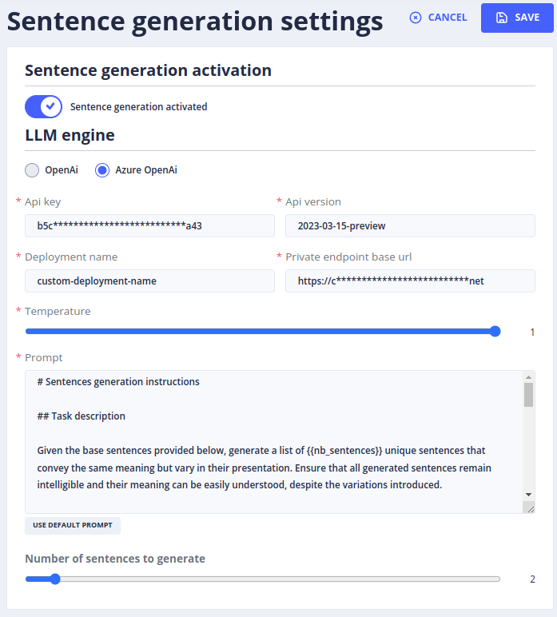

# The _Sentence generation settings_ menu

The _Gen AI_ > _Sentence generation settings_ menu configures the generation of training sentences for FAQ bots.

> To access this page, you need the **_admin_** role.
>  (more details on roles in [security](../operate/security.md#roles)).

## Configuration

To activate sentence generation, you must choose:

**An AI provider:**

- See the [list of AI providers](providers/llm-embedding.md)

**A temperature:**

- This is the default temperature used when creating training sentences.
- It defines how inventive the model generating the sentences is.
- It is between 0 and 1.0:
    - 0 = no latitude when creating sentences
    - 1.0 = the greatest latitude when creating sentences

**A prompt:**

- The prompt used to generate new training sentences.

**The number of sentences:**

- The number of training sentences generated by each request.

**Activation:**

- Enables or disables the feature.

## Usage

To use the **Generate Sentences** feature, go to the _Stories & Answers_ > _FAQs stories_ menu:

1. Select **one or more sentences** to use as a training base.
2. Click on Edit, then on the **Question** tab.
3. Click on **the light bulb**: a window with new parameters is displayed:

4. Choose the question(s) to use as a training base.
5. Choose whether the AI should include spelling mistakes, SMS-style language and abbreviations.
6. The default temperature is the one chosen in the Settings, but it can be changed here if needed.
7. Click on **Generate**.

The AI generates a list of variants of the selected question.
Select the most relevant variants and validate the selection.

The sentences selected during the session are then added to the questions of the FAQ.
