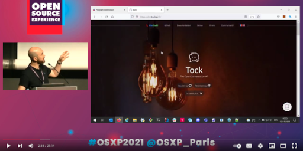
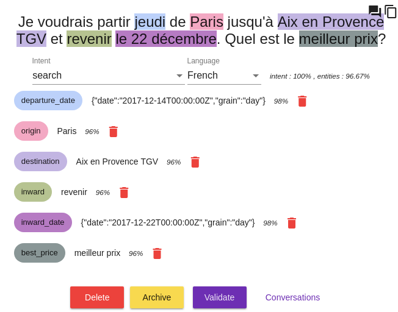

# Pr008

**Tock** (*The Open Conversation Kit*) is a complete and open platform to build conversational agents - also known as _bots_. 

Tock does not depend on 3rd-party APIs, although it is possible to integrate with them.
Users choose which components to embed and decide to keep (or share) ownership of conversational data and models.

> Tock has been used in production since 2016 by [OUI.sncf](https://www.oui.sncf/services/assistant)
> (Web/mobile, messaging platforms, smart speakers) and [more and more organisations](../en/about/showcase.md)
> (energy, banking, healthcare...).

The platform source code is available on [GitHub](https://github.com/theopenconversationkit/tock) 
under the [Apache License, version 2.0](https://github.com/theopenconversationkit/tock/blob/master/LICENSE).

## Overview

The [Tock.ai](https://doc.tock.ai/) site is a good starting point to learn about the solution and its growing community.
[Tutorials](../en/user/studio.md), [presentations](../en/about/ressources.md) and a [live demo](https://www.youtube.com/watch?v=UsKkpYL7Hto) 
(20 minutes, in English, [ℹ️ abstract](https://www.opensource-experience.com/en/event/20-minutes-from-zero-to-live-chatbot-with-tock/)) 
are also available:

## Features

* Bots _standalone_ or integrated with Web sites, mobile apps, social networks, smart speakers.
* Full-featured _NLU_ _([Natural Language Understanding](https://en.wikipedia.org/wiki/Natural-language_understanding))_ platform:
    * Leveraging open technologies, such as 
[OpenNLP](https://opennlp.apache.org/), [Stanford CoreNLP](https://stanfordnlp.github.io/CoreNLP/), 
[Duckling](https://github.com/facebook/duckling), [Rasa](https://rasa.com/) 
(later [Spacy](https://spacy.io/), [BERT](https://en.wikipedia.org/wiki/BERT_(language_model)), ...)
    * Can be deployed alone (for use cases like [_Internet Of Things_](https://en.wikipedia.org/wiki/Internet_of_Things))(img/tock-nlp-admin.png "NLU interface example - qualifying a sentence")tps://nodejs.org/), [Python](https://www.python.org/) _DSLs_ 
and any-language _REST API_ (see [_Bot API_](dev/bot-api.md))
* Numerous text/voice integrations available with [Messenger](https://www.messenger.com/), [WhatsApp](https://www.whatsapp.com/), 
[Google Assistant](https://assistant.google.com/), [Alexa](https://alexa.amazon.com/), [Twitter](https://twitter.com/), 
[Apple Business Chat](https://www.apple.com/fr/ios/business-chat/), [Teams](https://products.office.com/fr-fr/microsoft-teams/), 
[Slack](https://slack.com/)... (see [connectors](dev/connectors.md))
* _Cloud_ or _on-premise_ setups, with or without [Docker](https://www.docker.com/), 
_"embedded"_ bots without Internet 

## Technologies

Tock components can run as _containers_ (provided implementation for [Docker](https://www.docker.com/)). 

The application runs on [JVM](https://fr.wikipedia.org/wiki/Machine_virtuelle_Java) platforms. 
The reference language is [Kotlin](https://kotlinlang.org/), but other programming languages can be leveraged through the available APIs.
 
On the server side, Tock relies on [Vert.x](http://vertx.io/) and [MongoDB](https://www.mongodb.com ) (alt. [DocumentDB](https://aws.amazon.com/fr/documentdb/)). 
Various _NLU_ libraries and algorithms can be used, but Tock does not depend on them directly.

_Tock Studio_ graphical user interfaces are built with [Angular](https://angular.io/) in [Typescript](https://www.typescriptlang.org/).

[React](https://reactjs.org) and [Flutter](https://flutter.dev/) toolkits are provided for Web and Mobile integrations.

## Getting started...
* Read [Tutorial](en/user/studio.md) and start using the [demo/sandbox platform](https://demo.tock.ai/)
* User manual for [developers](dev/modes.md)

*[NLU]: Natural Language Understanding