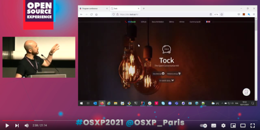

# Welcome to Tock - open conversational platform, with or without generative AI

**Tock** (*The Open Conversation Kit*) is a complete and open platform to build conversational assistants:
answer from your documents with the LLM of your choice (RAG), run controlled journeys written by your teams,
or combine both.

Tock does not depend on 3rd-party APIs, although it is possible to integrate with them.
Users choose which components to embed, including local LLMs, and decide to keep (or share) ownership of conversational
data and models.

> Tock has been used in production since 2016 by SNCF (OUI.sncf assistant, now SNCF Connect)
> (Web/mobile, messaging platforms, smart speakers) and [more and more organisations](project/showcase.md)
> (energy, banking, healthcare...).

The platform source code is available on [GitHub](https://github.com/theopenconversationkit/tock) 
under the [Apache License, version 2.0](https://github.com/theopenconversationkit/tock/blob/master/LICENSE).

## With an LLM, without, or both

| | With an LLM | Without an LLM | Mixed |
|---|---|---|---|
| **Principle** | The [RAG](gen-ai/rag.md) answers from your documents | The NLU model detects the intent, [stories](studio/stories-and-answers.md) and [FAQs](studio/faq.md) answer | The NLU model routes each sentence to a story or to the RAG |
| **Answers** | Generated, with their sources | Written and validated by your teams | Written for the sensitive journeys, generated for the rest |
| **Suited to** | Large document bases, open questions | Transactional journeys, regulated contexts, embedded bots without Internet, no inference cost | Most assistants in production |
| **Get started** | [RAG tutorial](getting-started/rag-tutorial.md) | [First bot with Tock Studio](getting-started/first-bot-studio.md) | [How the bot answers](gen-ai/how-it-works.md) |

Generative AI is an optional building block: the Gen AI orchestrator is only deployed if you use it,
and an existing bot can activate the RAG from _Tock Studio_.

## Overview

[Tutorials](getting-started/index.md), [presentations](project/resources.md) and a [live demo](https://www.youtube.com/watch?v=UsKkpYL7Hto) 
(20 minutes, in English) are also available:

## Features

* Generative AI (see [Gen AI](gen-ai/index.md)):
    * _RAG_ (Retrieval-Augmented Generation) answers based on your documents, with their sources,
      with [PGVector](https://github.com/pgvector/pgvector) or [OpenSearch](https://opensearch.org/) vector stores
    * LLM and embedding providers: [OpenAI](https://openai.com/), [Azure OpenAI](https://azure.microsoft.com/products/ai-services/openai-service),
      [Ollama](https://ollama.com/) for local models...
    * Control over the answers: [stories and FAQs combined with the RAG](gen-ai/how-it-works.md), covered and excluded topics,
      structured answering prompt
    * [Continuous improvement](gen-ai/improve.md): retrieval diagnostic, playground, LLM observability with
      [Langfuse](https://langfuse.com/), datasets and answer evaluations
* _Tock Studio_ interfaces:
    * Configuration of the Gen AI features, the knowledge base and the prompts
    * No-code conversational journeys, FAQs and decision trees
    * Internationalization (_i18n_) support for multilingual bots
    * Conversation monitoring, user journeys / trends (_Analytics_) and answer quality
* Full-featured _NLU_ _([Natural Language Understanding](https://en.wikipedia.org/wiki/Natural-language_understanding))_
  platform, routing each sentence to a journey or to the RAG:
    * Leveraging open technologies, such as 
[OpenNLP](https://opennlp.apache.org/), [Stanford CoreNLP](https://stanfordnlp.github.io/CoreNLP/), 
[Duckling](https://github.com/facebook/duckling), [Rasa](https://rasa.com/),
or models hosted on [AWS SageMaker](https://aws.amazon.com/sagemaker/)
    * Can be deployed alone (for use cases like [_Internet Of Things_](https://en.wikipedia.org/wiki/Internet_of_Things))
* Bots _standalone_ or integrated with Web sites, mobile apps, social networks, smart speakers.
* Frameworks to develop complex journeys and integrate third-party services:   _DSLs_ in
[Kotlin](https://kotlinlang.org/), [Javascript/Nodejs](https://nodejs.org/), [Python](https://www.python.org/)
and any-language _REST API_ (see [_Bot API_](develop/bot-api.md))
* Numerous text/voice integrations available with [Messenger](https://www.messenger.com/), [WhatsApp](https://www.whatsapp.com/), 
[Teams](https://www.microsoft.com/microsoft-teams/), [Slack](https://slack.com/), [Google Chat](https://workspace.google.com/products/chat/), [Mattermost](https://mattermost.com/), [iAdvize](https://www.iadvize.com/),
[Alcmeon](https://www.alcmeon.com/), OpenAI-compatible clients,
a Web connector with [React](https://reactjs.org) and [Flutter](https://flutter.dev/) kits... (see [channels](channels/index.md))
* _Cloud_ or _on-premise_ setups, with or without [Docker](https://www.docker.com/), on [Kubernetes](operate/installation.md#installation-on-kubernetes),
_"embedded"_ bots without Internet 

## Technologies

Tock components can run as _containers_ (provided implementation for [Docker](https://www.docker.com/)). 

The application runs on [JVM](https://en.wikipedia.org/wiki/Java_virtual_machine) platforms. 
The reference language is [Kotlin](https://kotlinlang.org/), but other programming languages can be leveraged through the available APIs.
 
On the server side, Tock relies on [Vert.x](http://vertx.io/) and [MongoDB](https://www.mongodb.com ) (alt. [DocumentDB](https://aws.amazon.com/documentdb/)). 
Various _NLU_ libraries and algorithms can be used, but Tock does not depend on them directly.

_Tock Studio_ graphical user interfaces are built with [Angular](https://angular.dev/) in [Typescript](https://www.typescriptlang.org/).

The Gen AI orchestrator is a [Python](https://www.python.org/) service built with [FastAPI](https://fastapi.tiangolo.com/)
and [LangChain](https://www.langchain.com/), which calls the LLM, embedding and vector store providers.

[React](https://reactjs.org) and [Flutter](https://flutter.dev/) toolkits are provided for Web and Mobile integrations.

## Getting started...

* [Tutorials](getting-started/index.md), starting with the [RAG tutorial](getting-started/rag-tutorial.md), and [demo platform](https://demo.tock.ai/)
* [Gen AI](gen-ai/index.md): RAG, knowledge base, prompts, answer quality
* Manuals for [users](studio/index.md), [developers](develop/index.md), [administrators](operate/architecture.md)
* [Resources (slides, videos)](project/resources.md) and [code examples](develop/examples.md)

*[NLU]: Natural Language Understanding