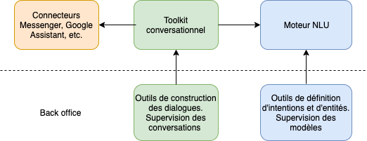
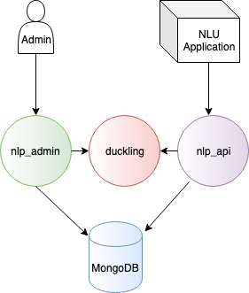

# Tock Architecture

This chapter presents the general architecture of a Tock platform: components and dependencies,
flows, proxy configuration, etc.

## Functional Architecture

Two major components are available:

* the _NLU_ engine: _Natural Language Understanding_ (see [_Tock Studio_](../studio/index.md))
* the conversational framework integrated into _NLU_ services and various connectors such as
Messenger, WhatsApp, Teams or Slack (see [developer manual](../develop/index.md) and [connectors](../channels/index.md)).

The NLU platform is independent of the conversational part. It is possible to use the NLU without having to
master the complexity induced by conversation management. In some important use cases, such as the [Internet of Things](https://en.wikipedia.org/wiki/Internet_of_things),
using an NLU model alone is relevant.

## Technical architecture

Tock is composed of several application components (_containers_ when using Docker)
and a [MongoDB](https://www.mongodb.com) database.

> The [Docker](https://www.docker.com/) and [Docker Compose](https://docs.docker.com/compose/) descriptors provided
(ie. the `Dockerfile` and `docker-compose.yml`) describe the architecture of Tock.
>
> A complete example can be found in the file [`docker-compose-bot-open-data.yml`](https://github.com/theopenconversationkit/tock-docker/blob/master/docker-compose-bot-open-data.yml)
> available in the repository [`tock-docker`](https://github.com/theopenconversationkit/tock-docker).

### MongoDB database

The Mongo database must be configured as a _replica set_.
This is mandatory because Tock uses the [Change Streams](https://docs.mongodb.com/manual/changeStreams/)
functionality which has as a prerequisite the installation in replica set.
A single-node replica set is enough for development; in production, deploy at least 3 instances
to ensure high availability of the database.

### Application components

Here is a quick description of the different application components (and [Docker](https://www.docker.com/) images provided
with Tock):

* _Tock Studio_ interfaces and tools:
    * [`tock/bot_admin`](https://hub.docker.com/r/tock/bot_admin): _Tock Studio_

* _NLU_ part:
    * [`tock/build_worker`](https://hub.docker.com/r/tock/build_worker): rebuilds models automatically whenever needed
    * [`tock/duckling`](https://hub.docker.com/r/tock/duckling): parses dates and primitive types using [Duckling](https://duckling.wit.ai)
    * [`tock/nlp_api`](https://hub.docker.com/r/tock/nlp_api): parses sentences based on models
      built in _Tock Studio_

* Conversational part:
    * [`tock/bot_api`](https://hub.docker.com/r/tock/bot_api): API to develop bots ([_Tock Bot API_](../develop/bot-api.md) mode)
    * [`tock/kotlin_compiler`](https://hub.docker.com/r/tock/kotlin_compiler) (optional): script compiler to enter them directly in the [_Stories and Answers_](../studio/stories-and-answers.md) interface of _Tock Studio_

* _Gen AI_ part (optional, see [Gen AI](../gen-ai/index.md)):
    * [`tock/gen-ai-orchestrator-server`](https://hub.docker.com/r/tock/gen-ai-orchestrator-server): Gen AI orchestrator,
      called by `bot_api` and `bot_admin` for the RAG, the sentence generation and the playground
    * [`tock/llm-indexing-tools`](https://hub.docker.com/r/tock/llm-indexing-tools): tools to [index documents](../gen-ai/indexing.md)
      in the vector store, run on demand
    * A vector store: [PGVector](https://github.com/pgvector/pgvector) or [OpenSearch](https://opensearch.org/)
      (see [Vector store providers](../gen-ai/providers/vector-store.md))
    * Optionally, [Langfuse](https://langfuse.com/) to trace the LLM calls (see [Observability](../gen-ai/observability.md))

A final component, the bot itself, must be added and made accessible to partners and external channels with which
we wish to integrate.

> Of course the implementation of the bot is not provided with Tock (everyone implements their own functionalities for their needs)
> but an example is available in
[`docker-compose-bot-open-data.yml`](https://github.com/theopenconversationkit/tock-docker/blob/master/docker-compose-bot-open-data.yml).

### Deployment modes

- The _NLU platform_ mode alone (without conversational part):

- The _Tock Bot API_ mode (recommended for most cases), allowing to develop in [Kotlin](https://kotlinlang.org/)
or another language through the Tock conversational API:

- The _Integrated bot_ mode (historical) allowing to develop in [Kotlin](https://kotlinlang.org/) only
using all the possibilities of Tock but accessing the MongoDB database directly from the bot:

## See also...

* [Installation](installation.md)
* [Security](security.md)
* [Supervision](supervision.md)
* [Cloud](cloud.md)
* [High availability](cloud.md#high-availability)