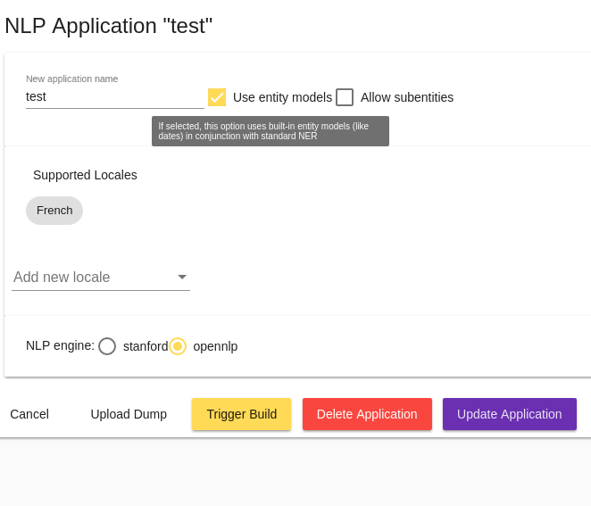

# The *Settings* menu

The _Settings_ menu allows you to create and configure Tock conversational applications (i.e.
models / bots that can coexist on a platform). Several administration and configuration functions for
bots are also available via this menu: import/export a configuration, configure the language, connectors, etc.

## The *Applications* tab

This screen allows you to create, modify, delete Tock conversational applications.

> When you first connect to the [demo platform](https://demo.tock.ai/),
> a simplified wizard allows you to create the first application (the first bot). You can then go through
> this screen to add other applications.

### Create an application

To add an application, click on _Create New Application_ :

* Enter a name / identifier for the application

* Choose whether the model can include _entities_ or even _sub-entities_ (see [Concepts](../concepts.md) for more information)

* Select one or more languages (see [Building a multilingual bot](i18n.md) for more information)

* Select an NLU engine: [Apache OpenNLP](https://opennlp.apache.org/) by default, or
[Stanford CoreNLP](https://stanfordnlp.github.io/CoreNLP/) if the optional
[`tock-corenlp`](https://github.com/theopenconversationkit/tock-corenlp) module is installed
(see [Installation](../operate/installation.md)). The _bgem3_ engine uses models hosted on Amazon SageMaker
(see [Configuration](../operate/configuration.md#amazon-sagemaker-models)), and the optional `tock-nlp-model-rasa`
module adds a [Rasa](https://rasa.com/) engine.

### Edit, import and export an application

For each application already created, you can then:

* _Download an application dump_ : download its configuration in JSON format: language, intent/entity model, etc.

* _Download a sentences dump_: download its qualified sentences in JSON format

* _Edit_: modify the application configuration
    * A form allows you to modify the initial configuration
    * An _Advanced options_ section adds other parameters for advanced users:
        * _Upload dump_: load a configuration or qualified sentences from a file in JSON format.
         Only new intents/sentences are added, this function does not modify/delete existing intents/sentences
        * _Trigger build_: trigger/force model rebuild
        * _NLU Engine configuration_: fine-tune the underlying NLU engine (parameters depend on the engine
        used, [Apache OpenNLP](https://opennlp.apache.org/) or [Stanford CoreNLP](https://stanfordnlp.github.io/CoreNLP/))

The _Upload dump_ function (see above) is also directly accessible at the bottom of the screen, allowing:

* Either to modify an application (if the `application name` exists)
* Either create/import a new one

## The *Configurations* tab

This screen allows you to access the _connectors_ of a bot, to add, modify or delete them. This is also where you find
the information to connect programmatically.

### Connect programmatically to the bot

The settings to connect to the bot programmatically (ie. via a program / programming language)
are found in this screen:

* The _API Key_ can be copied and embedded in the client code of the _Bot API_ to connect programmed journeys
in Kotlin or in another programming language like Javascript/Nodejs or Python

* An address / URL can be configured to use the _WebHook_ mode of _Bot API_

To learn more about these settings and journey development, see [Bot API](../develop/bot-api.md)

### Manage connectors

The list of _connectors_ of the bot is displayed under the API key. To add a connector to the bot, click on
_Create a new Configuration_.

All connectors have the following configuration:

* _Configuration name_ : the name of this connector configuration, displayed in _Tock Studio_
* _Connector type_ : the channel type (e.g. Messenger, Slack, etc.)
* _Connector identifier_ : an identifier for the connector, unique for the bot
* _Relative REST path_ : a relative path unique for the platform, to communicate with the bot on this channel.

> By default, the path is of the form `/io/<namespace>/<bot>/<connector>`, for instance `/io/app/new_assistant/web`.
> If this path is already used on the platform (two connectors of the same type for the same bot), a number is appended to it.

Each connector also has an additional configuration specific to this connector type. These settings
are in _Connector Custom Configuration_. These specific settings are documented with each connector/channel type,
see [Connectors](../channels/index.md).

### Test connectors

For each connector added to the bot, a _test connector_ is also created and configured. It is used to "simulate" the connector
when testing the bot directly in the _Tock Studio_ interface (menu _Test_ > _Test_).

By default, test connectors are not displayed in the _Settings_ > _Configurations_ screen. Click on _Display test
configurations_ to view them and possibly modify them.

> In particular, if you get connection error messages in the _Test_ > _Test_ page, do not hesitate to
> check the test configuration, in particular the _Application base url_ address (for a platform deployed with Docker
> Compose by default, it should be `http://bot_api:8080` with the container name and port declared
> in the `docker-compose-bot.yml` descriptor).

## The *Namespaces* tab

This screen allows you to manage one or more namespaces or _namespaces_. Each application, each bot is created
within a namespace. It is possible to manage several namespaces, and to share some of them with
a team or other Tock Studio users. To do this, simply edit the namespace and add other
users (giving them more or less rights on the namespace).

## The *Log* tab

This view allows you to track the main application configuration changes made
by users via Tock Studio: application creation, connector modifications, imports, etc.

## The *Synchronization* tab

This screen copies the stories, intents and training of a bot to another bot: see [Synchronization](synchronization.md).
