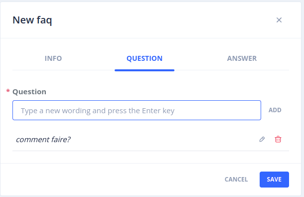
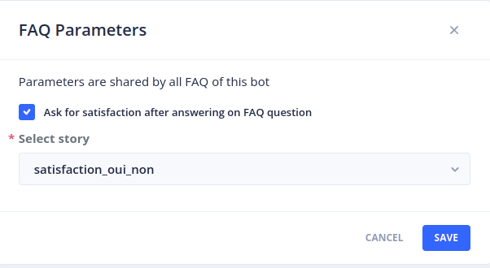

# FAQs

The _Stories & Answers_ > _FAQs stories_ menu allows you to create, modify and enrich conversational models with
_Frequently Asked Questions_: questions with a simple answer (plain text or Markdown).

It is intended for a business audience not familiar with conversational concepts (intents, entities, etc.).

> To access this page, you must have the _botUser_ role (more details on roles in [security](../operate/security.md#roles)).

## FAQ list

This page lists all existing FAQs (with pagination).

For each FAQ you can find the following elements:

- Its name
- The first question, and the number of associated questions
- An excerpt of the returned answer
- A set of tags

The following actions are available for each FAQ:

- _Enable_ / _Disable_: once disabled, the bot no longer sends the associated answer but the default _unknown_ answer
- _Test this question in a dialog_: opens the _Test_ screen with the question
- _Edit_: modifies the elements of the FAQ (name, description, tags, questions, answer)
- _Download_: downloads the FAQ in JSON format
- _Show story details_: displays the story associated with the FAQ
- _Delete_: deletes the FAQ. The underlying intent is also deleted, and its questions are moved back to the
  _Inbox sentences_ of [_Language Understanding_](nlu.md).

The buttons at the top of the page allow you to:

- _Import FAQs_: import FAQs from a JSON export (see below)
- _Export all faqs_: download all the FAQs of the bot in JSON format
- _Disable all_: disable all the active FAQs of the bot
- _FAQ Parameters_: configure the satisfaction question (see below)

### Filters

You can search for FAQs by entering text in the _Search_ field, filter them by selecting one or more tags,
and limit the display to active, inactive or all FAQs with the _Active_ checkbox.

## Creating a new FAQ

You can create a new FAQ by clicking on the _+ New FAQ_ button.
This opens a panel with 3 tabs.

> A _Simple_ story is automatically created and associated with each new FAQ.

### _INFO_ tab

In this tab, you can:

- Define the name of the FAQ
- Give a description to explain what it answers
- Add tags to group FAQs by theme

> The name of the FAQ is used to generate the underlying intent. If an intent with this name is already used by
> another application of the namespace, you can either share it between the two applications or create a new one.

### _QUESTION_ tab

In this tab, you can add as many questions as necessary to feed the model.
These questions are associated with the underlying intent of the FAQ.
It is recommended to have at least 10 questions with varied formulations so that the model reaches a minimum recognition rate.

The _Generate sentences_ button proposes new formulations generated by an LLM
(see [sentence generation](../gen-ai/sentence-generation.md)).

### _ANSWER_ tab

In this tab you define the answer sent to the user when their question matches the FAQ:

- The answer format: plain text or Markdown (if the channel supports it)
- The answer content, which can be different for each locale / connector / interface combination
- Optional footnotes (title, URL, content), displayed as sources under the answer

## Qualifying user sentences

The sentences sent by the users are qualified in _Language Understanding_ > _Inbox sentences_,
like any other sentence (see [Language understanding](nlu.md)): the intent of each FAQ appears in the list of intents.
Validating a sentence with the intent of a FAQ adds it to the questions of this FAQ.

## Importing FAQs

The _Import FAQs_ button imports a JSON file produced by _Export all faqs_, for instance to copy FAQs from one bot to another.

## Satisfaction question

The _FAQ Parameters_ button allows you to configure a story executed after the answer of a FAQ, to collect the
user's satisfaction on the quality of the answer.

Check the _Ask for satisfaction after answering on FAQ question_ box, then choose a story in the _Select story_ list.

> An _Ending_ [rule](stories-and-answers.md#story-rules) is automatically created between the story of each FAQ and the selected story.
