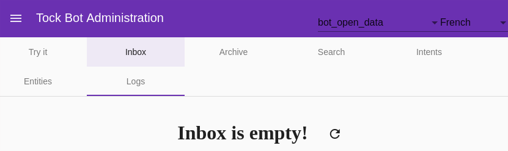

# The Tock Studio interface

This page presents the general characteristics of _Tock Studio_.

The following pages cover the different menus of the application and different functionalities.

## Logging in to the application

A standard browser is enough to access _Tock Studio_. The user is prompted to authenticate:

* On the [Tock demo platform](https://demo.tock.ai/),
the user is prompted to authenticate via their GitHub account. The user must then accept that Tock accesses
their account - only the GitHub account identifier is read by Tock.

* On a default Tock platform, the credentials are `admin@app.com` / `password`. They are set by the
`tock_users` and `tock_passwords` properties, which must be changed: see [Security](../operate/security.md#implementation-by-properties).

> It is also possible, as an alternative, to use an authentication mechanism upstream of the application, for example via
> an [Apache HTTPd](https://httpd.apache.org/) service or a cloud service such as [AWS Cognito](https://aws.amazon.com/cognito/)
> on the one hand and a [LDAP](https://en.wikipedia.org/wiki/Lightweight_Directory_Access_Protocol) type directory on the other hand.

## The application banner

At the top left of the interface are:

* A button to display (or hide) the different _Tock Studio_ menus

* The name of the interface

At the top right of the interface are:

* The currently selected application / bot
 (useful when several bots co-exist on the platform)

* The currently selected language (useful for testing a multilingual bot)

* A link to log out
