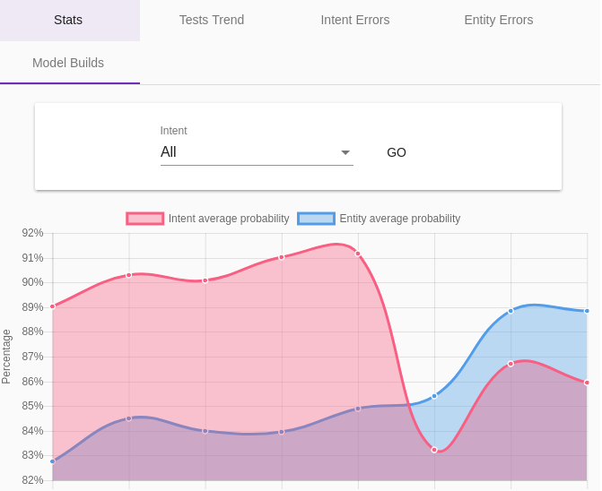
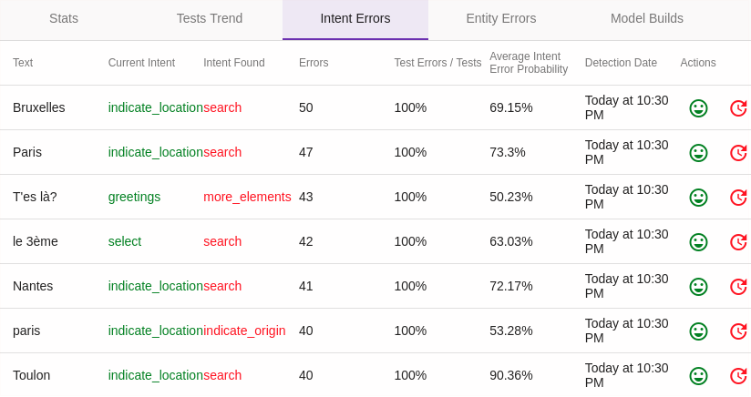
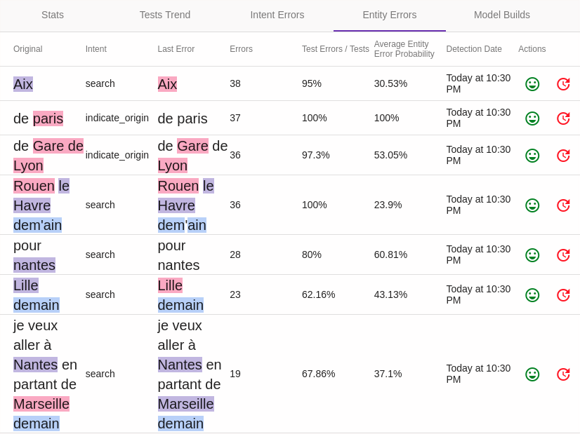

# The _Model Quality_ menu

The _Model Quality_ (or _NLU QA_) menu allows you to evaluate and monitor over time the quality/relevance/performance of conversational models.

## The _Model Stats_ tab

This screen presents graphs to track the evolution of several indicators of the quality of the conversational model:

* **Relevance**: the scores of the detection algorithms on intents (_Intent average probability_)
and on entities (_Entity average probability_)

* **Traffic / errors**: the number of requests to the model (_Calls_) and the number of errors (_Errors_)

* **Performance**: the response time of the model (_Average call duration_)

## The _Intent Distance_ tab

The metrics presented in the table on this page (_Occurrences_ and _Average Diff_) allow you to identify intents that are
more or less close in the model, in particular to optimize the modeling.

## The _Count Stats_ tab

This tab lists the sentences most often received by the bot, with the number of occurrences of each one, its last
usage, the intent detected (with its probability and the probability of the entities) and whether the sentence has
been validated. Filter by intent (or _Unknown_) and set a minimum count to find the frequent sentences that are not
yet qualified, or that are misunderstood.

## The _Model Builds_ tab

This screen presents statistics on the latest reconstructions of the model. These are therefore indications on
the performance of the model.

## The _Test Trends_ tab

The _Partial model tests_ are a classic way to detect qualification errors,
or problems of proximity of intents (or entities) between them.

> This involves taking a part of the current model at random (for example 90% of the sentences of the model) in order to build
> a slightly less relevant model, then testing the remaining 10% with this new model.
>
> The principle established, all that remains is to repeat the process a certain number of times
> so that the most frequent errors are presented to a manual corrector.
>
> Note that these tests are only useful with already substantial models.

This tab shows the evolution of the relevance of the partial model tests.

> By default, the tests are scheduled to be launched from midnight to 5am, every 10 minutes.
> It is possible to configure this behavior with the `tock_test_model_timeframe` property: the start and end hours, separated by a comma (default: `0,5`).

## The _Test Intent Errors_ tab

This screen shows the results of the _partial tests_ of intent detection (see above), with the details of the
phrases/expressions recognized differently from the real model.

In this example, no "real" error was detected. However, we can see that in some cases the model
is systematically wrong, with a high probability.

For each sentence, it is possible via the _Actions_ column to confirm that the basic model is correct (with
_Validate Intent_) or to correct the detected error (_Change The Intent_).

> It is interesting to periodically analyze these differences, some differences being well explained, even being
> sometimes "assumed" (false negatives), others can reveal a problem in the model.

## The _Test Entity Errors_ tab

Like _Intent Test Errors_ for entities, this screen presents the results of _partial tests_ for entity detection.

> It is interesting to periodically analyze these differences, some differences being well explained, even being
> sometimes "assumed" (false negatives), others can reveal a problem in the model.
