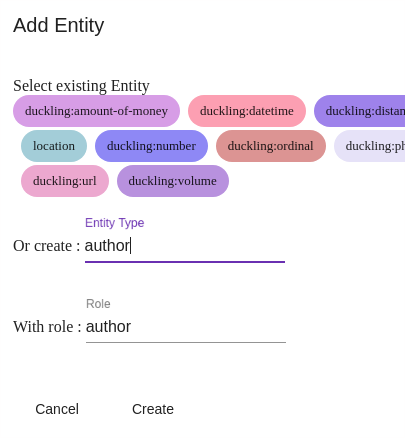

# The _Language Understanding_ menu

The _Language Understanding_ (or _NLU_) menu allows you to create, modify, and enrich conversational models:
declare _intentions_ and _entities_, _qualify_ sentences, etc. (see [Concepts](../concepts.md)
for more information).

In this page, the details of each tab are presented. See also [Building conversational models](build-model.md)
for a more usage-driven presentation.

## The _New sentence_ tab

This screen allows you to enter sentences and check which intent/entities are detected.

Enter a sentence and validate to see the detection resulting from the conversational model (in practice: how the bot
interprets the sentence). The following are then displayed:

* _Intent_: the recognized intent
* _Language_: the detected language
* The score(s) returned by the algorithms (according to their level of confidence on the intent and on any entities)
* If applicable, each entity detected with its role/type and score

It is possible to modify all the elements detected from this screen:

* To modify the intent (or even create a new one on the fly) or the detected language, use the fields /
selection lists under the sentence
* To delete an entity, use the button next to the entity score
* To add an entity, select a block of words in the sentence with the mouse then specify its role/type.

> Note: if you have enabled this option at the application/bot level, it is possible to declare
> _sub-entities_. You will learn more in [Building conversational models](build-model.md).

The following buttons and commands are available for the sentence as a whole:

* _Delete_: delete the sentence
* _Unknown_: qualify the sentence as an unknown intent (default response)
* _Validate_: confirm the detected intent/entities and save the sentence in the model
(ultimately causing a reconstruction of the model, its _corpus_ being enriched with this sentence)

Other links are available to display conversations containing this sentence, copy the content of the
sentence, create a journey from this sentence.

## The _Inbox sentences_ tab

This tab shows (with pagination and some display options) all the sentences received by the _NLU_ model
with the detected intents/entities/language/scores.

These sentences can come from real users regardless of the channels, from an entry in the _New sentence_ tab
or from a conversation via the _Test_ > _Test_ page in _Tock Studio_.

> When you are testing from an external channel, do not hesitate to click on the _Refresh_ button
> (top left of the screen) to refresh the list of sentences.

The buttons and commands under each sentence are identical to those in the _New sentence_ tab (see above).

## The _Search sentences_ tab

This screen allows you to search through all the sentences: _Inbox sentences_ but also qualified sentences
saved in the model.

## The _Unknown sentences_ tab

This screen allows you to browse sentences whose intent has not been recognized (_unknown_ intent).

## The _Intents_ tab

This screen lists and manages the intents. See [Intents](intents.md).

## The _Entities_ tab

This screen manages the entity types: predefined values, sub-entities, obfuscation... See [Entities](entities.md).

## The _Sentences logs_ tab

This screen displays the complete log of sentences received and allows you to go back to conversations (i.e. all the sentences received and bot responses for a user).

> Note: unlike the _Inbox sentences_ view, the _Sentences logs_ show the sentences received even when they already exist
> identically in the model (in this case, the model and algorithms are not even queried, the response being
> known).
