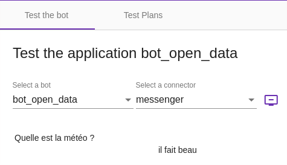
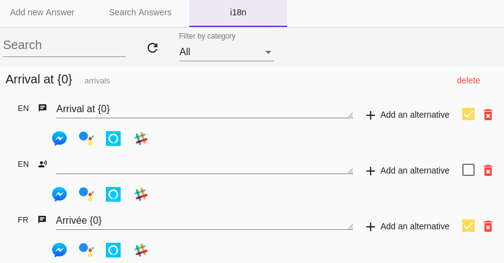

# The _Stories & Answers_ menu

The _Stories & Answers_ menu allows you to build the journeys (_stories_) of the bot and their answers.

On this page, the details of each screen are presented. See also
[Create your first bot with Tock Studio](../getting-started/first-bot-studio.md) for an example of creating a
story, and [Build a multilingual bot](i18n.md) for the _Answers_ screen.

## The _New Story_ screen

A story associates one or more intents with an answer. There are three types of stories:

* _Simple_: one or more answers, in text or media messages
* _Scripted_: answers written in Kotlin directly in _Tock Studio_ (requires the `kotlin_compiler` component)
* _Simple (Faq)_: the stories created by the [FAQs](faq.md) screen

### Create a simple answer

> The guide [Create your first bot with Tock Studio](../getting-started/first-bot-studio.md) presents
> an example of creating a story with a simple answer.
>
> The _Test_ > _Test_ menu then allows you to quickly check the behavior of the bot on this story.

### Creating complex answers

It is possible to indicate several answers and also "rich" answers called _Media Message_.

This allows, regardless of the channel, to display images, titles, subtitles and action buttons.

#### Mandatory entities

It is possible, before displaying the main answer, to check if certain entities
are filled in, and if not, to display the appropriate question.

The corresponding option is called _Mandatory Entities_.

> For example, if the bot needs to know the destination of the user and the user has not indicated it yet,
> the bot asks "To which destination?".

#### Actions

Actions are presented as suggestions, when the channel allows it.

It is possible to present a tree of actions to build a decision tree.

## The _All stories_ screen

This screen allows you to browse and manage the stories created.

These can be stories configured in _Tock Studio_ (ie. with the _New Story_ screen) but also stories
declared programmatically via [_Bot API_](../develop/bot-api.md). To see the latter, uncheck the
_Configured stories only_ option.

## The _FAQs stories_ screen

This screen manages the questions / answers of the bot: see [FAQs](faq.md).

## The _Answers_ screen

This screen allows you to modify the answers of the bot, according to several criteria:

* The language (this is called _internationalization_ or _i18n_)
* The channel (text or voice), that is to say in practice the connector
* According to a rotation: it is possible to record several texts for the same _label_ in
  the same _language_ on the same _connector_ - the bot will then randomly answer one of these texts, then perform a
  rotation so as not to always answer the same thing.

> This makes the bot more pleasant by varying its answers.

See also [Building a multilingual bot](i18n.md) for the use of the _Answers_ screen, and
[Internationalization](../develop/i18n.md) for the development aspects on this topic.

## The _Documents_ screen

This screen lists the files and links used in the media messages of the stories (images, audio and video files,
links...), with the story that uses them. You can filter them by type and extension, and open the story to edit them.

## The _Rules_ screen

This screen contains the following sections.

### _Tagged Stories_

Stories that have a particular function, depending on their tags:

* Bot disabling stories, tagged with **DISABLE**
* Bot enabling stories, tagged with **ENABLE**
* Stories for which only the entities of the sub-steps are checked to decide if the user stays in the story
* Stories for which only the intents of the story are checked to select an action from an entity

### _Story rules_

Rules applied to the stories, possibly for a single configuration of the bot:

* _Activation_: enables or disables a story
* _Redirection_: redirects a story to another story
* _Ending_: runs another story after the end of a story, for instance a satisfaction question
  (see [FAQs](faq.md#satisfaction-question))

### _Features_

This section allows you to manage _features_ that can be enabled or disabled from the interface (_feature flipping_).
