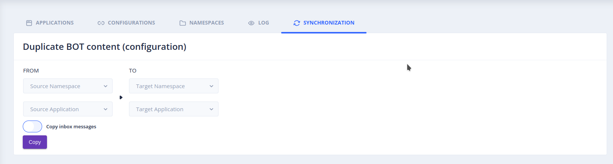

# The _Synchronization_ screen

The _Settings_ > _Synchronization_ screen copies the stories, intents and training of a bot (the source) to another bot
(the target), possibly in another namespace. For instance, you can develop and test new stories on a pre-production bot,
then copy them to the production bot, or copy the sentences received by a production bot to a pre-production bot
to qualify them.

Select the namespace and the application of the source and of the target, then start the synchronization.

> This screen requires access to several namespaces: the administrator of the platform must set the
> `tock_namespace_open_access` property to `true` (see [Configuration](../operate/configuration.md#environment)).

## What is synchronized

- **Stories and intents**: the stories of the source and their intents are copied to the target.

    > **Warning:** the stories of the target that do not exist in the source are deleted, and the other ones are
    > overwritten by the stories of the source.

- **Training**: the qualified sentences of the source overwrite those of the target. Only the sentences that exist in the
  source are affected: the other sentences of the target are kept. For instance, if the target associates "hello"
  with the `greetings` intent and the source associates it with the `test` intent, the target now associates it with `test`.

- **Sentences to qualify** (_Copy Inbox Messages_ option): the sentences not yet qualified are also copied, for instance
  to qualify the sentences received in production on a pre-production bot.
