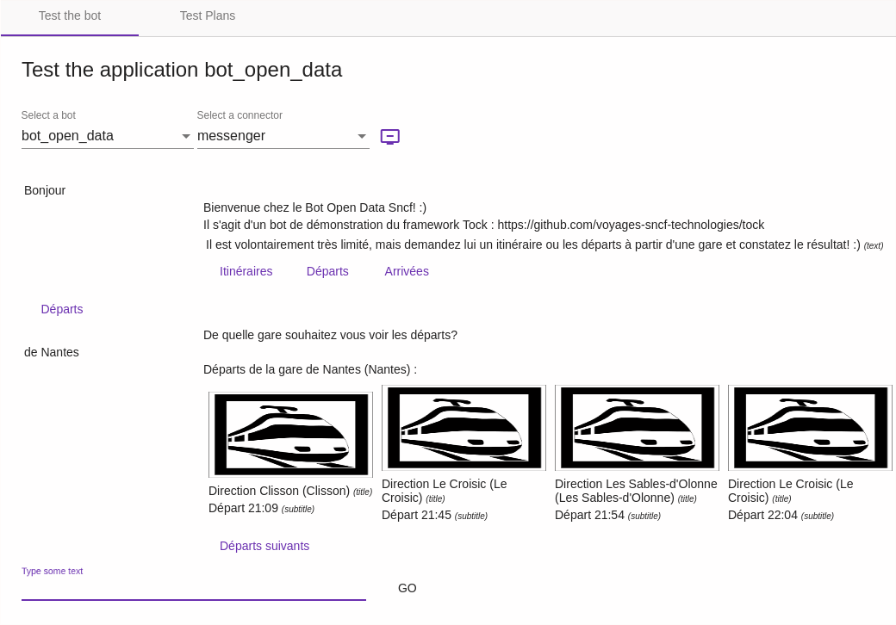

# The _Test_ menu

The _Test_ menu allows you to test a bot directly in the _Tock Studio_ interface, as well as to manage automatic test plans.

## The _Test_ screen

Via this menu, you can talk directly to the bot by simulating different languages and connectors.

This allows you to quickly and easily test a bot in the _Tock Studio_ interface,
without having to use external software and channels.

> The interface remains minimal because the goal is to quickly test the bot, not to obtain
a real user interface or even a rendering identical to that of a particular connector.
>
> Depending on the type of messages returned by the bot and the connector used, the rendering in
> the _Test_ > _Test_ screen may not be satisfactory. Indeed, for perfect compatibility with this screen,
> the connectors must respect certain implementation rules.
>
> If you notice that a certain type of message for a given connector is not well managed in this
> interface, do not hesitate to raise a [_issue_ GitHub](https://github.com/theopenconversationkit/tock/issues).

To talk to a bot in the interface, once in _Test_ > _Test_ :

* Check the language (top right of the interface)
* Select an application/bot
* Select a connector to emulate
* Start typing sentences...

Here is another example with a conversation including rich components of the Messenger connector, with their rendering
in the generic _Tock Studio_ interface :

For each message exchange with the bot, the detected language is indicated. By clicking on
_View Nlp Stats_ you can see the details of the model's response: intent, entities, scores, etc.

## The _Test Plans_ tab

This tool allows you to create and track the execution of automated conversation tests, in order to automatically and regularly check the non-regression of the bot.

1. Create a test plan with the _Create a new Test Plan_ button, and give it a name.
2. Add conversations to it from [_Analytics_ > _Dialogs_](analytics.md): the _Add dialog to Test Plan_ button of a
   dialog adds it to the selected plan. A good practice is to add a dialog once its answers have been checked.
3. Launch the plan with _Launch_: Tock replays the user sentences of each conversation and compares the bot answers
   with the recorded ones.

Each execution shows the number of conversations and errors. For a failed conversation, _Display details_ shows the
expected dialog and the last answer actually received.

Test plans can also be run from [Xray](https://www.getxray.app/) (JIRA): see the `tock_bot_test_xray_url` property and the
[Xray tests](../operate/configuration.md#xray-tests) module.
