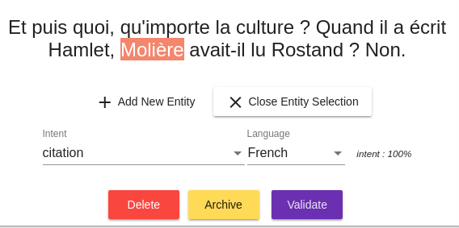

# Building conversational models

The _Tock Studio_ documentation can be browsed screen by screen, including the _Language Understanding_
and _Model Quality_ menus for managing conversational models. Feel free to refer to it if you
have a question about a particular tab/option.

This page presents the construction of models by focusing more on usage and learning,
allowing you to move from one screen to another without exhaustively detailing each feature of the platform.

> Note that it is possible to deploy the Tock NLU platform alone, in this case the Tock graphical interfaces
>are limited to the _Settings_, _Language Understanding_ and _Model Quality_ menus. This page can therefore be used as a tutorial for a use
>of Tock restricted to _Language Understanding_, for example for a use such as the [Internet of Things](https://fr.wikipedia.org/wiki/Internet_des_objets).

## Go to the *Language Understanding* section

The _Language Understanding_ menu returns to the _Inbox_ tab by default. Initially, you have no sentences if no one has yet spoken to the bot:

## Add and qualify sentences

### Add a sentence

* Go to the _New Sentence_ screen
* Enter a sentence

## Create a new intent

* Assign a new intent to the sentence by selecting _Create a New Intent_ in the _Intent_ selection list.

### Specify entities

Depending on what the intent is for, you can specify the entities you want your model to recognize
in the sentence:

* Select a portion of the sentence corresponding to the entity (ie. a group of words to select with the mouse)
* Click on _Add Entity_ that just appeared

* Choose an existing entity type or create a new one
* Give a role to this entity

> Example: in the sentence "I want to go from Paris to New York", probably Paris and New York are two entities
>of the same type (locality) but do not have the same role in the intent (origin and destination).

It is of course possible to have multiple occurrences of the same role, or a different role in the same sentence.

### Take advantage of *predefined entities*

By default, Tock offers a number of _predefined entity_ types, including the types supported by the
[Duckling](https://github.com/facebook/duckling) library: amounts, dates, etc. If you select these entity types,
they will be automatically recognized and valued.

### Validate the sentence

When the intent and entities are correct, complete the qualification of the sentence by clicking on _Validate_.

### Qualify other sentences

After two or three sentences for a given intention, it is common for the model to start recognizing
the following sentences and detecting the intention well (with an increasing score, as long as the
sentences are relatively close / related to the intention of course):

If a sentence is not well qualified, change the intention / entities then do _Validate_ to apply
the correction. If the sentence was well qualified, do _Validate_ directly.

In both cases, you feed the model, which rebuilds itself, and becomes more relevant for the
following sentences.

You are building your conversational model!

This is the beginning of **learning** for your bot or conversational application.

> The qualification of sentences, their number but also their variety (especially over time, because today's users are not exactly tomorrow's users) are the basis of a **relevant model** and a **good conversational experience**
for users.

## Browse the model's sentences

The _Search_ tab allows you to browse all the model's sentences using a certain number of criteria.
The most used is the simple text search for which it is also possible to use regular expressions.

Each sentence has a _Status_ that can change over time:

* _Inbox_ : The sentence has not yet been qualified and is not part of the model
* _Validated_ : The sentence has been validated but is not yet taken into account in the NLP models (this can take time in the case of large models)
* _Included in model_ : The sentence has been validated and has been taken into account in the NLP models

This screen therefore allows you to consult the sentences that are already part of the model (in other words already qualified),
and to change the sentence qualifications over time. It is notably possible
to re-qualify an entire group of sentences.

> For example, you can create a new intention later and decide that all sentences meeting
> a certain criterion (keyword or other) must now be qualified in this new intention.

## Edit the advanced features of the application

The _Applications_ menu gives access to the list of applications/bots available on the platform:

With the edit button, several options are available, in particular:

### NLU engine selection

You have the possibility to select the NLU library used by this bot
(provided that several engines are present in the platform installation).

### Enable entity templates

This option allows you to reuse pre-built entity templates in your new intentions.
For example, if you create an intention with a `duckling:datetime` entity,
dates will be automatically recognized for this intention in all new sentences assigned to this
intention.

> Internally, an arbitration is made between the information coming from the pre-built entity models and the
>information taken from your own model.

This option is enabled by default. It may be useful to disable it for very large models,
for which native detection will be superior in almost all cases to that of the entity models.

### Enabling subentities

If you enable this option, you will be able to qualify several levels of entities:

The number of levels is not limited, but it is recommended not to specify more than 3 or 4.

### Predefined entity values

A given entity can have _predefined values_. To do this, you must go to the _Entities_ tab,
select an entity. The icon next to the delete icon shows the types of entities you can edit:

In the example above, two labels are defined for the week value:

* Week
* weekly

## Continue...

To learn more about entity management, especially in programmatically created intentions,
or simply to continue browsing the Tock user manual,
you can go to the [Development](../../dev/modes.md) chapter.