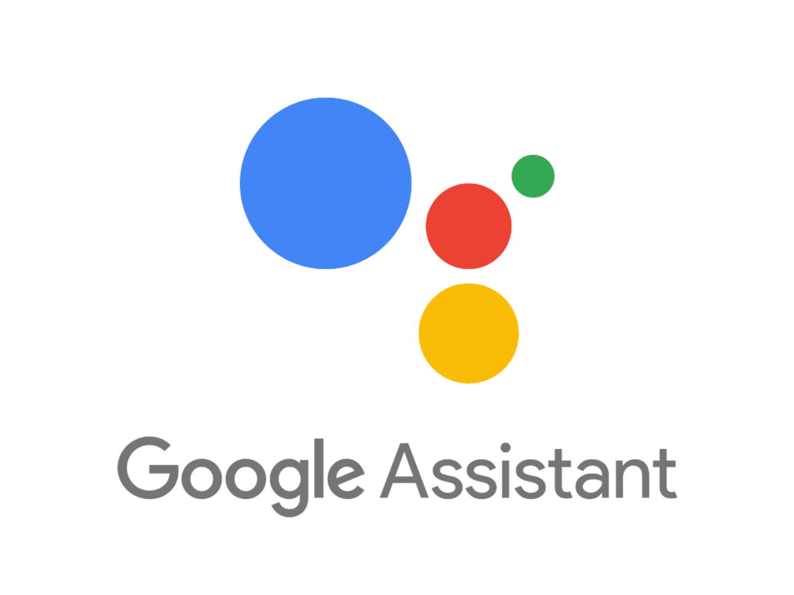
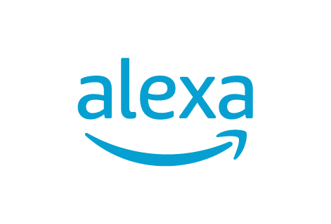

# Building a multichannel bot with Tock

## Notion of *connector*

A Tock _connector_ allows you to integrate a bot into an external communication channel (text or voice).
Aside from the _test connector_ type (used internally by the _Tock Studio_ interface), connectors
are associated with channels external to the Tock platform.

The whole point of Tock connectors lies in the ability to develop conversational assistants
independently of the channel(s) used to talk to it. It is thus possible to create a bot for a channel,
then make it multichannel later by adding connectors.

The _Web connector_ has the particularity of exposing a generic API to interact with a Tock bot.
As a result, it allows even more integrations on the "frontend" side, using this API as a gateway.

This page actually lists:

- The [_connectors_](canaux.md#connectors-provided-with-tock) provided with the Tock distribution:

{style="width:50px;"}

{style="width: 75px;"}

{style="width: 70px;"}

{style="width:50px;"}

{style="width: 75px;"}

{style="width:50px;"}

{style="width:50px;"}

{style="width:50px;"}

{style="width:50px;"}

{style="width:50px;"}

 
{style="width:50px;"}

{style="width:50px;"}

{style="width:50px;"}

{style="width:50px;"}

- The [kits using the _Web connector_](canaux.md#integrations-via-the-web-connector) to integrate other channels:

{style="width:50px;"}

{style="width:50px;"}

{style="width:50px;"}

- The [possible integrations for voice processing](canaux.md#voice-technologies):

{style="width:50px;"}

{style="width: 70px;"}

{style="width:50px;"}

{style="width:50px;"}

{style="width:50px;"}

{style="width:50px;"}

{style="width: 75px;"}

 {style="width: 100px;"}

{style="width: 75px;"}

## Connectors provided with Tock

Tock provides many connectors for different types of channels (see below). New connectors are
regularly added to the platform, depending on project needs but also on the schedule for opening
public channels to bots.

> Examples: arrival of Google Home in France in 2017, Alexa in 2018, opening of WhatsApp APIs then Business Chat in 2019, etc.

To learn more about the referenced bots using this or that connector in production,
do not hesitate to consult the page [Tock showcase](../../about/showcase.md).

### Messenger

{style="width:50px;"}

* **Channel** : [Facebook Messenger](https://www.messenger.com/)
* **Type** : text _(+ voice via voice message upload )_
* **Status** : Tock connector used in production since 2016

The guide [Connect your bot to Messenger](../../guides/messenger.md) explains how to integrate a bot
Tock with a Facebook page / [Messenger] (https://www.messenger.com/).

To learn more about this connector, you can also go to the folder
[connector-messenger](https://github.com/theopenconversationkit/tock/tree/master/bot/connector-messenger) on GitHub,
where you will find the sources and the _README_ of the connector.

### Slack

{style="width:100px;"}

* **Channel** : [Slack](https://slack.com/)
* **Type** : text
* **Status** : Tock connector used outside production

The guide [Connect your bot to Slack](../../guides/slack.md) explains how to integrate a bot
Tock with a [Slack](https://slack.com/) _channel_.

To learn more about this connector, you can also go to the folder
[connector-slack](https://github.com/theopenconversationkit/tock/tree/master/bot/connector-slack) on GitHub,
where you will find the sources and the _README_ of the connector.

### Google Assistant / Home

{style="width: 100px;"}

{style="width:100px;"}

* **Channel**: [Google Assistant](https://assistant.google.com/) / [Google Home](https://store.google.com/fr/product/google_home)
* **Type**: text + voice
* **Status** : Tock connector used in production since 2017

To learn more about this connector, see its sources and its _README_ in the folder
[connector-ga](https://github.com/theopenconversationkit/tock/tree/ master/bot/connector-ga) on GitHub.

### Alexa / Echo

{style="width: 100px;"}

* **Channel** : [Amazon Alexa](https://alexa.amazon.com/) / Amazon Echo
* **Type** : voice
* **Status**: Tock connector used in production since 2018

Important note: in the case of Alexa, the NLP model is necessarily built and hosted at Amazon.

Only the conversational framework part of Tock can be used.

To learn more about this connector, see its sources and its _README_ in the
[connector-alexa](https://github.com/theopenconversationkit/tock/tree/master/bot/connector-alexa) folder on GitHub.

### Rocket.Chat

{style="width:75px;"}

* **Channel** : [Rocket.Chat](https://rocket.chat/)
* **Type** : text
* **Status** : to be specified

To learn more about this connector, see its sources and its _README_ in the folder
[connector-rocketchat](https://github.com/theopenconversationkit/tock/tree/master/bot/connector-rocketchat) on GitHub.

### WhatsApp

{style="width:75px;"}

* **Channel** : [WhatsApp from Facebook](https://www.whatsapp.com/)
* **Type** : text
* **Status** : Tock connector used in production since 2019

To learn more about this connector, see its sources and its _README_ in the folder
[connector-whatsapp](https://github.com/theopenconversationkit/tock/tree/master/bot/connector-whatsapp) on GitHub.

### Teams

{style="width:75px;"}

* **Channel** : [Microsoft Teams](https://products.office.com/fr-fr/microsoft-teams/)
* **Type** : text + voice
* **Status** : Tock connector used in production since 2019

To learn more about this connector, see its sources and its _README_ in the folder
[connector-teams](https://github.com/theopenconversationkit/tock/tree/master/bot/connector-teams) on GitHub.

### Business Chat

{style="width:50px;"}

* **Channel** : [Apple Business Chat (Messages)](https://www.apple.com/fr/ios/business-chat/)
* **Type** : text
* **Status** : Tock connector used in production since 2019

To learn more about this connector, see its sources and its _README_ in the folder
[connector-businesschat](https://github.com/theopenconversationkit/tock/tree/master/bot/connector-businesschat) on GitHub.

### Twitter

{style="width:100px;"}

* **Channel** : [Twitter](https://twitter.com/) (private messages)
* **Type** : text
* **Status** : Tock connector used in production since 2019

To learn more about this connector, see its sources and its _README_ in the folder
[connector-twitter](https://github.com/theopenconversationkit/tock/tree/master/bot/connector-twitter) on GitHub.

### Allo-Media

{style="width:75px;"}

* **Channel** : [Allo-Media](https://www.allo-media.net/) (telephony)
* **Type** : voice
* **Status** : Tock connector used in production since 2020

This connector was developed for the [AlloCovid](https://www.allocovid.com/) bot.
For more information, see the [AlloMediaConnector](https://github.com/theopenconversationkit/allocovid/blob/master/src/main/kotlin/AlloMediaConnector.kt)
class with the [bot sources](https://github.com/theopenconversationkit/allocovid) on GitHub.

### Google Chat

{style="width:50px;"}

* **Channel** : [Google Chat](https://chat.google.com) (formerly Google Hangouts)
* **Type** : text
* **Status** : Tock connector used outside of production

To learn more about this connector, see its sources and _README_ in the
[connector-google-chat](https://github.com/theopenconversationkit/tock/tree/master/bot/connector-google-chat) folder on GitHub.

### Mattermost

{style="width:50px;"}

* **Channel** : [Mattermost](https://mattermost.com/)
* **Type** : text
* **Status** : Tock connector not used for production (no use case yet)

Please refer to [connector-mattermost](https://github.com/theopenconversationkit/tock/tree/master/bot/connector-mattermost)
for sources and _README_ instructions.

### Web generic

{style="width:75px;"}

This generic connector allows you to integrate a Tock bot into any website or application:
portal, web or mobile application, REST client, etc.

The connector exposes a REST API to the bot, easily integrated from any web or mobile application, or programming language.

Several kits and components based on the Web connector are already available to integrate Tock bots into
different sites and applications, such as websites with [React](canaux.md#react),
native mobile applications with [Flutter](canaux.md#flutter-beta) or even
intranets [SharePoint](canaux.md#sharepoint-beta).

* **Channel** : Web (generic for all sites & web applications)
* **Type** : text
* **Status** : Tock connector used in production since 2020

To learn more about this connector, see its sources and its _README_ in the folder
[connector-web](https://github.com/theopenconversationkit/tock/tree/master/bot/connector-web) on GitHub.
It contains examples and documentation in _Swagger_ format of the REST API.

### Test (generic)

{style="width:75px;"}

This connector is internal to Tock, it is used to communicate with a bot directly in the
_Tock Studio_ interface (_Test_ > _Test the bot_ view) by emulating other connectors.

## Integrations via the Web connector

The _Web connector_ exposes a generic API to interact with a Tock bot.
As a result, it allows even more integrations on the "frontend" side, using this API as a gateway.

### React
{style="width:100px;"}

This React component integrates a Tock bot and renders it graphically in a web application.
The web application communicates with the bot via a [Web connector](canaux.md#web-generic).

* **Integration** : [React](https://fr.reactjs.org/) (JavaScript / JSX)
* **Type** : Web applications
* **Status** : Used in production since 2020

For more information, see the sources and the _README_ in the repository
[`tock-react-kit`](https://github.com/theopenconversationkit/tock-react-kit) on GitHub.

### Flutter *(beta)*

{style="width:75px;"}

This Flutter component integrates a Tock bot and provides its graphical rendering in a mobile or web application. The app communicates with the bot via a [web connector](canaux.md#web-generic).

* **Integration**: [Flutter](https://flutter.dev/) (Dart)
* **Type**: Native mobile and web apps
* **Status**: Beta, in development

For more information, see the sources and the _README_ in the
[`tock-flutter-kit`](https://github.com/theopenconversationkit/tock-flutter-kit) repository on GitHub.

### SharePoint *(beta)*

{style="width:75px;"}

This _WebPart_ component allows you to integrate a Tock bot into a SharePoint site.
It embeds the [tock-react-kit](canaux.md#react) to communicate with the bot
via a [Web connector](canaux.md#web-generic) and manage the graphic rendering of the bot in the SharePoint page.

* **Integration** : [Microsoft SharePoint](https://www.microsoft.com/en-us/microsoft-365/sharepoint/collaboration)
* **Type** : Websites & Intranets
* **Status** : Beta, in development

For more information, see the sources and the _README_ in the
[`tock-sharepoint`](https://github.com/theopenconversationkit/tock-sharepoint) repository on GitHub.

## Voice technologies

Tock bots process sentences in text format by default (_chatbots_). However, voice technologies can be
integrated into the bot's "terminals" in order to obtain voice conversations (_voicebots_ and _callbots_):

- Translation of voice into text (_Speech-To-Text_) upstream of the processing by the bot (ie. before the _NLU_ step)
- Translation of text into voice (_Text-To-Speech_) downstream of the processing by the bot (ie. voice synthesis of the bot's response)

Some _connectors_ provided with Tock allow a bot to be integrated into an external channel
managing the STT and TTS voice aspects.

In addition, other voice technologies have been integrated into Tock in recent years.
They are mentioned for information purposes, even when no ready-to-use _connector_ is provided.

### Google / Android

Google's _Speech-To-Text_ and _Text-To-Speech_ functions are used through the
[Google Assistant / Home connector](canaux.md#google-assistant-home), also by the voice
functions of the [Microsoft Teams app for Android](https://play.google.com/store/apps/details?id=com.microsoft.teams)
compatible with the [Teams connector](canaux.md#teams), as well as within the Android platform
in particular for native mobile developments. 

{style="width:75px;"}

{style="width: 75px;"}

{style="width:75px;"}

{style="width:75px;"}

* **Technology** : STT & TTS Google / Android
* **Status** : used with Tock in production
(via connectors [Google Assistant / Home](canaux.md#google-assistant-home),
[Microsoft Teams](canaux.md#teams)
and natively Android for botsintegrated _on-app_)

### Apple / iOS

Apple's _Speech-To-Text_ and _Text-To-Speech_ features are used through the
[Business Chat connector](canaux.md#business-chat), as well as within iOS
for native mobile developments.

{style="width:75px;"}

{style="width:75px;"}

* **Technology** : STT & TTS Apple / iOS
* **Status** : used with Tock in production (via Business Chat connector
and natively iOS for integrated _on-app_ bots)

### Amazon / Alexa

Alexa (Amazon) _Speech-To-Text_ and _Text-To-Speech_ functions are used through the
[Alexa connector / Echo](canaux.md#alexa-echo).

{style="width:75px;"}

* **Technology**: STT & TTS Amazon / Alexa
* **Status**: used with Tock in production (via Alexa connector)

### Allo-Media & Voxygen

The company [Allo-Media](https://www.allo-media.net/) offers an AI platform based on phone calls.

[Voxygen](https://www.voxygen.fr/) offers speech synthesis services.

On the occasion of the development of the [AlloCovid](https://www.allocovid.com/) bot, an [Allo-Media connector](canaux.md#allo-media)
was developed to integrate the bot (Tock) with the Allo-Media services:
_Speech-To-Text_ and _Text-To-Speech_ with Voxygen.

{style="width:100px;"}

 {style="width: 100px;"}

* **Technology**: Allo-Media & Voxygen
* **Status**: used with Tock in production (via Allo-Media connector)

### Nuance

[Nuance](https://www.nuance.com) offers speech recognition & AI solutions.

For voice command experiments in 2016, Nuance had been
integrated with Tock for its _Speech-To-Text_ functions.

Although this integration has not been maintained since, it worked
after a few days of implementation.

{style="width: 100px;"}

* **Technology**: Nuance
* **Status**: used with Tock in 2016

## Connector architecture & data governance

With a view to _governance_ of conversational models and data, the Tock connector architecture has several advantages:

* The model is built in Tock, it is not shared via connectors
* The choice of a bot's connectors allows you to control the propagation (or not) of conversations

> For example, for a bot internal to a company, you can choose to use only connectors

>to its own channels (website, etc.) or internal to the company (enterprise applications, professional space on

an Android phone, etc.).

* Even if a bot is connected to several external channels/partners, only the Tock platform has all the
conversations on all these channels.

## Developing your own connector

It is possible to create your own Tock connector, for example to interface a Tock bot with a channel specific to
the organization (often a specific website or mobile application), or when a general public channel
opens to conversational bots and the Tock connector does not yet exist.

The [_Bot Framework_](../../dev/bot-integre.md) section of the Tock developer manual gives instructions for
implementing your own connector.